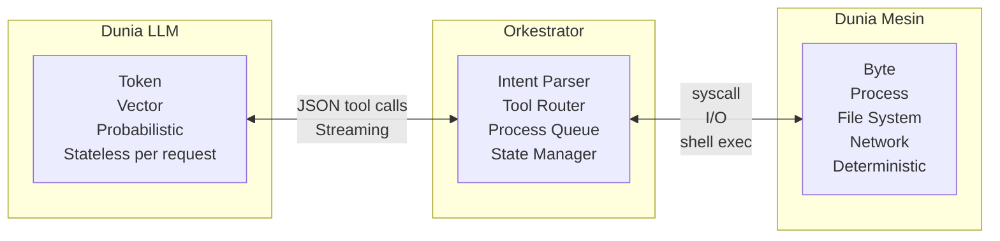
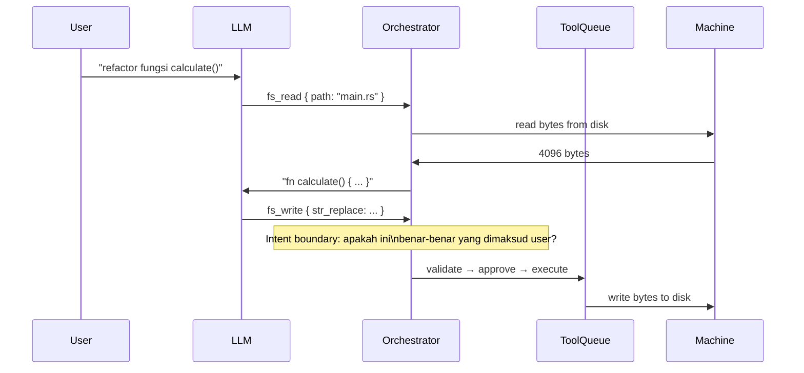
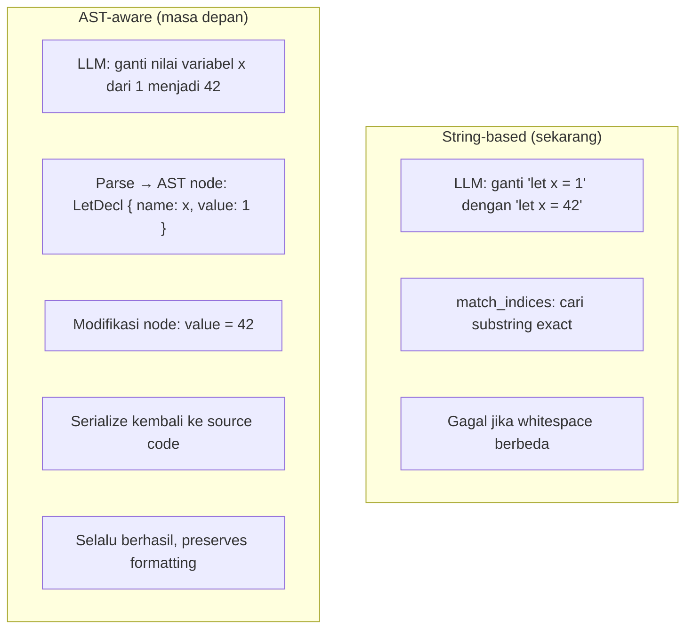
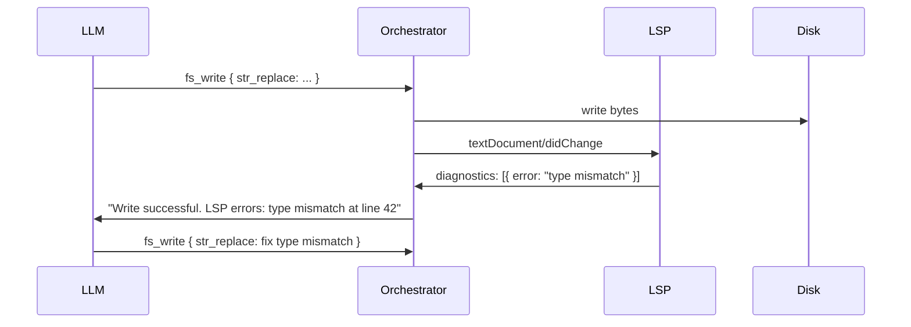
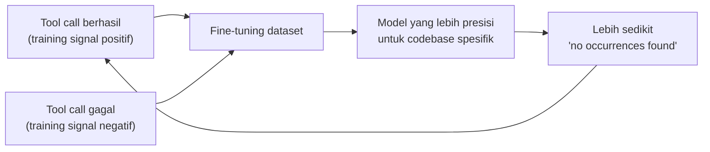
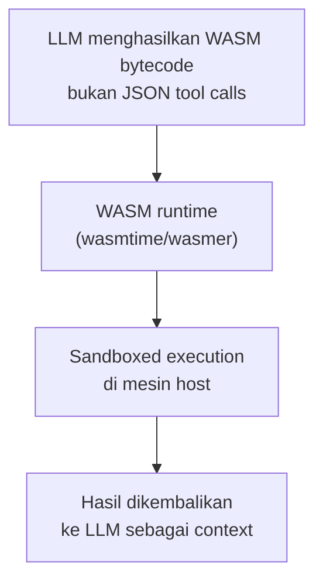

## Prolog: Semua Ini Bukan Tentang Komunitas

Ketika kamu melihat daftar ini — OpenCode, Kiro CLI, Cline, Aider, Copilot CLI, Codex, Gemini CLI, Claude CLI, Kimi CLI, Qwen Code, Cody, Windsurf, NxCode, AwanCode, KiloClaw — kamu mungkin berpikir ini adalah persaingan ekosistem. Siapa yang punya komunitas terbesar, toolchain terlengkap, integrasi terbanyak.

Tapi semakin dalam kamu masuk ke source code masing-masing, semakin kamu menyadari bahwa semua itu adalah **lapisan permukaan**. Ada sesuatu yang jauh lebih esensial di bawahnya.

Pertanyaan yang sebenarnya bukan *"tool mana yang terbaik?"* — tapi *"bagaimana sebuah respons probabilistik dari LLM bisa menjadi instruksi deterministik yang dieksekusi oleh mesin?"*

---

## Bagian 1: Anatomi Sebuah "AI Coding Agent"

Semua tool yang disebutkan di atas, pada dasarnya, adalah **orkestrator** — program yang duduk di antara dua dunia yang sangat berbeda:



LLM tidak "menulis kode". LLM menghasilkan **token** yang, ketika di-decode, membentuk JSON yang berisi instruksi. Orkestrator yang menginterpretasikan JSON itu dan menjalankan aksi nyata di mesin.

Ini adalah perbedaan yang sangat fundamental — dan sebagian besar diskusi tentang AI coding agent melewatkannya.

---

## Bagian 2: Masalah Intent Boundary

Ketika kamu minta AI untuk "refactor fungsi ini", apa yang sebenarnya terjadi?



Di titik **"Intent boundary"** itulah semua kompleksitas berada. Orkestrator harus:

1. **Memvalidasi** bahwa instruksi LLM masuk akal secara teknis
2. **Menerjemahkan** dari representasi LLM (string, JSON) ke operasi mesin (byte, syscall)
3. **Mengelola state** antara tool calls yang berurutan
4. **Tidak saling mengunci** — jika dua tool calls berjalan paralel, mereka tidak boleh corrupt state yang sama

Inilah yang membedakan orkestrator yang baik dari yang buruk. Bukan fiturnya. Bukan UI-nya. Tapi **seberapa cerdas ia mengelola boundary antara intent LLM dan eksekusi mesin**.

---

## Bagian 3: Mengapa Semua Tool Ini Masih "Berbohong" kepada LLM

Ada ironi yang menarik di semua AI coding agent saat ini: mereka semua, dalam berbagai derajat, **menyembunyikan realitas mesin dari LLM**.

Ketika `fs_read` mengembalikan konten file, LLM menerima string UTF-8 yang sudah di-decode. LLM tidak tahu bahwa file itu sebenarnya adalah sequence of bytes. LLM tidak tahu tentang encoding, line endings, atau byte order marks.

Ketika `str_replace` gagal karena tab vs spasi, LLM menerima pesan error dalam bahasa manusia. LLM tidak tahu bahwa di level byte, `\t` (0x09) dan `    ` (0x20 0x20 0x20 0x20) adalah hal yang sama sekali berbeda.

Ini bukan salah LLM. LLM dilatih pada teks manusia, bukan pada byte sequences. Tapi ini menciptakan **abstraction gap** yang menjadi sumber bug sistematis di semua tool ini.

```
LLM "melihat":          "    fn foo() {"
Mesin "melihat":        0x20 0x20 0x20 0x20 0x66 0x6E 0x20 0x66 0x6F 0x6F 0x28 0x29 0x20 0x7B
```

---

## Bagian 4: Dari Token ke Byte — Gap yang Belum Terjembatani

LLM bekerja dengan **token** — unit abstrak yang bisa berupa kata, sub-kata, atau karakter. Token bukan byte. Token bukan karakter. Token adalah artefak dari proses tokenisasi yang dioptimalkan untuk kompresi dan prediksi.

```
"    fn foo()" → tokenizer → [" ", " ", " ", " ", "fn", " ", "foo", "()"]
                                                    ↑
                              4 spasi bisa jadi 1 token atau 4 token
                              tergantung tokenizer
```

Ketika LLM menghasilkan kode, ia tidak berpikir dalam byte. Ia berpikir dalam token. Dan ketika token itu di-decode menjadi string, lalu string itu digunakan untuk mencari substring di file, kita sudah melewati dua lapisan abstraksi yang masing-masing bisa memperkenalkan ketidakcocokan.

**Ini adalah root cause dari semua "Execution failed: no occurrences found"** yang kita bahas di artikel sebelumnya.

---

## Bagian 5: Apa yang Dimaksud "AST-Aware"

Salah satu solusi yang paling menjanjikan adalah membuat orkestrator **AST-aware** — alih-alih bekerja dengan string, bekerja dengan Abstract Syntax Tree.



Dengan AST-aware editing:
- Tidak ada masalah whitespace — AST tidak peduli indentasi
- Tidak ada masalah CRLF — AST adalah struktur, bukan string
- Modifikasi lebih presisi — kamu mengubah node, bukan substring

Di Rust, `tree-sitter` adalah library yang paling mature untuk ini. Ia mendukung 100+ bahasa dan bisa mem-parse kode secara incremental.

---

## Bagian 6: LSP sebagai Feedback Loop

OpenCode sudah mengimplementasikan ini: setelah setiap `fs_write`, ia memanggil LSP untuk mendapatkan diagnostics. Jika ada error, error itu langsung dikirim ke LLM sebagai konteks untuk iterasi berikutnya.



Ini adalah **closed-loop feedback** yang membuat AI jauh lebih efektif. LLM tidak perlu menebak apakah kodenya benar — ia mendapat konfirmasi langsung dari compiler/type checker.

Kiro CLI belum punya ini. Ini adalah salah satu gap terbesar dibanding OpenCode.

---

## Bagian 7: BYOK dan Implikasinya untuk Training

BYOK (Bring Your Own Key/Model) bukan hanya tentang privasi atau cost. Ini tentang **customizability di level yang lebih dalam**.

Jika komunitas bisa menghubungkan LLM mereka sendiri ke Kiro CLI, maka:

1. **Fine-tuning dengan data yang lebih presisi** — setiap tool call yang berhasil/gagal bisa menjadi training signal
2. **Domain-specific models** — model yang di-fine-tune untuk Rust akan lebih baik dalam menghasilkan `old_str` yang tepat
3. **Feedback loop yang lebih ketat** — model bisa belajar dari pola error yang spesifik untuk codebase tertentu



Ini adalah **flywheel** — semakin banyak dipakai, semakin baik modelnya, semakin sedikit error, semakin banyak dipakai.

---

## Bagian 8: WebAssembly — Jembatan antara Token dan Byte

Ini adalah bagian yang paling spekulatif tapi paling menarik.

Saat ini, LLM dan mesin berkomunikasi melalui lapisan abstraksi yang tebal: JSON → string → byte. Setiap lapisan memperkenalkan potensi ketidakcocokan.

Bagaimana jika LLM bisa berkomunikasi langsung di level yang lebih rendah?

**WebAssembly (WASM)** adalah format binary yang:
- Platform-agnostic (berjalan di mana saja)
- Deterministic (tidak ada undefined behavior)
- Sandboxed (aman untuk dieksekusi)
- Mendekati native performance

Bayangkan sebuah arsitektur di mana:



Alih-alih LLM menghasilkan `{"command": "str_replace", "old_str": "..."}`, LLM menghasilkan WASM module yang, ketika dieksekusi, melakukan transformasi yang diinginkan secara langsung di level byte.

Ini bukan fiksi ilmiah. Beberapa penelitian sudah mengeksplorasi LLM yang menghasilkan kode WASM secara langsung. Dan Rust adalah bahasa yang paling natural untuk ini — Rust adalah salah satu bahasa pertama yang mendukung WASM sebagai compilation target.

```rust
// Masa depan yang mungkin: LLM menghasilkan WASM transformer
// yang dieksekusi langsung oleh orkestrator

#[no_mangle]
pub fn transform(input: *const u8, len: usize) -> *mut u8 {
    // Transformasi byte-level yang dihasilkan LLM
    // Tidak ada string matching, tidak ada JSON parsing
    // Langsung di level byte
}
```

---

## Bagian 9: Lanskap Saat Ini — Radar untuk Navigasi

Jika kamu ingin mengikuti perkembangan di ruang ini, ada satu resource yang sangat berguna: **[Big Model Radar](https://github.com/gsscsd/big_model_radar)** — sebuah repository yang melacak perkembangan model dan tool AI secara komprehensif.

Dari perspektif yang kita bahas di artikel ini, berikut cara membaca lanskap saat ini:

| Tool | String-based | AST-aware | LSP Integration | BYOK | WASM |
|------|-------------|-----------|-----------------|------|------|
| OpenCode | ✓ (+ fuzzy) | Partial | ✓ | Partial | ✗ |
| Kiro CLI | ✓ (+ fuzzy*) | ✗ | ✗ | ✗ | ✗ |
| Cline | ✓ (+ fuzzy) | ✗ | Partial | ✓ | ✗ |
| Aider | ✓ | ✗ | ✗ | ✓ | ✗ |
| Copilot CLI | ✓ | ✗ | Via IDE | ✗ | ✗ |

*fuzzy matching yang kita implementasikan di PR #3725

Tidak ada yang sudah sampai ke WASM. Tidak ada yang benar-benar AST-aware secara penuh. Ini adalah frontier yang masih terbuka.

---

## Bagian 10: Apa yang Sebenarnya Kita Bangun

Ketika kita berkontribusi ke Kiro CLI — memperbaiki UTF-8 panic, menambahkan fuzzy matching, mengimplementasikan file freshness check — kita tidak hanya memperbaiki bug.

Kita sedang **mendefinisikan bagaimana seharusnya boundary antara LLM dan mesin dikelola**.

Setiap keputusan desain yang kita buat — return byte range bukan string, normalize CRLF di boundary, check mtime sebelum write — adalah keputusan tentang **di mana abstraksi harus berada** dan **di mana realitas byte harus diekspos**.

Ini adalah pertanyaan yang akan terus relevan selama ada AI yang berinteraksi dengan mesin. Dan jawabannya akan membentuk bagaimana AI coding agent berevolusi — dari string-based ke AST-aware ke, mungkin suatu hari, WASM-native.

---

## Epilog: Undangan untuk Berpikir Lebih Dalam

Jika kamu tertarik dengan ruang ini, beberapa titik masuk yang bagus:

- **[Big Model Radar](https://github.com/gsscsd/big_model_radar)** — untuk mengikuti perkembangan model dan tool
- **[tree-sitter](https://tree-sitter.github.io/)** — untuk memahami AST-aware parsing
- **[wasmtime](https://wasmtime.dev/)** — untuk mengeksplorasi WASM runtime di Rust
- **[tower-lsp](https://github.com/ebkalderon/tower-lsp)** — untuk membangun LSP server di Rust
- **[aws/amazon-q-developer-cli](https://github.com/aws/amazon-q-developer-cli)** — untuk berkontribusi langsung ke Kiro CLI

Pertanyaan yang paling menarik bukan *"tool mana yang terbaik sekarang?"* — tapi *"arsitektur apa yang akan membuat semua tool ini menjadi lebih baik secara fundamental?"*

Dan jawabannya, saya percaya, ada di persimpangan antara byte-level precision Rust, AST-aware parsing, LSP feedback loops, dan — mungkin — WebAssembly sebagai lingua franca antara LLM dan mesin.

---

*Artikel ini adalah bagian dari series [Rust Cookbook untuk AI Engineer](/tags/cookbook). Kontribusi yang direferensikan: [PR #3725](https://github.com/aws/amazon-q-developer-cli/pull/3725) dan seri PR lainnya di Kiro CLI.*
