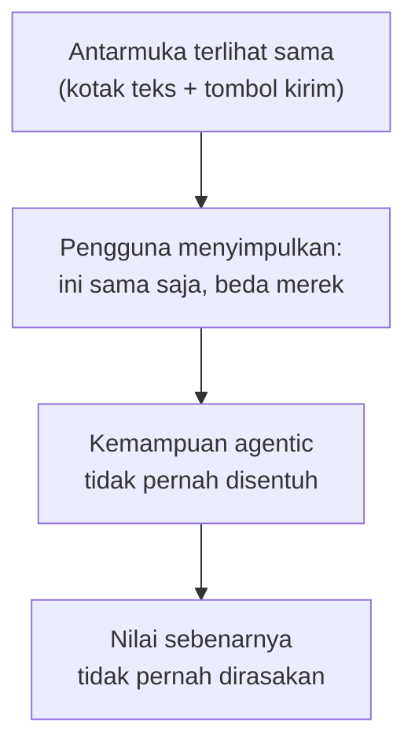
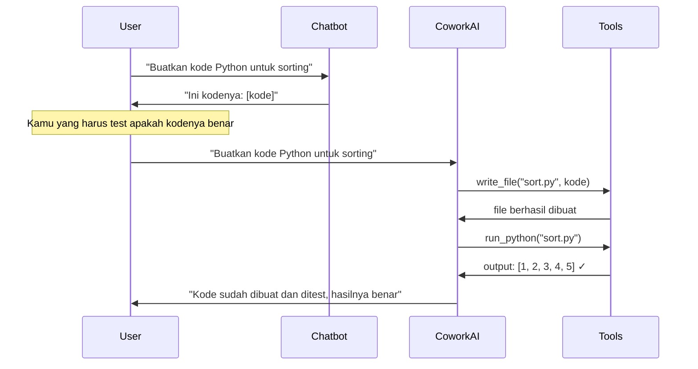
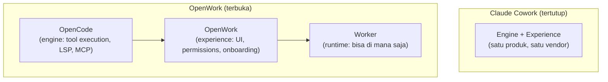

## Masalahnya Bukan di Mereknya

Kalau kamu tanya orang awam apa bedanya ChatGPT dengan Claude Cowork, jawabannya hampir pasti: *"Yang satu dari OpenAI, yang satu dari Anthropic."*

Itu bukan jawaban yang salah. Tapi itu juga bukan jawaban yang benar — karena pertanyaannya sendiri sudah salah bingkai.

Perbedaan yang paling penting antara ChatGPT (chatbot) dan Claude Cowork (AI cowork) bukan soal siapa yang membuatnya. Bukan soal model mana yang lebih pintar. Bukan soal harganya. Perbedaannya ada di **cara kerja yang fundamental** — dan cara kerja itu menentukan apa yang bisa dan tidak bisa kamu lakukan dengannya.

Tapi karena antarmukanya terlihat mirip — kotak teks, tombol kirim, respons yang muncul — orang cenderung menyimpulkan bahwa keduanya adalah hal yang sama, hanya dengan nama berbeda.

Ini adalah kesalahpahaman yang mahal.

---

## Bagaimana Narasi Dibangun

Sebelum masuk ke teknis, ada sesuatu yang perlu kita akui: **narasi produk AI sengaja dibangun untuk menyederhanakan**.

Ketika Anthropic meluncurkan Claude Cowork pada Januari 2025, mereka tidak mempromosikannya sebagai *"agentic AI framework dengan tool execution loop"*. Mereka mempromosikannya sebagai *"asisten yang bisa bekerja bersamamu"*. Kata "cowork" dipilih dengan sangat hati-hati — ia membangkitkan gambaran kolaborasi, bukan gambaran program yang mengeksekusi perintah di komputermu.

Ini bukan kebohongan. Tapi ini adalah framing yang sangat strategis.

Hasilnya: jutaan orang menggunakan Claude Cowork dengan cara yang sama seperti mereka menggunakan ChatGPT biasa — tanya-jawab, minta saran, minta tulisan. Mereka tidak pernah menyentuh kemampuan agentic-nya. Mereka membayar lebih mahal untuk sesuatu yang mereka gunakan dengan cara yang lebih murah.



---

## Apa yang Sebenarnya Berbeda

Mari kita bedah dari cara kerjanya, bukan dari brandingnya.

**Chatbot** — ChatGPT standar, Gemini, Claude tanpa mode agentic — bekerja dalam satu siklus sederhana:

```
Input teks → Model memproses → Output teks
```

Tidak ada aksi di luar itu. Model tidak bisa membuka file di komputermu. Tidak bisa menjalankan perintah. Tidak bisa mengecek apakah jawabannya benar dengan menjalankan kodenya. Semua yang ia lakukan adalah menghasilkan teks.

**AI Cowork** — Claude Cowork, ChatGPT Agent, dan padanan open source-nya — bekerja dalam siklus yang berbeda:

```
Input teks → Model merencanakan → Model mengeksekusi tool → 
Hasil tool dikembalikan ke model → Model merencanakan lagi → 
... (berulang sampai tujuan tercapai) → Output final
```

Perbedaannya bukan di kualitas teksnya. Perbedaannya ada di **loop eksekusi** — kemampuan untuk mengambil aksi nyata, mendapat feedback dari aksi itu, dan menyesuaikan rencana berdasarkan feedback tersebut.



---

## Mengapa Ini Penting Secara Bisnis

Perbedaan cara kerja ini punya implikasi bisnis yang sangat konkret.

Dengan chatbot, **kamu adalah eksekutornya**. AI memberikan instruksi, kamu yang menjalankan. Ini berarti setiap saran AI masih membutuhkan waktu dan energimu untuk dieksekusi. Kalau AI salah, kamu yang menemukan kesalahannya — setelah kamu sudah menghabiskan waktu untuk mengeksekusi.

Dengan AI cowork, **AI adalah eksekutornya**. Kamu memberikan tujuan, AI yang merencanakan dan menjalankan. Kalau AI salah di tengah jalan, ia bisa mendeteksi sendiri (melalui error message, test failure, atau LSP diagnostics) dan memperbaiki tanpa perlu kamu intervensi.

Ini bukan perbedaan kenyamanan. Ini perbedaan **leverage** — seberapa banyak output yang bisa kamu hasilkan per unit waktu yang kamu investasikan.

---

## OpenWork: Ketika Visi Ini Dibuat Terbuka

Di sinilah OpenWork masuk dengan cara yang menarik.

OpenWork bukan sekadar "alternatif open source Claude Cowork". Kalau kamu baca [VISION.md](https://github.com/different-ai/openwork/blob/dev/VISION.md)-nya secara langsung, ada satu kalimat yang sangat jelas:

> *"OpenCode is the engine. OpenWork is the experience: onboarding, safety, permissions, progress, artifacts, and a premium-feeling UI."*

Ini adalah arsitektur yang sangat berbeda dari Claude Cowork. Claude Cowork adalah produk monolitik — engine dan experience digabung, dikontrol sepenuhnya oleh Anthropic. OpenWork memisahkan keduanya secara eksplisit.



Pemisahan ini punya konsekuensi yang sangat nyata:

- Kamu bisa ganti engine-nya (pakai model LLM apapun)
- Kamu bisa ganti experience-nya (bangun UI sendiri di atas OpenCode API)
- Kamu bisa kontrol di mana worker berjalan (lokal, cloud, atau infrastruktur perusahaanmu)

Ini adalah perbedaan antara **menyewa apartemen** dan **memiliki tanah** — secara fungsional terlihat mirip, tapi secara kontrol sangat berbeda.

---

## Ekosistem yang Tumbuh di Bawah Permukaan

Salah satu hal yang paling menarik dari OpenCode adalah ekosistem plugin yang tumbuh di sekitarnya. Dari [halaman ekosistem resminya](https://opencode.ai/docs/ecosystem), ada puluhan plugin komunitas yang menambahkan kemampuan yang tidak ada di produk tertutup manapun:

- `opencode-vibeguard` — menyensor secrets dan PII sebelum dikirim ke LLM, lalu restore secara lokal
- `opencode-dynamic-context-pruning` — mengoptimalkan penggunaan token dengan membuang output tool yang sudah tidak relevan
- `opencode-pty` — memungkinkan agent menjalankan proses background dan berinteraksi dengan mereka secara interaktif
- `opencode-type-inject` — auto-inject TypeScript/Svelte types ke dalam file reads

Tidak ada satupun dari ini yang bisa kamu lakukan di Claude Cowork atau ChatGPT Agent — karena keduanya tidak mengekspos API yang memungkinkan ekstensi semacam ini.

---

## Persepsi yang Perlu Dikoreksi

Ada beberapa kesalahpahaman yang sangat umum yang perlu diluruskan:

**"Claude Cowork lebih pintar dari ChatGPT Agent"** — ini membandingkan hal yang berbeda dimensi. Kalau yang dimaksud adalah "kecerdasan dasar", maka yang perlu dibandingkan adalah modelnya — Claude 3.5 Sonnet vs GPT-4o, misalnya. Dan bahkan itu pun bukan soal "kecerdasan" dalam arti manusia, melainkan soal kapasitas model dan bagaimana ia di-tune untuk memahami konteks dari token-token yang masuk. Sedangkan Claude Cowork vs ChatGPT Agent adalah perbandingan di layer yang sama sekali berbeda — layer tooling, layer perkakas yang bersinggungan langsung dengan dunia nyata. Dua hal ini tidak bisa disamakan dalam satu kalimat perbandingan.

**"OpenWork gratis, Claude Cowork berbayar, jadi OpenWork lebih baik"** — gratis bukan berarti lebih baik. OpenWork membutuhkan setup, pemeliharaan, dan pemahaman teknis. Untuk pengguna non-teknis, Claude Cowork mungkin tetap pilihan yang lebih tepat.

**"Semua AI cowork pada dasarnya sama"** — tidak. Perbedaan antara tool yang terintegrasi LSP (seperti OpenCode) dan yang tidak bisa sangat signifikan untuk pekerjaan coding. LSP integration berarti agent mendapat feedback langsung dari compiler — ini mengubah kualitas output secara fundamental.

---

## Cara Membaca Produk AI dengan Lebih Kritis

Lain kali kamu melihat produk AI baru, ada beberapa pertanyaan yang lebih berguna dari sekadar "ini dari siapa?":

**Apakah ini chatbot atau agent?** — apakah AI hanya menghasilkan teks, atau ia bisa mengeksekusi aksi?

**Kalau agent, tool apa yang bisa ia gunakan?** — file system? Terminal? Browser? API eksternal? Semakin banyak tool, semakin besar leverage-nya.

**Apakah ada feedback loop?** — apakah agent bisa mendeteksi kesalahannya sendiri (melalui error, test, atau LSP) dan memperbaiki tanpa intervensi?

**Seberapa terbuka arsitekturnya?** — apakah kamu bisa menambahkan tool baru? Ganti model? Kontrol di mana ia berjalan?

**Siapa yang mengontrol datamu?** — apakah semua yang kamu kirim melewati server vendor, atau bisa berjalan sepenuhnya lokal?

---

## Penutup: Membaca Lebih Dalam dari Teks di Layar

Kesalahpahaman tentang AI cowork bukan karena orang tidak cukup pintar. Kesalahpahaman itu terjadi karena antarmuka yang dirancang untuk menyembunyikan kompleksitas — dan karena narasi pemasaran yang lebih tertarik pada adopsi massal daripada pemahaman mendalam.

Tapi kalau kamu developer, kalau kamu orang teknis, kalau kamu peduli dengan kontrol atas alat yang kamu gunakan — membaca lebih dalam dari teks yang tampil di layar adalah keterampilan yang sangat berharga.

OpenWork, OpenCode, dan ekosistem di sekitarnya bukan hanya alternatif yang lebih murah. Mereka adalah cara yang berbeda untuk berpikir tentang hubungan antara manusia, AI, dan mesin — hubungan di mana kamu yang memegang kendali, bukan vendor.

---

**Referensi:**
- [OpenWork VISION.md](https://github.com/different-ai/openwork/blob/dev/VISION.md)
- [OpenCode Ecosystem](https://opencode.ai/docs/ecosystem)
- [OpenWork](https://github.com/different-ai/openwork)
- [OpenCode](https://github.com/anomalyco/opencode)
