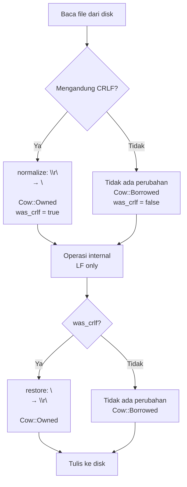

Dua byte. `0x0D` dan `0x0A`. Warisan dari mesin tik tahun 1960-an yang masih menyebabkan bug di AI agent tahun 2026 — termasuk di dalam Kiro CLI yang sedang saya kerjakan.

---

## Asal Usul: Mesin Tik, Teletype, dan Warisan yang Tidak Mau Pergi

Untuk memahami kenapa masalah ini masih ada di 2026, kita perlu mundur ke era sebelum komputer personal.

Pada era mesin tik dan teletype, ada dua operasi fisik yang berbeda untuk pindah ke baris baru. Carriage Return (CR) menggerakkan kepala cetak kembali ke posisi paling kiri — operasi mekanis yang butuh waktu. Line Feed (LF) menggulung kertas satu baris ke atas. Kedua operasi ini harus dilakukan berurutan untuk memulai baris baru, dan dari situlah `CR+LF` lahir sebagai standar de facto.

Ketika komputer mulai menggunakan terminal berbasis teletype (seperti ASR-33), konvensi ini ikut terbawa. MS-DOS, yang lahir dari ekosistem ini, mengadopsi `\r\n` sebagai line ending standar. Windows mewarisi keputusan itu, dan sampai hari ini, Notepad (sebelum update 2018) tidak bisa membaca file Unix dengan benar.

Unix memutuskan untuk menyederhanakan. Satu karakter sudah cukup: `\n` (LF). Tidak ada alasan teknis untuk mempertahankan `\r` di era software. Keputusan ini lebih bersih, dan seluruh ekosistem Unix/Linux/macOS mengikutinya.

Hasilnya: dua dunia yang tidak kompatibel, dipisahkan oleh satu byte.

---

## Representasi Byte: Apa yang Sebenarnya Tersimpan di Memory

Mari kita konkret. String `"hello\nworld"` di Unix tersimpan di memory seperti ini:

```
68 65 6C 6C 6F 0A 77 6F 72 6C 64
h  e  l  l  o  \n w  o  r  l  d
```

File yang sama dibuat di Windows:

```
68 65 6C 6C 6F 0D 0A 77 6F 72 6C 64
h  e  l  l  o  \r \n w  o  r  l  d
```

Satu byte ekstra: `0x0D`. Tidak terlihat di text editor. Tidak terlihat di `cat`. Tapi ada di sana, diam-diam, menunggu untuk merusak asumsi kode kita.

Di Rust, kita bisa memverifikasi ini langsung:

```rust
let unix_line = "hello\nworld";
let windows_line = "hello\r\nworld";

println!("{:?}", unix_line.as_bytes());
// [104, 101, 108, 108, 111, 10, 119, 111, 114, 108, 100]

println!("{:?}", windows_line.as_bytes());
// [104, 101, 108, 108, 111, 13, 10, 119, 111, 114, 108, 100]
//                                    ^^
//                                    0x0D — si pengganggu
```

`\r` adalah byte `13` (desimal) atau `0x0D` (hex). `\n` adalah byte `10` atau `0x0A`. Keduanya adalah control characters — tidak punya representasi visual, tapi punya efek nyata pada parsing.

---

## Bug Nyata: Kiro CLI dan Kasus `\r` yang Tersembunyi

Ini bukan skenario hipotetis. Bug ini saya temukan langsung saat mengerjakan fitur di Kiro CLI — sebuah AI coding agent yang bekerja dengan file kode pengguna.

### Konteks

Kiro CLI perlu membaca file, memahami kontennya, lalu melakukan operasi seperti mencari baris tertentu, menghitung offset byte, dan menerapkan patch. Semua operasi ini bergantung pada asumsi bahwa struktur baris konsisten.

### Skenario Bug

Bayangkan file `main.rs` yang dibuat di Windows, atau di-clone dari repo dengan `core.autocrlf=true`. File ini menggunakan `\r\n` sebagai line ending.

Kode yang terlihat benar:

```rust
let content = std::fs::read_to_string("main.rs").unwrap();
let lines: Vec<&str> = content.split('\n').collect();

for (i, line) in lines.iter().enumerate() {
    println!("Line {}: '{}' (len={})", i, line.trim(), line.len());
}
```

Untuk baris `fn main() {`, kita mengharapkan output:

```
Line 3: 'fn main() {' (len=12)
```

Yang sebenarnya kita dapat:

```
Line 3: 'fn main() {' (len=13)
```

`trim()` memang menghapus `\r` dari tampilan, tapi `line.len()` menghitung panjang sebelum trim. Baris yang terlihat 12 karakter sebenarnya 13 byte di memory.

### Kenapa Ini Berbahaya

Masalah ini menjadi kritis saat menghitung byte offset untuk operasi patch. Misalnya:

```rust
// Menghitung offset byte dari baris ke-N
fn byte_offset_of_line(content: &str, line_number: usize) -> usize {
    content
        .split('\n')
        .take(line_number)
        .map(|line| line.len() + 1) // +1 untuk '\n'
        .sum()
}
```

Jika `content` mengandung `\r\n`, setiap baris terhitung 1 byte lebih panjang dari yang seharusnya. Setelah 100 baris, offset sudah meleset 100 byte. Patch yang diterapkan akan mengenai lokasi yang salah — tidak ada error, tidak ada panic, tapi hasilnya salah. Inilah yang disebut silent data corruption.

### Kasus Fuzzy Matching

Bug ini semakin parah di konteks fuzzy matching. Saat Kiro CLI mencoba mencocokkan potongan kode dari AI response dengan konten file aktual, perbandingan string seperti ini akan gagal:

```rust
// AI response menggunakan LF, file menggunakan CRLF
let from_ai = "fn main() {\n    println!(\"hello\");\n}";
let from_file = "fn main() {\r\n    println!(\"hello\");\r\n}";

assert_eq!(from_ai, from_file); // GAGAL — meski "terlihat sama"
```

Fuzzy matching yang tidak menormalisasi line ending akan melaporkan similarity score rendah untuk dua string yang secara semantik identik. AI agent kemudian bingung, mencoba strategi lain, dan akhirnya gagal menerapkan perubahan.

---

## Solusi: Normalisasi di Boundary

Pendekatan yang benar bukan menyebar pengecekan `\r` di seluruh codebase — itu resep untuk bug yang terlewat. Pendekatan yang benar adalah normalisasi di boundary: tepat saat data masuk ke sistem.

### Fungsi Normalisasi dengan `Cow<str>`

```rust
fn normalize_line_endings(s: &str) -> (std::borrow::Cow<str>, bool) {
    if s.contains("\r\n") {
        (s.replace("\r\n", "\n").into(), true)
    } else {
        (s.into(), false)
    }
}
```

Fungsi ini mengembalikan tuple: string yang sudah dinormalisasi, dan flag boolean yang menandakan apakah normalisasi terjadi. Flag ini penting untuk langkah restore nanti.

### Kenapa `Cow<str>` dan Bukan `String`?

`Cow<str>` adalah singkatan dari Clone-on-Write, sebuah enum di Rust standard library:

```rust
pub enum Cow<'a, B: ?Sized + 'a> {
    Borrowed(&'a B),
    Owned(<B as ToOwned>::Owned),
}
```

Untuk kasus ini, `Cow<str>` bisa berupa `Cow::Borrowed(&str)` — referensi ke string asli tanpa alokasi baru — atau `Cow::Owned(String)` — string baru yang dialokasikan di heap.

Pertimbangkan skenario nyata: dari 1000 file yang diproses Kiro CLI, mungkin hanya 50 yang berasal dari Windows dan mengandung `\r\n`. Jika kita selalu mengembalikan `String`, kita melakukan 1000 alokasi heap. Dengan `Cow<str>`, hanya 50 alokasi yang terjadi — untuk file yang memang perlu dimodifikasi.

```rust
// Tanpa Cow: selalu alokasi
fn normalize_always_alloc(s: &str) -> String {
    s.replace("\r\n", "\n") // alokasi baru meski tidak ada \r\n
}

// Dengan Cow: zero-copy jika tidak perlu
fn normalize_line_endings(s: &str) -> (std::borrow::Cow<str>, bool) {
    if s.contains("\r\n") {
        (s.replace("\r\n", "\n").into(), true) // Cow::Owned — alokasi
    } else {
        (s.into(), false)                       // Cow::Borrowed — zero-copy
    }
}
```

Untuk file besar (ratusan KB), perbedaan ini signifikan. Zero-copy bukan sekadar optimasi — ini adalah cara berpikir yang benar tentang ownership data.

### Pattern Restore Line Endings

Setelah melakukan operasi pada string yang sudah dinormalisasi, kita mungkin perlu mengembalikan line ending ke format aslinya sebelum menulis kembali ke file. Ini penting untuk menghormati konvensi proyek pengguna.

```rust
fn restore_line_endings<'a>(s: &'a str, was_crlf: bool) -> std::borrow::Cow<'a, str> {
    if was_crlf {
        s.replace('\n', "\r\n").into() // Cow::Owned
    } else {
        s.into() // Cow::Borrowed
    }
}
```

Penggunaan lengkapnya:

```rust
fn process_file(path: &str) -> std::io::Result<()> {
    let raw = std::fs::read_to_string(path)?;

    // 1. Normalisasi di boundary masuk
    let (normalized, was_crlf) = normalize_line_endings(&raw);

    // 2. Semua operasi internal menggunakan LF saja
    let patched = apply_patch(&normalized);

    // 3. Restore sebelum menulis kembali
    let output = restore_line_endings(&patched, was_crlf);

    std::fs::write(path, output.as_bytes())
}
```

Logika internal (`apply_patch`) tidak perlu tahu apa-apa tentang CRLF. Ia hanya berurusan dengan LF. Kompleksitas dikurung di dua titik: masuk dan keluar.

---

## Alur Normalisasi: Diagram



Pola ini adalah bracket pattern: normalisasi di awal, restore di akhir, logika bersih di tengah. Tidak ada kebocoran asumsi tentang format line ending ke dalam logika bisnis.

---

## Kasus Edge yang Perlu Diperhatikan

### Mixed Line Endings

File dengan campuran `\r\n` dan `\n` memang ada — biasanya hasil merge yang buruk atau editor yang tidak konsisten. Fungsi `normalize_line_endings` di atas menangani ini dengan benar karena `replace("\r\n", "\n")` hanya mengganti pasangan `\r\n`, tidak menyentuh `\n` yang berdiri sendiri.

### `\r` Tanpa `\n`

Format lama macOS (sebelum OS X) menggunakan `\r` saja sebagai line ending. Ini sangat jarang ditemui di 2026, tapi untuk file legacy, perlu penanganan tambahan:

```rust
fn normalize_all_line_endings(s: &str) -> std::borrow::Cow<str> {
    if s.contains('\r') {
        // Tangani \r\n dulu, lalu \r yang tersisa
        s.replace("\r\n", "\n").replace('\r', "\n").into()
    } else {
        s.into()
    }
}
```

### Git dan `core.autocrlf`

Git punya mekanisme konversi line ending otomatis via `core.autocrlf`. Di Windows, setting `true` akan mengkonversi LF ke CRLF saat checkout dan sebaliknya saat commit. Artinya file di working directory Windows bisa berbeda byte-per-byte dengan file di repository, meski konten "sama".

Untuk tool yang bekerja dengan file di working directory seperti Kiro CLI, kita tidak bisa berasumsi bahwa file sudah dalam format LF hanya karena repository menggunakan LF. Normalisasi tetap diperlukan.

---

## Pelajaran: Normalize di Boundary, Bukan di Dalam Logic

Ini adalah prinsip yang lebih luas dari sekadar line ending.

Setiap kali data masuk ke sistem dari sumber eksternal — file, network, user input — ada kemungkinan data itu tidak dalam format yang kita asumsikan. Ada dua pilihan: defensive coding di setiap titik (cek `\r` di setiap fungsi yang memproses string), atau normalisasi di boundary (satu titik masuk, satu titik keluar). Pilihan pertama menyebar kompleksitas, mudah terlewat, dan sulit di-test. Pilihan kedua membuat logika internal bekerja dengan asumsi yang konsisten.

Ini bukan hanya soal kebersihan kode — ini adalah cara berpikir yang benar tentang data contracts. Fungsi internal punya kontrak: "saya menerima string dengan LF". Siapa yang bertanggung jawab memenuhi kontrak itu? Boundary layer, bukan setiap fungsi di dalam.

Analoginya seperti sanitasi input di web application. Kita tidak meng-escape HTML di setiap fungsi yang menyentuh user input. Kita melakukannya di satu tempat — saat data masuk atau saat data di-render. Prinsipnya sama.

---

## Kesimpulan

Bug ini berbahaya bukan karena sulit diperbaiki — solusinya sederhana. Bug ini berbahaya karena tidak terlihat. String terlihat sama di layar. Test mungkin lolos karena test environment menggunakan Unix. Bug baru muncul di production ketika pengguna Windows mengupload file mereka.

Tiga hal yang perlu diingat: pahami representasi byte (`\r\n` adalah dua karakter, bukan satu), gunakan `Cow<str>` untuk normalisasi yang efisien, dan normalisasi di boundary — bukan di dalam logic.

Kode yang benar bukan kode yang menangani semua kasus di setiap fungsi. Kode yang benar adalah kode yang tahu di mana harus menetapkan asumsi, dan menjaga asumsi itu konsisten dari awal sampai akhir.

---

*Bug ini ditemukan dan diperbaiki saat mengerjakan fitur fuzzy matching di Kiro CLI. Jika kamu mengerjakan tool yang memproses file dari berbagai platform, periksa asumsi line ending kamu sekarang — sebelum pengguna yang menemukannya.*
