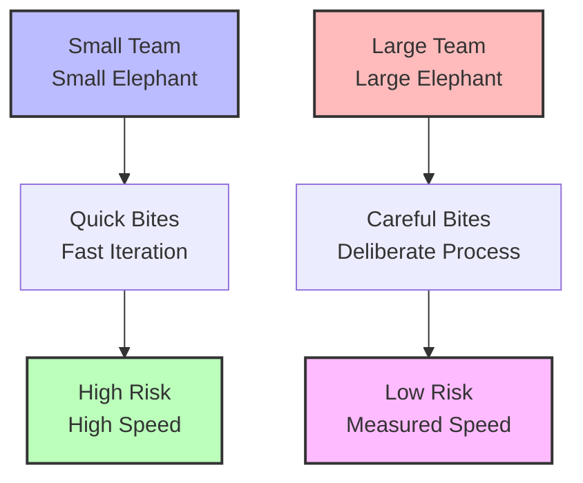
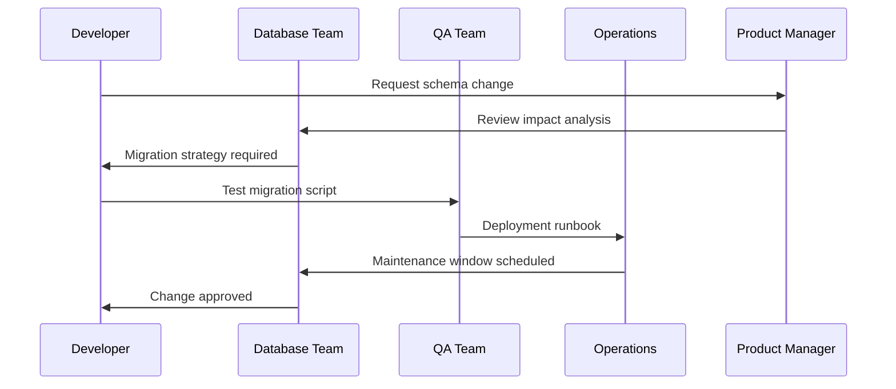
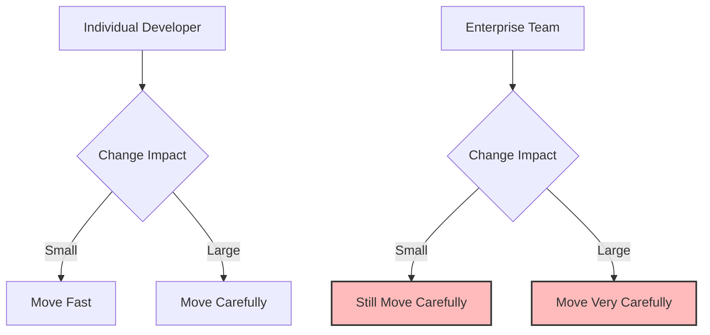
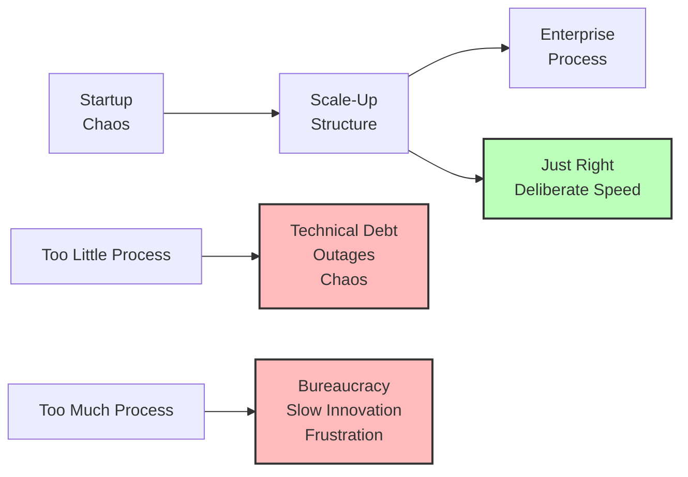
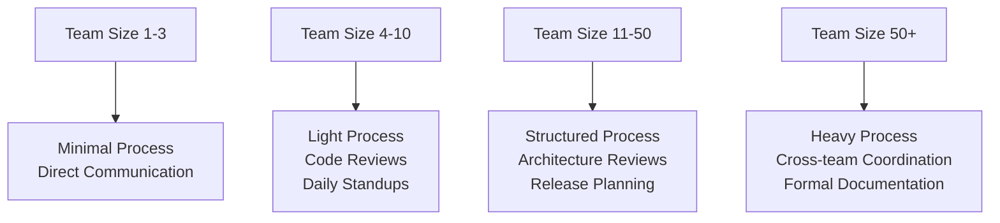

## The Frustration: Why Does Everything Take Forever at Big Companies?

You've probably experienced this: A simple feature that takes 2 hours to code somehow requires 2 weeks to deploy at a large company. Meetings about meetings. Approval chains longer than a CVS receipt. Process documentation that needs its own documentation.

**Your first instinct?** "This is bureaucratic nonsense! Small startups move so much faster!"

**But here's the thing:** You're witnessing the Enterprise Elephant Theory in action, and it's actually more intelligent than you think.

## The Enterprise Elephant Theory Explained

Remember the classic question: **"How do you eat an elephant?"**

The answer: **"One bite at a time."**

But here's my extension - **The Enterprise Elephant Theory:**

> "The bigger the elephant, the more careful each bite needs to be. And the more people eating, the more coordination each bite requires."

In software development terms:



## The Mathematics of Scale

Let's break down why enterprise processes exist using actual numbers:

### Startup (5 developers):

```
Communication paths = n(n-1)/2 = 5(4)/2 = 10 paths
Deployment risk = Low (affects few users)
Rollback complexity = Simple (one person can fix)
Decision makers = 1-2 people
```

### Enterprise (500 developers):

```
Communication paths = 500(499)/2 = 124,750 paths
Deployment risk = High (affects millions)
Rollback complexity = Extreme (multiple teams affected)
Decision makers = 10-50 people across departments
```

**The scaling problem isn't linear - it's exponential.**

## Real-World Enterprise Elephant Examples

### Example 1: The "Simple" Database Schema Change

**Startup approach:**

```sql
-- Just do it
ALTER TABLE users ADD COLUMN preferences JSON;
```

**Enterprise approach:**



**Why the complexity?**

- **Millions of records** - Migration takes hours
- **24/7 uptime requirement** - Zero downtime deployment needed
- **Multiple applications** - 15 services depend on this table
- **Compliance requirements** - Data changes need audit trails
- **International teams** - Coordination across time zones

### Example 2: The Git Commit That Broke Everything

**What happened:**
A developer at a Fortune 500 company made a "quick fix" commit that mixed:

- Critical security patch
- New feature code
- Experimental refactoring
- Debug logging changes

**The disaster:**

```bash
# When they needed to rollback the security issue
git revert abc123

# They also reverted:
# ❌ The new feature (customer demo failed)
# ❌ Performance improvements (site slowed down)
# ❌ Bug fixes (old issues returned)
```

**Cost:** $2.3M in lost revenue, 48 hours of emergency fixes, and a very uncomfortable board meeting.

**The lesson:** In enterprise environments, **atomic commits aren't just best practice - they're financial necessity.**

## The Psychology Behind Enterprise Inertia

### Why Smart People Create "Slow" Processes

It's not stupidity - it's **risk management at scale**:



**The Enterprise Mindset:**

- **"What if this breaks?"** becomes more important than **"How fast can we ship?"**
- **"Who else is affected?"** becomes a critical question
- **"Can we rollback safely?"** determines deployment strategy

### The Coordination Tax

Every additional team member adds **coordination overhead**:

```
Team Size 1: 100% coding time
Team Size 5: 80% coding, 20% coordination
Team Size 50: 60% coding, 40% coordination
Team Size 500: 40% coding, 60% coordination
```

**This isn't inefficiency - it's physics.** You can't have 500 people working on the same codebase without massive coordination.

## When the Elephant Theory Breaks Down

### Anti-Pattern 1: Process for Process' Sake

```
❌ Bad: "We need approval for changing a comment"
✅ Good: "We need approval for database schema changes"
```

### Anti-Pattern 2: Fear-Driven Development

```
❌ Bad: "Never change anything because it might break"
✅ Good: "Change carefully with proper safeguards"
```

### Anti-Pattern 3: Committee-Driven Architecture

```
❌ Bad: "Let's have 20 people design this API"
✅ Good: "Let's have 2 experts design, 20 people review"
```

## The Startup vs Enterprise Spectrum

### Startup Advantages (Small Elephant)

- **Speed** - Deploy 10x per day
- **Flexibility** - Pivot quickly
- **Innovation** - Try crazy ideas
- **Direct communication** - No telephone game

### Enterprise Advantages (Large Elephant)

- **Stability** - 99.99% uptime
- **Scale** - Handle millions of users
- **Resources** - Dedicated teams for everything
- **Expertise** - Deep domain knowledge

### The Sweet Spot: Scale-Appropriate Processes



## Practical Applications of Elephant Theory

### For Individual Developers

**When working in enterprise environments:**

1. **Embrace atomic commits** - Your future self will thank you
2. **Write detailed PR descriptions** - Help reviewers understand context
3. **Think about rollback scenarios** - What happens if this breaks?
4. **Document your decisions** - Why did you choose this approach?

```bash
# Enterprise-friendly commit style
git commit -m "feat(auth): add OAuth2 integration for SSO

- Implements RFC 6749 OAuth2 authorization code flow
- Adds JWT token validation middleware
- Includes comprehensive error handling
- Maintains backward compatibility with existing auth

Resolves: JIRA-1234
Tested: Unit tests + integration tests pass
Rollback: Feature flag AUTH_OAUTH2_ENABLED controls activation"
```

### For Team Leads

**Scaling team processes:**



### For Architects

**Design for your elephant size:**

**Small Elephant (Startup):**

```javascript
// Move fast, optimize later
const result = await quickAndDirtyAPI(data);
```

**Large Elephant (Enterprise):**

```javascript
// Defensive programming
try {
  const validatedData = await validateInput(data);
  const result = await robustAPI(validatedData);
  await auditLog("API_CALL", { user, action, result });
  return result;
} catch (error) {
  await errorReporting.capture(error);
  throw new APIError("Service temporarily unavailable");
}
```

## The Future: Intelligent Elephants

### Modern Tools That Help Large Teams Move Faster

**Infrastructure as Code:**

```yaml
# Terraform makes infrastructure changes reviewable
resource "aws_instance" "web" {
ami           = "ami-12345678"
instance_type = "t3.micro"

tags = {
Name = "WebServer"
Team = "Platform"
Environment = "Production"
}
}
```

**Feature Flags:**

```javascript
// Deploy code without activating features
if (featureFlag.isEnabled("NEW_CHECKOUT_FLOW")) {
  return newCheckoutProcess();
}
return legacyCheckoutProcess();
```

**Automated Testing:**

```bash
# Confidence through automation
npm run test:unit
npm run test:integration
npm run test:e2e
npm run security:scan
npm run performance:test
```

### The Intelligent Enterprise

Smart companies are finding ways to **maintain elephant-sized stability** while achieving **startup-like speed**:

- **Microservices** - Small teams own small services
- **DevOps culture** - Developers own their deployments
- **Automated everything** - Reduce human coordination overhead
- **Clear ownership** - Eliminate committee decision-making

## Key Insights for Modern Developers

### 1. Process Isn't the Enemy - Bad Process Is

**Good process:**

- Prevents disasters
- Enables faster recovery
- Scales team effectiveness
- Reduces cognitive load

**Bad process:**

- Exists for its own sake
- Slows everything down
- Creates bureaucracy
- Frustrates everyone

### 2. Your Role in the Elephant

Whether you're at a startup or enterprise, ask yourself:

- **"What size elephant am I working with?"**
- **"Are our processes appropriate for our scale?"**
- **"How can I help us move more deliberately?"**
- **"What would happen if this change broke?"**

### 3. The Career Perspective

**Early career:** Learn to move fast and break things
**Mid career:** Learn when to move fast vs. when to be careful
**Senior career:** Help others understand the appropriate speed for the situation

## The Philosophical Conclusion

The Enterprise Elephant Theory isn't about accepting slow, bureaucratic processes. It's about understanding that **different scales require different approaches**.

A Formula 1 race car and a cargo ship are both vehicles, but they're optimized for completely different purposes. Similarly:

- **Startups are Formula 1 cars** - Built for speed and agility
- **Enterprises are cargo ships** - Built for stability and capacity

**The mistake is trying to make a cargo ship race like a Formula 1 car, or expecting a race car to carry 10,000 containers.**

## Actionable Takeaways

### For Startup Developers Moving to Enterprise:

1. **Embrace the process** - It exists for good reasons
2. **Think about scale** - Your changes affect more people
3. **Document everything** - Future you will be grateful
4. **Ask "what if this breaks?"** before every change

### For Enterprise Developers:

1. **Question unnecessary process** - Not all elephants need the same care
2. **Automate coordination** - Reduce human overhead where possible
3. **Push for atomic changes** - Make rollbacks surgical
4. **Advocate for appropriate tooling** - Help your elephant move smarter

### For Everyone:

1. **Match your process to your scale**
2. **Understand the coordination tax**
3. **Optimize for your actual constraints**
4. **Remember: Deliberate ≠ Slow**

---

**The next time someone complains about "enterprise bureaucracy," share the Elephant Theory with them. Sometimes what looks like inefficiency is actually intelligence at scale.**

_What's your experience with enterprise vs. startup development? Have you seen the Elephant Theory in action? Share your stories - I'd love to hear how different organizations handle their elephants._

_Follow [@sandikodev](https://twitter.com/sandikodev) for more development philosophy and practical insights that bridge the gap between theory and reality._
