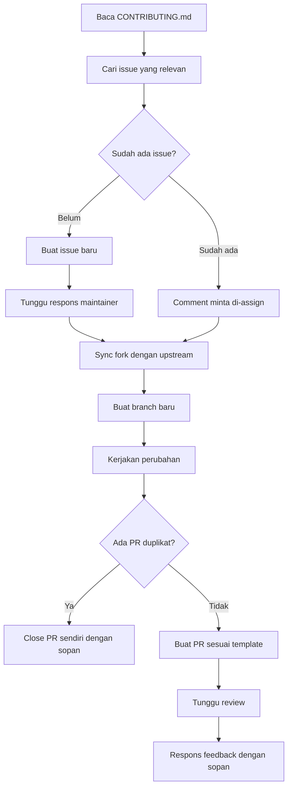

## Latar Belakang: Kontribusi Pertama yang Tidak Semulus Dugaan

Hari ini saya mencoba berkontribusi ke [OpenCode](https://github.com/anomalyco/opencode) — sebuah proyek open source AI coding agent yang cukup aktif dengan ribuan pull request masuk setiap bulannya. Kontribusi pertama saya sederhana: menambahkan terjemahan README ke Bahasa Indonesia.

Terdengar mudah. Tapi ternyata ada banyak hal yang perlu dipahami sebelum sebuah PR bisa diterima dengan baik. Artikel ini adalah catatan perjalanan itu — sekaligus panduan bagi siapa saja yang baru ingin mulai berkontribusi ke proyek open source.

---

## Mengapa Etika Itu Penting di Open Source?

Proyek open source yang besar seperti OpenCode bisa menerima ribuan pull request. Para maintainer — orang-orang yang menjaga kualitas kode — bekerja sukarela atau dengan waktu terbatas. Setiap PR yang masuk adalah beban review bagi mereka.

Karena itu, ada norma tidak tertulis (dan kadang tertulis) yang perlu diikuti: **jangan buang waktu maintainer**. Kontribusi yang baik bukan hanya soal kode yang benar, tapi juga soal cara kamu menyampaikannya.

> [!NOTE]
> Proyek OpenCode memiliki bot otomatis yang akan menutup PR dalam 2 jam jika tidak mengikuti template. Ini bukan kejam — ini cara mereka menjaga kualitas dari ribuan kontribusi yang masuk.

---

## Alur yang Benar Sebelum Mulai

### 1. Baca CONTRIBUTING.md Terlebih Dahulu

Hampir semua proyek open source punya file `CONTRIBUTING.md`. Ini adalah "peraturan rumah" yang wajib dibaca sebelum melakukan apapun. Di OpenCode misalnya, ada aturan seperti:

- Semua PR harus merujuk ke issue yang sudah ada
- Deskripsi PR tidak boleh panjang dan terkesan di-generate AI
- Judul PR harus mengikuti format _conventional commit_ (`feat:`, `fix:`, `docs:`, dll)
- Ada template PR yang wajib diisi

> [!WARNING]
> Kalau kamu langsung bikin PR tanpa membaca CONTRIBUTING.md, kemungkinan besar PR kamu akan ditolak otomatis oleh bot dalam hitungan menit. Ini yang terjadi pada saya di percobaan pertama.

<details>
<summary>📋 Contoh template PR yang wajib diikuti di OpenCode</summary>

```markdown
### Issue for this PR

Closes #

### Type of change

- [ ] Bug fix
- [ ] New feature
- [ ] Refactor / code improvement
- [ ] Documentation

### What does this PR do?

Please provide a description of the issue, the changes you made to fix it,
and why they work.

### How did you verify your code works?

### Screenshots / recordings

### Checklist

- [ ] I have tested my changes locally
- [ ] I have not included unrelated changes in this PR
```

Perhatikan catatan di template aslinya: **"If you paste a large clearly AI generated description here your PR may be IGNORED or CLOSED!"**

</details>

### 2. Cek Apakah Kontribusimu Sudah Ada

Ini pelajaran paling mahal yang saya pelajari hari ini.

Saya membuat PR untuk menambahkan README Bahasa Indonesia. Ternyata sudah ada dua PR lain dengan tujuan yang sama — salah satunya bahkan lebih lengkap karena mengupdate link di semua file README, bukan hanya satu.

Sebelum mulai mengerjakan apapun, **selalu search dulu** di tab Issues dan Pull Requests:

```
is:open README Indonesia
is:open Indonesian translation
```

> [!CAUTION]
> Membuat PR duplikat bukan hanya membuang waktu kamu, tapi juga membuang waktu maintainer yang harus membaca dan menutupnya. Di komunitas open source, ini dianggap tidak sopan.

### 3. Claim Issue Sebelum Mulai Coding

Di dunia open source, "claim issue" artinya memberitahu orang lain bahwa kamu yang akan mengerjakan sebuah tugas.

Bayangkan papan tugas di kantor. Kalau kamu mau mengerjakan salah satu tugas, kamu bilang dulu ke atasan supaya tidak ada dua orang mengerjakan hal yang sama. Di GitHub, caranya cukup comment di issue:

> "Can I work on this?"

Maintainer akan membalas dan menambahkan namamu sebagai **assignee**. Itu tanda kamu sudah "dapat izin" dan tidak akan bentrok dengan kontributor lain.

> [!TIP]
> Cari issue dengan label [`good first issue`](https://github.com/anomalyco/opencode/issues?q=is%3Aissue+state%3Aopen+label%3A%22good+first+issue%22) atau [`help wanted`](https://github.com/anomalyco/opencode/issues?q=is%3Aissue+state%3Aopen+label%3Ahelp-wanted) untuk kontribusi pertama. Issue-issue ini memang disiapkan untuk kontributor baru.

---

## Sync Fork Sebelum Mulai

Ketika kamu melakukan fork sebuah repo, kamu mendapat salinan kode pada saat itu. Tapi repo aslinya terus berkembang. Kalau kamu langsung coding dari fork yang sudah ketinggalan, PR kamu bisa konflik dengan perubahan terbaru.

Solusinya: selalu sync fork sebelum mulai kerja baru.

```bash
# Tambahkan remote upstream (cukup sekali)
git remote add upstream git@github.com:anomalyco/opencode.git

# Sync setiap kali mau mulai kontribusi baru
git fetch upstream
git checkout dev
git merge upstream/dev
git push origin dev
```

> [!IMPORTANT]
> Perhatikan nama branch default repo yang kamu fork. OpenCode menggunakan `dev`, bukan `main`. Selalu cek `CONTRIBUTING.md` atau `AGENTS.md` untuk mengetahui branch default yang digunakan.

Jadikan ini ritual wajib. Setiap kali mau mulai, sync dulu.

---

## Tentang Deskripsi PR

Ini sering disepelekan tapi sangat penting. Maintainer membaca puluhan PR setiap hari. Deskripsi yang panjang dan terkesan di-generate AI justru membuat mereka malas membaca.

Yang baik adalah deskripsi **singkat, jelas, dan dalam kata-katamu sendiri**. Contoh yang saya gunakan:

```
Adds `README.id.md` — Indonesian (Bahasa Indonesia) translation of the main README.
Also adds the language link in `README.md`.

As an Indonesian developer, I wanted to make OpenCode more accessible
to the Indonesian community. This follows the same pattern as other
language translations already in the repo.
```

> [!TIP]
> Tiga kalimat sudah cukup. Maintainer langsung paham apa yang kamu lakukan dan mengapa. Lebih pendek lebih baik, selama semua informasi penting ada.

---

## Ketika PR Kamu Ternyata Duplikat

Ini yang terjadi pada saya. Setelah PR lolos pengecekan bot, saya menemukan bahwa sudah ada PR lain yang lebih lengkap mengerjakan hal yang sama.

Pilihan yang paling etis: **close PR sendiri** sebelum maintainer yang menutupnya, dan tinggalkan komentar yang sopan:

> Closing in favor of #15912 which covers the same change and has been open longer. Will look for other ways to contribute.

> [!NOTE]
> Ini justru menunjukkan kedewasaan sebagai kontributor. Maintainer akan lebih menghargai sikap ini dibanding mempertahankan PR yang pasti ditolak. Reputasi jangka panjang lebih berharga dari satu PR yang di-merge.

---

## Bonus: Menggunakan GitKraken MCP untuk Otomasi Workflow GitHub

Selama proses kontribusi ini, saya menggunakan **GitKraken MCP** yang terintegrasi dengan Kiro CLI untuk mengotomasi beberapa langkah — seperti mengecek status PR duplikat tanpa harus buka browser.

<details>
<summary>🔧 Apa itu MCP dan GitKraken CLI?</summary>

**MCP (Model Context Protocol)** adalah protokol terbuka yang memungkinkan AI assistant seperti Kiro untuk berkomunikasi dengan tools eksternal secara langsung. Dengan MCP, Kiro bisa mengakses GitHub, membaca PR, bahkan membuat komentar — semua dari dalam sesi chat.

**GitKraken CLI (`gk`)** adalah command-line tool dari GitKraken yang menyediakan MCP server untuk GitHub. Dengan ini, Kiro bisa:

- Mengecek detail PR
- Membaca komentar
- Membuat review
- Mengelola issues

</details>

### Instalasi GitKraken CLI di Linux

```bash
# Download .deb package
wget https://github.com/gitkraken/gk-cli/releases/download/v3.1.54/gk_3.1.54_linux_amd64.deb
sudo apt install ./gk_3.1.54_linux_amd64.deb
```

> [!WARNING]
> Jika setelah instalasi perintah `gk` tidak ditemukan atau malah menjalankan `gitk` (GUI tool yang berbeda), kemungkinan ada alias yang konflik di shell kamu. Cek dengan `which gk` dan `alias | grep gk`.

<details>
<summary>🐛 Troubleshooting: `gk` menjalankan `gitk` bukan GitKraken CLI</summary>

Ini terjadi karena ada alias `gk` yang mengarah ke `gitk` di file konfigurasi shell (`.zshrc`, `.bashrc`, atau `.profile`).

**Solusi:**

```bash
# Cek alias yang ada
alias | grep gk

# Hapus alias sementara
unalias gk

# Atau hapus permanen dari .zshrc/.bashrc
# Cari baris yang berisi alias gk= dan hapus

# Verifikasi binary yang benar
which gk
# Harusnya: /usr/local/bin/gk

# Atau panggil langsung dengan path penuh
/usr/local/bin/gk auth login
```

Jika instalasi via `.deb` tidak menaruh binary di PATH yang benar, download versi `.zip` dan pindahkan manual:

```bash
wget https://github.com/gitkraken/gk-cli/releases/download/v3.1.54/gk_3.1.54_linux_amd64.zip
unzip gk_3.1.54_linux_amd64.zip
sudo mv gk /usr/local/bin/gk
```

</details>

### Login ke GitKraken

```bash
gk auth login
```

Jika kamu menggunakan server tanpa display (headless/SSH), browser tidak akan terbuka otomatis. Gunakan URL yang ditampilkan di terminal:

```
A browser will open with instructions to follow.
If the browser does not open, use this url: https://gitkraken.dev/login?source=gitkraken_cli

Please enter your token code: xxxxxxxx-xxxx-xxxx-xxxx-xxxxxxxxxxxx
```

Buka URL tersebut di browser lokal kamu, login, lalu salin token yang diberikan ke terminal.

> [!TIP]
> Setelah login berhasil, GitKraken MCP akan otomatis tersedia untuk Kiro CLI. Kamu bisa langsung minta Kiro untuk mengecek PR, membaca komentar, atau bahkan membuat review — semua tanpa buka browser.

<details>
<summary>⚠️ Limitasi: Organisasi dengan OAuth restriction</summary>

Beberapa organisasi GitHub (termasuk `anomalyco` pemilik OpenCode) mengaktifkan **OAuth App access restrictions**. Ini berarti tool pihak ketiga seperti GitKraken MCP tidak bisa mengakses data organisasi tersebut meskipun kamu sudah login.

Error yang muncul:

```
403 -- Although you appear to have the correct authorization credentials,
the `anomalyco` organization has enabled OAuth App access restrictions,
meaning that data access to third-parties is limited.
```

**Solusinya:** Untuk repo yang ada di organisasi dengan restriction seperti ini, kamu tetap harus melakukan aksi (comment, close PR, dll) langsung di browser GitHub. GitKraken MCP tetap berguna untuk repo di akun personal atau organisasi yang tidak membatasi OAuth.

</details>

---

## Alur Lengkap Kontribusi yang Etis

Ini ringkasan alur yang benar dari awal sampai akhir:



---

## Penutup

Kontribusi open source bukan hanya soal kemampuan teknis. Ada dimensi sosial dan etis yang sama pentingnya: menghargai waktu maintainer, tidak membuat duplikat pekerjaan, dan berkomunikasi dengan jelas.

Kontribusi pertama saya hari ini tidak berhasil di-merge. Tapi saya belajar lebih banyak dari kegagalan itu dibanding kalau langsung berhasil. Dan itu, menurut saya, adalah inti dari semangat open source — belajar bersama, terbuka terhadap feedback, dan terus berkembang.

> [!TIP]
> Kegagalan pertama di open source adalah hal yang sangat normal. Yang membedakan kontributor yang akhirnya diterima komunitas adalah mereka yang belajar dari setiap PR yang ditolak, bukan yang menyerah setelah satu kali gagal.

Sampai jumpa di kontribusi berikutnya. 🚀

---

_Ditulis berdasarkan pengalaman nyata berkontribusi ke [anomalyco/opencode](https://github.com/anomalyco/opencode) pada April 2026._
