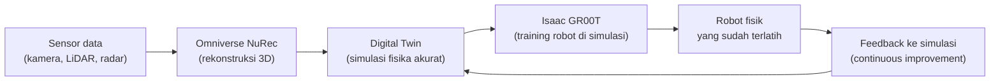
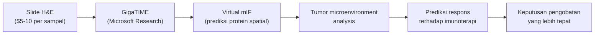
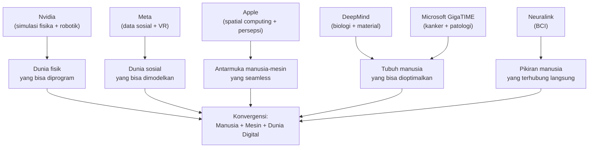

## Yang Tidak Masuk Berita Teknologi Hari Ini

Buka Twitter atau LinkedIn hari ini, dan kamu akan melihat diskusi tentang GPT-5, Claude 4, atau model open source terbaru dari Mistral. Itu wajar — model LLM adalah yang paling mudah dirasakan dampaknya secara langsung oleh developer dan pengguna biasa.

Tapi ada lapisan lain dari persaingan AI yang hampir tidak pernah masuk dalam diskusi sehari-hari — lapisan di mana yang dipertaruhkan bukan sekadar siapa yang punya chatbot terbaik, tapi siapa yang akan mengontrol infrastruktur fisik, biologis, dan kognitif dari peradaban manusia di abad ke-21.

Ini bukan hiperbola. Mari kita bedah satu per satu.

---

## Nvidia: Jauh Lebih dari Sekadar GPU

Kebanyakan orang tahu Nvidia sebagai perusahaan GPU — chip yang dibutuhkan untuk melatih model AI. Itu benar, tapi itu hanya permukaan.

Yang tidak banyak diketahui: Nvidia sudah bertahun-tahun membangun **Omniverse** — platform simulasi dunia fisik yang memungkinkan developer membuat digital twin dari pabrik, kota, bahkan seluruh ekosistem. Bukan sekadar visualisasi 3D — tapi simulasi yang akurat secara fisika, di mana gravitasi, gesekan, cahaya, dan material berperilaku seperti di dunia nyata.

Pada Agustus 2025, Nvidia mengumumkan **Omniverse NuRec** dan **Cosmos World Foundation Models** — sistem yang bisa merekonstruksi dunia nyata dalam 3D dari data sensor, lalu menggunakannya untuk melatih robot secara masif dalam simulasi sebelum robot itu pernah menyentuh dunia nyata.

Ini adalah **flywheel untuk robotik** — semakin banyak robot yang beroperasi di dunia nyata, semakin banyak data yang masuk ke simulasi, semakin baik simulasinya, semakin cepat robot baru bisa dilatih.

Tapi Nvidia tidak berhenti di robotik industri. Mereka juga bermain di **autonomous vehicles** (kerjasama dengan hampir semua produsen mobil besar), **digital humans** (avatar yang berperilaku realistis), dan — yang paling menarik — **physical AI** untuk memahami dunia fisik secara fundamental.

Nvidia juga punya kerjasama dengan game engine besar: Unreal Engine (Epic Games) dan Unity sudah terintegrasi dengan Omniverse. Ini bukan kebetulan — game engine adalah tempat di mana simulasi dunia virtual sudah matang selama puluhan tahun, dan Nvidia ingin menjembatani dunia game dengan dunia robotik dan AI.

---

## Apple: Spatial Computing sebagai Trojan Horse

Apple Vision Pro diluncurkan pada Februari 2024 dengan harga $3.499 — terlalu mahal untuk konsumer biasa, terlalu terbatas untuk enterprise. Banyak yang menyimpulkan bahwa Vision Pro adalah kegagalan.

Tapi itu membaca situasinya dengan salah.

Apple tidak pernah meluncurkan produk pertama untuk pasar massal. iPhone pertama tidak punya App Store. iPad pertama tidak punya keyboard. Apple Watch pertama tidak punya GPS. Semua produk pertama Apple adalah **platform untuk belajar** — untuk memahami bagaimana manusia berinteraksi dengan teknologi baru, sebelum mereka membuat versi yang benar-benar untuk semua orang.

Vision Pro adalah platform untuk belajar tentang **spatial computing** — cara manusia berinteraksi dengan komputer ketika komputer ada di mana-mana di sekitar mereka, bukan hanya di layar persegi di depan mereka.

Yang lebih menarik adalah apa yang ada di balik Vision Pro: **Apple Research** sudah bertahun-tahun mengembangkan teknologi yang tidak pernah dipublikasikan secara luas. Eye tracking yang sangat presisi. Hand tracking tanpa controller. Spatial audio yang akurat. Pemahaman tentang ruang fisik di sekitar pengguna.

Semua ini adalah fondasi untuk sesuatu yang jauh lebih besar dari headset VR — ini adalah fondasi untuk **ambient computing**, di mana antarmuka digital melebur dengan dunia fisik secara seamless.

Dan ketika kamu menggabungkan spatial computing dengan AI yang semakin canggih, kamu mulai melihat ke mana Apple sedang menuju: bukan hanya asisten suara seperti Siri, tapi sistem yang benar-benar memahami konteks fisik dan sosial penggunanya secara real-time.

---

## Meta: Data Sosial sebagai Senjata Tersembunyi

Meta (dulu Facebook) sering dibicarakan dalam konteks privasi dan regulasi. Tapi dari perspektif AI, ada sesuatu yang jauh lebih fundamental: **Meta memiliki dataset interaktivitas sosial manusia terbesar yang pernah ada**.

Bukan hanya teks — tapi bagaimana manusia bereaksi terhadap konten, bagaimana emosi menyebar dalam jaringan sosial, bagaimana keputusan dibuat dalam konteks sosial, bagaimana manusia membangun identitas dan hubungan secara digital.

Data ini tidak bisa dibeli atau direplikasi. Ia dibangun selama 20 tahun dari miliaran pengguna di seluruh dunia.

Meta menggunakan data ini untuk melatih model AI mereka — termasuk **Llama**, model open source yang mereka rilis secara gratis. Ini adalah keputusan strategis yang brilian: dengan merilis Llama secara open source, Meta mendorong seluruh ekosistem untuk membangun di atas fondasi mereka, sambil tetap memegang keunggulan data yang tidak bisa direplikasi siapapun.

Meta juga bermain di ruang yang sama dengan Apple dan Nvidia: **spatial computing dan virtual world**. Meta Quest adalah headset VR terlaris di dunia. Horizon Worlds adalah upaya mereka untuk membangun metaverse. Dan dengan data sosial yang mereka miliki, mereka punya pemahaman tentang bagaimana manusia berinteraksi secara sosial yang tidak dimiliki Apple atau Nvidia.

---

## IBM: Raja yang Diam-diam Masih Berkuasa

IBM adalah nama yang jarang muncul dalam diskusi AI konsumer — dan itu disengaja. IBM tidak bermain di pasar konsumer. IBM bermain di pasar yang jauh lebih besar dan jauh lebih menguntungkan: **enterprise dan infrastruktur**.

Ketika bank-bank besar memproses transaksi, ketika rumah sakit mengelola rekam medis, ketika pemerintah menjalankan sistem perpajakan — banyak dari infrastruktur itu berjalan di atas sistem IBM. Mainframe IBM masih memproses sebagian besar transaksi keuangan global.

Di bidang AI, IBM punya **Watson** — yang meskipun tidak sepopuler ChatGPT, sudah digunakan di ribuan enterprise untuk use case yang sangat spesifik: analisis dokumen hukum, diagnosis medis, manajemen rantai pasok. Watson bukan chatbot generalis — ia adalah sistem AI yang dioptimalkan untuk domain tertentu dengan data yang sangat spesifik.

Yang lebih menarik: IBM Research adalah salah satu lab riset AI paling produktif di dunia, dengan fokus pada **quantum computing** dan **AI untuk sains** — bukan untuk membuat chatbot yang lebih pintar, tapi untuk memecahkan masalah yang tidak bisa dipecahkan oleh komputer klasik.

---

## Microsoft GigaTIME: Ketika AI Menyentuh Biologi

Pada Desember 2025, Microsoft Research mempublikasikan sebuah paper di jurnal *Cell* — salah satu jurnal ilmiah paling bergengsi di dunia — tentang model AI bernama **GigaTIME**.

GigaTIME bukan chatbot. Ia adalah model multimodal yang bisa **memetakan tumor microenvironment** — ekosistem sel di sekitar tumor yang menentukan bagaimana kanker berperilaku dan bagaimana ia merespons pengobatan — dari slide jaringan biasa seharga $5-10.

Sebelumnya, analisis semacam ini membutuhkan teknik **multiplex immunofluorescence (mIF)** yang bisa menghabiskan ribuan dolar per sampel. GigaTIME belajar untuk memprediksi hasil analisis mahal itu dari slide murah yang sudah rutin dibuat di setiap rumah sakit.

Angkanya mengejutkan: dilatih pada 40 juta sel, divalidasi pada 14.256 pasien kanker dari puluhan rumah sakit, mencakup 24 jenis kanker dan 306 subtipe. Satya Nadella mengumumkannya secara publik pada Maret 2026.

Ini bukan "menyembuhkan kanker" — tapi ini adalah langkah yang sangat konkret menuju **demokratisasi diagnosis kanker**. Rumah sakit di negara berkembang yang tidak mampu membeli peralatan mIF senilai jutaan dolar kini bisa mendapatkan insight yang sama dari slide murah yang sudah mereka miliki.

---

## Nvidia + Meta + Apple: Tiga Visi untuk Dunia Virtual

Ada satu arena di mana ketiga perusahaan ini bersaing secara langsung, meskipun dari sudut yang berbeda: **dunia virtual sebagai ruang kerja, komunikasi, dan hiburan manusia**.

Nvidia membangun **infrastruktur simulasi** — dunia virtual yang akurat secara fisika untuk melatih AI dan robot. Meta membangun **infrastruktur sosial** — dunia virtual di mana manusia berinteraksi satu sama lain. Apple membangun **infrastruktur persepsi** — cara manusia melihat dan berinteraksi dengan lapisan digital di atas dunia fisik.

Ketiganya menuju titik yang sama dari arah yang berbeda: dunia di mana batas antara digital dan fisik menjadi semakin tipis.

Dan di ujung spektrum itu, ada sesuatu yang bahkan lebih radikal: **Brain-Computer Interface (BCI)**. Neuralink milik Elon Musk sudah melakukan implantasi pada manusia pertama pada 2024. Tujuan jangka panjangnya bukan hanya membantu orang dengan disabilitas — tapi memungkinkan manusia untuk berinteraksi dengan dunia digital secara langsung, tanpa perantara layar atau controller.

Ketika kamu menggabungkan BCI dengan dunia virtual yang dibangun Nvidia, Meta, dan Apple — kamu mulai melihat outline dari sesuatu yang sangat berbeda dari cara kita hidup hari ini.

---

## Google DeepMind: Fondasi Sains yang Paling Dalam

Kembali ke Google DeepMind — yang sudah kita singgung di artikel sebelumnya sebagai "pemain terkuat yang paling jarang disebut."

**AlphaFold** adalah mungkin kontribusi AI terbesar untuk sains dalam dekade ini. Ia memecahkan masalah **protein folding** — memprediksi struktur 3D protein dari urutan asam aminonya — yang sudah menjadi tantangan terbuka dalam biologi selama 50 tahun. AlphaFold 2 (2020) dan AlphaFold 3 (2024) sudah memprediksi struktur hampir semua protein yang diketahui manusia, membuka pintu untuk desain obat yang jauh lebih cepat dan akurat.

Ini bukan hanya tentang kanker. Ini tentang **semua penyakit yang disebabkan oleh protein yang salah lipat** — Alzheimer, Parkinson, cystic fibrosis, dan ribuan penyakit lainnya. DeepMind sudah memberikan akses gratis ke database AlphaFold untuk seluruh komunitas ilmiah dunia.

Di bidang lain, DeepMind mengembangkan **GNoME** — model AI untuk menemukan material baru. Pada 2023, GNoME menemukan 2,2 juta material kristal baru yang stabil — lebih banyak dari semua material yang ditemukan manusia sepanjang sejarah. Beberapa di antaranya berpotensi menjadi superkonduktor suhu ruang — yang jika berhasil, akan merevolusi transmisi energi listrik secara global.

---

## Mengapa Ini Semua Terhubung

Kalau kamu melihat semua ini dari jarak jauh, ada pola yang menarik:

Ini bukan konspirasi. Ini adalah arah yang logis dari teknologi yang sudah ada hari ini, dikembangkan secara independen oleh perusahaan-perusahaan yang masing-masing punya motivasi bisnis yang sangat konkret.

Yang membuat ini menarik sekaligus mengkhawatirkan adalah bahwa tidak ada satu pun dari perusahaan ini yang punya gambaran lengkap tentang ke mana semua ini bermuara. Mereka masing-masing mengoptimalkan untuk tujuan mereka sendiri — dan konvergensinya terjadi sebagai efek samping, bukan sebagai rencana yang disengaja.

---

## Catatan tentang Skeptisisme yang Sehat

Ketika Satya Nadella mengumumkan GigaTIME pada Maret 2026, ada yang langsung menyebutnya sebagai "terobosan yang akan mengubah pengobatan kanker." Ada juga yang skeptis — mengingatkan bahwa jarak antara paper ilmiah dan implementasi klinis yang luas bisa memakan waktu puluhan tahun.

Keduanya benar.

GigaTIME adalah terobosan nyata yang sudah divalidasi secara ilmiah. Tapi perjalanan dari "model yang bekerja di dataset penelitian" ke "alat yang digunakan dokter di seluruh dunia" melibatkan regulasi, validasi klinis, integrasi dengan sistem rumah sakit, pelatihan tenaga medis, dan ribuan hambatan lain yang tidak ada dalam paper ilmiah.

Skeptisisme yang sehat bukan berarti menolak kemajuan — tapi memahami bahwa kemajuan nyata biasanya lebih lambat dan lebih kompleks dari yang dinarasikan dalam press release.

---

## Penutup: Membaca Lebih Dalam dari Headline

Diskusi tentang AI hari ini terlalu banyak berfokus pada chatbot dan coding agent — karena itu yang paling mudah dirasakan dan paling mudah dijual.

Tapi fondasi yang sebenarnya dibangun di tempat yang lebih sunyi: di lab riset DeepMind yang memetakan protein, di server farm Nvidia yang mensimulasikan fisika, di data center Meta yang memodelkan perilaku sosial manusia, di ruang operasi di mana Neuralink sedang belajar membaca sinyal otak.

Semua ini terhubung. Dan memahami koneksinya — bukan hanya masing-masing bagiannya — adalah keterampilan yang akan semakin penting di tahun-tahun ke depan.

---

**Referensi:**
- [GigaTIME — Microsoft Research (Cell, Desember 2025)](https://news.microsoft.com/signal/articles/gigatime-ai-tool-advances-cancer-research/)
- [NVIDIA Omniverse NuRec + Cosmos (SIGGRAPH 2025)](https://nvidianews.nvidia.com/news/nvidia-opens-portals-to-world-of-robotics-with-new-omniverse-libraries-cosmos-physical-ai-models-and-ai-computing-infrastructure)
- [AlphaFold 3 — Google DeepMind](https://deepmind.google/technologies/alphafold/)
- [Neuralink First Human Implant (2024)](https://neuralink.com)

*Artikel ini adalah bagian dari series tentang lanskap AI. Artikel sebelumnya: [Peta Kekuatan AI: OpenAI, Anthropic, Google DeepMind, dan Microsoft](/posts/peta-kekuatan-ai-openai-anthropic-google-microsoft).*
