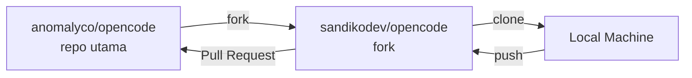
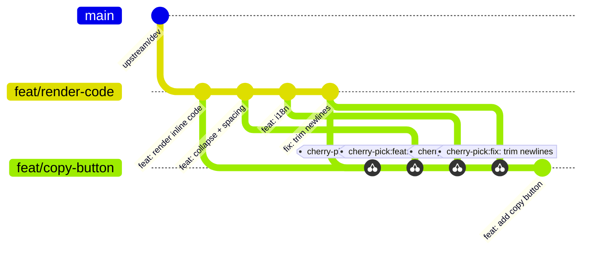
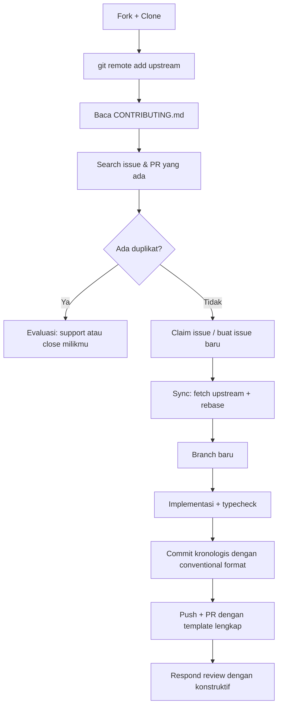

## Konteks

Sesi kontribusi ke [OpenCode](https://github.com/anomalyco/opencode) malam itu menghasilkan dua PR dan beberapa insight teknis yang layak didokumentasikan — bukan karena konsepnya baru, tapi karena jarang dibahas secara eksplisit dalam satu konteks yang utuh.

OpenCode adalah AI coding agent open source yang aktif dengan ribuan pull request masuk setiap bulannya — cukup representatif sebagai studi kasus workflow kolaborasi skala besar.

---

## `origin` vs `upstream`: Dua Remote, Dua Dunia

Ini adalah salah satu titik kebingungan yang paling umum dalam workflow fork-based contribution — dan bukan karena konsepnya sulit, tapi karena **konvensinya jarang dijelaskan secara eksplisit**.

Ketika melakukan fork sebuah repo, ada dua entitas yang terlibat:



Secara default setelah clone, Git hanya mendaftarkan satu remote:

```bash
$ git remote -v
origin  git@github.com:sandikodev/opencode.git (fetch)
origin  git@github.com:sandikodev/opencode.git (push)
```

**`origin` mengarah ke fork** — bukan repo utama. Ini yang sering menjadi sumber kebingungan, terutama bagi mereka yang terbiasa dengan workflow non-fork di mana `origin` memang adalah repo utama.

> [!IMPORTANT]
> Sync dengan `origin` saja berarti sync dengan fork sendiri yang tidak pernah mendapat update dari repo utama. Branch akan terus ketinggalan dan berpotensi conflict saat PR.

Solusinya: tambahkan remote kedua bernama `upstream` yang mengarah ke repo utama.

```bash
git remote add upstream git@github.com:anomalyco/opencode.git
```

```bash
$ git remote -v
origin    git@github.com:sandikodev/opencode.git (fetch)
origin    git@github.com:sandikodev/opencode.git (push)
upstream  git@github.com:anomalyco/opencode.git (fetch)
upstream  git@github.com:anomalyco/opencode.git (push)
```

Nama `upstream` adalah konvensi — bukan keharusan teknis. Tapi mengikuti konvensi ini penting karena banyak tooling dan dokumentasi mengasumsikannya.

> [!TIP]
> `git remote add upstream` cukup dijalankan sekali setelah clone. Setelah itu, sync routine di bawah bisa dijalankan kapanpun sebelum mulai kerja baru.

---

## Sync Routine: Menjaga Branch Tetap Relevan

```bash
git fetch upstream
git checkout dev          # sesuaikan dengan branch default repo
git rebase upstream/dev
git push origin dev
```

<details>
<summary>🔍 Rebase vs merge dalam konteks ini</summary>

`rebase` menempatkan commit lokal di atas commit terbaru dari upstream — menghasilkan history yang linear dan bersih. Ini yang umumnya disukai maintainer proyek open source karena memudahkan review dan bisect.

`merge` menghasilkan merge commit yang menggabungkan dua history. Valid secara teknis, tapi menambah noise di history untuk perubahan yang seharusnya sederhana.

Dalam konteks sync fork dengan upstream, `rebase` adalah pilihan yang lebih tepat.

</details>

> [!WARNING]
> Nama branch default tidak selalu `main`. OpenCode menggunakan `dev`. Selalu verifikasi di `CONTRIBUTING.md` atau `AGENTS.md` sebelum mulai.

---

## Duplikat PR: Masalah yang Lebih Umum dari yang Dikira

Dalam proyek dengan ribuan kontributor, kemungkinan seseorang sudah mengerjakan hal yang sama sangat tinggi. Ini bukan soal siapa yang lebih cepat — tapi soal efisiensi kolektif.

Pada kasus ini, saya membuat PR untuk menambahkan README Bahasa Indonesia. Bot langsung mendeteksi:

```
Potential Duplicate PRs Found:
- PR #12085: docs: add Indonesian readme translation
- PR #15912: docs(readme): Add Indonesian language and update links in all README files
```

PR #15912 ternyata lebih komprehensif — mengupdate link di semua README files, bukan hanya menambah satu file. Keputusan yang paling efisien: close PR sendiri dan arahkan ke yang sudah ada.

> Closing in favor of #15912 which covers the same change and has been open longer. Will look for other ways to contribute.

> [!NOTE]
> Menutup PR sendiri dengan alasan yang jelas justru membangun reputasi yang lebih baik dibanding mempertahankan PR yang akan ditolak. Maintainer menghargai kontributor yang bisa menilai situasi secara objektif.

Cara efektif mencegah ini: search sebelum mulai.

```
is:open README Indonesia
is:open Indonesian translation
```

---

## Implementasi Fitur: Render Code Block di User Message

Issue [#12791](https://github.com/anomalyco/opencode/issues/12791) melaporkan bahwa user message tidak merender backtick syntax — ditampilkan sebagai plain text. Setelah verifikasi tidak ada PR aktif yang mengerjakan ini, implementasi dimulai.

Titik perubahan ada di `HighlightedText` di `packages/ui/src/components/message-part.tsx`. Fungsi ini sebelumnya hanya menangani highlight untuk file reference dan agent mention — tidak ada parsing backtick sama sekali.

Penambahan parser:

```typescript
function parseCode(text: string): HighlightSegment[] {
  const re = /```([\w.-]*)[^\S\r\n]*\r?\n?([\s\S]*?)```|`([^`\n]+)`/g
  // triple backtick → code-block segment
  // single backtick → code-inline segment
  // teks biasa → plain segment, tidak disentuh
}
```

Hasilnya mencakup:
- Render inline code dan fenced code block dengan styling konsisten
- Auto-collapse untuk code block yang melebihi 8 baris
- Tombol copy menggunakan `IconButton` dari design system yang sudah ada
- i18n keys untuk semua 16 bahasa yang didukung

PR: [#20942](https://github.com/anomalyco/opencode/pull/20942)

---

## Cherry-Pick: Mengelola Dependency Antar Branch

Situasi yang menarik muncul ketika ingin melanjutkan ke fitur berikutnya — copy button untuk code block — sementara PR #20942 belum di-merge ke upstream.

Branch baru dari `upstream/dev` belum memiliki kode dari PR #20942. Solusinya adalah cherry-pick: mengambil commit spesifik dari branch lain tanpa merge seluruh branch.

```bash
git checkout dev
git checkout -b feat/user-message-code-copy-button
git cherry-pick f0f82bc88 bf6139415 f63f51c2e f162cd24b 72b53c64a 975f175fb
```



Ketika PR depend on PR lain, transparansi di deskripsi PR adalah kuncinya:

> This PR depends on #20942. The first 6 commits are from that PR and will disappear from this branch's diff once #20942 is merged into upstream.

> [!TIP]
> Ketika #20942 di-merge ke upstream, branch `feat/copy-button` tinggal di-rebase di atas `upstream/dev` yang baru — dan 6 commit cherry-pick itu otomatis hilang karena sudah ada di history.

PR: [#20946](https://github.com/anomalyco/opencode/pull/20946)

---

## `--no-verify`: Konteks dan Batasannya

Pre-push hook di OpenCode mengecek versi Bun:

```
error: This script requires bun@^1.3.11, but you are using bun@1.3.2
```

Flag `--no-verify` mem-bypass hook ini:

```bash
git push origin branch-name --no-verify
```

> [!WARNING]
> `--no-verify` tepat digunakan ketika hook yang di-bypass tidak relevan dengan perubahan yang dilakukan — misalnya perubahan CSS dan TSX di `packages/ui` yang tidak menyentuh runtime server. Untuk perubahan yang menyentuh logika bisnis atau infrastruktur, hormati hook yang ada.

---

## Detail Teknis yang Sering Terlewat

<details>
<summary>📋 Conventional commit dan scope</summary>

Format yang digunakan di OpenCode:
- `feat(ui):` — fitur baru di package UI
- `fix(app):` — bug fix di package app
- `tweak(ui):` — penyesuaian minor
- `docs:` — perubahan dokumentasi

Scope dalam tanda kurung bersifat opsional tapi membantu maintainer memahami area yang terpengaruh tanpa harus membuka diff.

</details>

<details>
<summary>🔗 Automatic issue linking</summary>

`Closes #NOMOR` di deskripsi PR mengaktifkan dua hal secara otomatis:
1. PR ditampilkan di halaman issue sebagai "linked pull request"
2. Issue ditutup otomatis ketika PR di-merge

GitHub juga menampilkan commit pertama yang me-reference issue di activity timeline issue — bukan semua commit, hanya yang pertama.

</details>

<details>
<summary>⚠️ Auto-assign di repo besar</summary>

Banyak repo besar menggunakan bot untuk auto-assign contributor ke issue baru. Ini adalah mekanisme triaging, bukan indikasi bahwa seseorang sudah aktif mengerjakan. Verifikasi selalu dengan melihat aktivitas nyata di thread issue sebelum mengambil keputusan.

</details>

---

## Alur Referensi



---

## Catatan Akhir

Kebingungan seputar `origin` vs `upstream`, atau kapan harus cherry-pick vs rebase, bukan indikator level seorang developer. Ini adalah gap yang muncul ketika seseorang tidak pernah benar-benar terekspos pada workflow kolaborasi open source skala besar — sesuatu yang tidak selalu ada di lingkungan kerja korporat maupun proyek personal.

Ekosistem version control itu luas. Git adalah yang paling survive dan mature, tapi nuansa workflow-nya — terutama dalam konteks kontribusi ke proyek publik — tetap membutuhkan eksposur langsung untuk benar-benar dipahami.

> [!TIP]
> Best practice bukan sesuatu yang bisa sepenuhnya dipelajari dari dokumentasi. Sebagian besar hanya bisa dipahami melalui iterasi langsung di lapangan.

---

*Ditulis berdasarkan pengalaman kontribusi ke [anomalyco/opencode](https://github.com/anomalyco/opencode) pada April 2026.*
*PR yang dihasilkan: [#20942](https://github.com/anomalyco/opencode/pull/20942) dan [#20946](https://github.com/anomalyco/opencode/pull/20946).*
