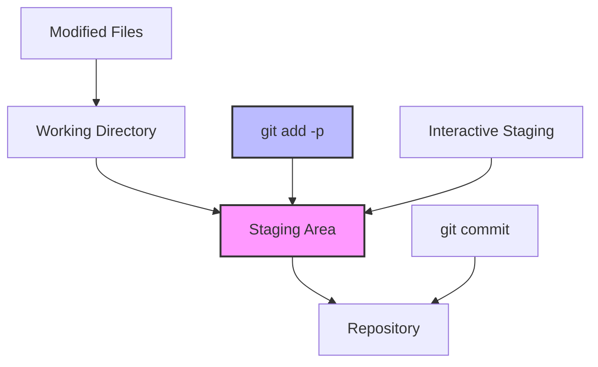
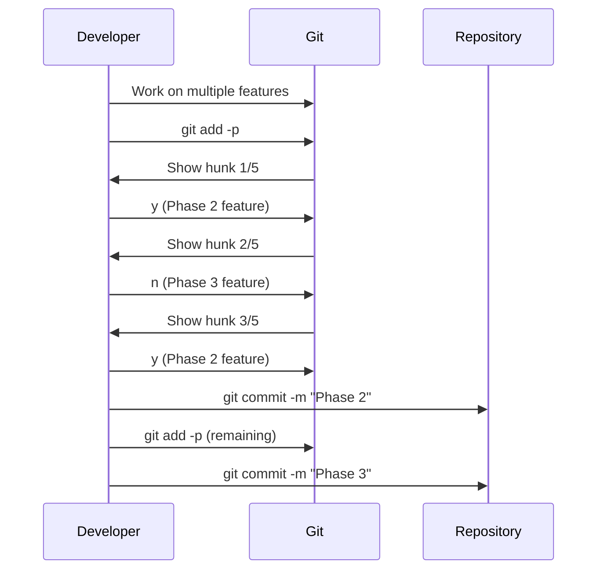

## The Problem: When Your Code Changes Are a Mixed Bag

Picture this: You're deep in development, working on multiple features simultaneously. Your editor shows modified files everywhere - some changes belong to Feature A, others to Feature B, and a few are just quick fixes that should be separate commits entirely.

**Sound familiar?**

Most developers reach for `git add .` and create one massive commit with a generic message like "fix stuff" or "update features". But what if I told you there's a better way?

**Git interactive staging is like having a scalpel instead of a sledgehammer.** It lets you surgically select exactly which changes belong in each commit, creating clean, atomic commits that tell a story.

## The Elephant Theory in Software Development

Before diving into the technical details, let me share a philosophy that changed how I think about commits:

> "How do you eat an elephant? One bite at a time."

In software development, this translates to: **How do you manage complex changes? One logical commit at a time.**

But here's where it gets interesting - there's also the **Enterprise Elephant Theory**: The bigger the organization, the more careful each "bite" needs to be. Large teams require more deliberate, well-structured commits because:

- Code reviews become more focused
- Rollbacks are surgical, not destructive
- Debugging becomes archaeological - you can trace exactly when and why each change was made
- Team collaboration improves when commits have clear intent

## Understanding Git's Three-Stage Architecture

Before mastering interactive staging, you need to understand Git's workflow:



**The Three Stages:**

1. **Working Directory** - Your modified files
2. **Staging Area** - Changes ready to commit
3. **Repository** - Committed history

Interactive staging gives you **granular control** over what moves from Working Directory to Staging Area.

## Git Interactive Staging in Action

Let's walk through a real scenario. I recently had mixed changes in my editor component:

### The Situation

```bash
# Check what's modified
git status
```

```
modified:   src/routes/_protected/editor.tsx
modified:   src/styles/pages/editor.css
```

But these files contained changes for **two different features**:

- **Phase 2**: Core functionality (YouTube input, video controls)
- **Phase 3**: Advanced features (keyboard shortcuts, UX polish)

### The Traditional Approach (❌ Don't Do This)

```bash
# The sledgehammer approach
git add .
git commit -m "update editor features"
```

**Problems with this approach:**

- Mixes unrelated changes
- Makes rollbacks difficult
- Confuses code reviewers
- Loses the story of development

### The Interactive Staging Approach (✅ Do This)

```bash
# The scalpel approach
git add -p
```

**What happens next is magic:**

```
diff --git a/src/routes/_protected/editor.tsx b/src/routes/_protected/editor.tsx
index 1234567..abcdefg 100644
--- a/src/routes/_protected/editor.tsx
+++ b/src/routes/_protected/editor.tsx
@@ -45,6 +45,12 @@ export function EditorPage() {
   const [videoUrl, setVideoUrl] = useState('')
   const [isAnalyzing, setIsAnalyzing] = useState(false)

+  // YouTube URL validation
+  const validateYouTubeUrl = (url: string) => {
+    return url.includes('youtube.com') || url.includes('youtu.be')
+  }
+
 Stage this hunk [y,n,q,a,d,s,e,?]?
```

**Interactive Options Explained:**

- `y` - Stage this hunk
- `n` - Don't stage this hunk
- `q` - Quit interactive mode
- `a` - Stage this and all remaining hunks
- `d` - Don't stage this or any remaining hunks
- `s` - Split this hunk into smaller pieces
- `e` - Edit this hunk manually
- `?` - Show help

### My Decision Process

For each hunk, I asked myself: **"Does this belong to Phase 2 or Phase 3?"**

**Phase 2 hunks (Core functionality) - Press `y`:**

- YouTube URL input validation
- Video analysis logic
- Basic timeline controls
- Clips list rendering

**Phase 3 hunks (Advanced features) - Press `n`:**

- Keyboard shortcuts
- Properties panel enhancements
- UX polish CSS
- Export functionality

### The Result: Two Clean Commits

```bash
# After interactive staging, commit Phase 2
git commit -m "feat: add core video analysis features

- YouTube URL validation and input
- AI-powered clip analysis
- Basic timeline interaction
- Clips list with video controls

Phase 2 complete - fundamental features working"

# Stage remaining changes for Phase 3
git add -p  # Select remaining hunks
git commit -m "feat: add advanced editor features

- Keyboard shortcuts (Space, J/K, Arrow keys)
- Enhanced properties panel with state binding
- UX polish and smooth transitions
- Export system foundation

Phase 3 complete - professional editor experience"
```

## Advanced Interactive Staging Techniques

### Splitting Hunks with `s`

Sometimes Git groups too many changes together. Use `s` to split them:

```bash
Stage this hunk [y,n,q,a,d,s,e,?]? s
Split into 2 hunks.
```

### Manual Editing with `e`

For ultimate precision, edit hunks manually:

```bash
Stage this hunk [y,n,q,a,d,s,e,?]? e
```

This opens your editor where you can:

- Remove lines you don't want to stage
- Keep only the changes that belong together
- Create perfectly atomic commits

### The Stash Consistency Test

Want to verify your staging is working correctly? Here's a mathematical proof using MD5 checksums:

```bash
# Before stashing
find . -name "*.tsx" -exec cat {} \; | md5sum
# Output: 4292c0e7a7b81794201ce421ea9a4336

git stash
git stash pop

# After stashing
find . -name "*.tsx" -exec cat {} \; | md5sum
# Output: 4292c0e7a7b81794201ce421ea9a4336
```

**Identical checksums = Perfect data integrity!**

## When to Use Interactive Staging

### Perfect Scenarios ✅

- **Mixed feature development** - Multiple features in same files
- **Bug fixes during feature work** - Separate fixes from features
- **Refactoring + new features** - Keep refactoring commits clean
- **Code review preparation** - Create reviewable, logical commits
- **Debugging sessions** - Separate debug code from actual fixes

### Skip Interactive Staging ❌

- **Single, focused changes** - When all changes belong together
- **New files** - `git add filename` is simpler
- **Emergency hotfixes** - Speed matters more than precision
- **Experimental branches** - Commit history less critical

## The Workflow Integration

### My Daily Git Workflow



### Integration with Modern Tools

**VS Code Integration:**

```bash
# Install GitLens extension
# Use Command Palette: "Git: Stage Selected Ranges"
```

**Terminal Enhancement:**

```bash
# Add to ~/.gitconfig
[alias]
    ap = add -p
    stage = add -p
    pick = add -p
```

## Performance Impact and Best Practices

### Speed Considerations

**Interactive staging is faster when:**

- You have clear mental model of changes
- Files are logically organized
- Changes are conceptually distinct

**Traditional staging is faster when:**

- All changes belong together
- Working on single feature
- Time pressure situations

### Best Practices

1. **Plan your commits** before starting interactive staging
2. **Use descriptive commit messages** that explain the "why"
3. **Keep hunks focused** - split when necessary
4. **Test after each commit** to ensure functionality
5. **Practice the workflow** until it becomes muscle memory

## Troubleshooting Common Issues

### "No changes to stage"

```bash
# Check what's actually modified
git diff --name-only
git status -s
```

### "Hunk too large to split"

```bash
# Edit manually
git add -p
# Choose 'e' for edit
# Remove unwanted lines in editor
```

### "Accidentally staged wrong changes"

```bash
# Unstage specific files
git reset HEAD filename

# Unstage everything
git reset HEAD
```

## The Mathematical Beauty of Atomic Commits

Here's why atomic commits matter from a mathematical perspective:

**Traditional Approach:**

```
Commit = Feature A + Feature B + Bug Fix + Refactoring
Rollback = Lose everything
```

**Atomic Approach:**

```
Commit 1 = Feature A
Commit 2 = Feature B
Commit 3 = Bug Fix
Commit 4 = Refactoring

Rollback = Surgical precision
```

**The Formula:**

```
Code Quality = (Atomic Commits × Clear Messages) / Mixed Changes
```

## Key Takeaways

1. **Interactive staging is surgical precision** for your commits
2. **The Elephant Theory applies** - eat complex changes one logical bite at a time
3. **Enterprise teams benefit most** from clean, atomic commits
4. **Practice makes perfect** - the workflow becomes natural with repetition
5. **Mathematical proof exists** for Git's data integrity during staging operations

## Next Steps

**Immediate Actions:**

1. Try `git add -p` on your current project
2. Practice splitting mixed changes into logical commits
3. Experiment with hunk splitting (`s`) and editing (`e`)

**Advanced Learning:**

1. Explore `git add --patch` with specific files
2. Learn about `git commit --patch` for direct staging+committing
3. Master `git rebase -i` for commit history editing

**Share Your Experience:**

- How has interactive staging changed your workflow?
- What's your biggest challenge with commit organization?
- Have you discovered any unique use cases?

---

**Remember:** Great developers don't just write great code - they tell great stories through their commit history. Interactive staging is your tool for becoming a better storyteller.

_Want to see more Git mastery techniques? Follow [@sandikodev](https://twitter.com/sandikodev) for advanced development workflows and tools that actually matter._
