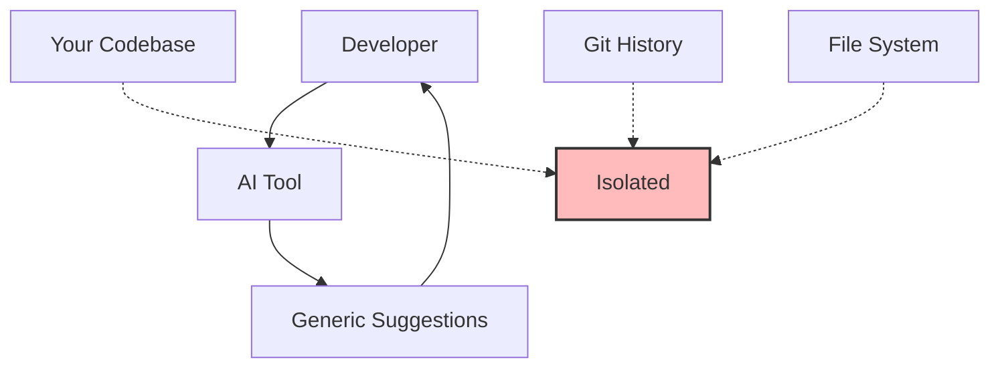
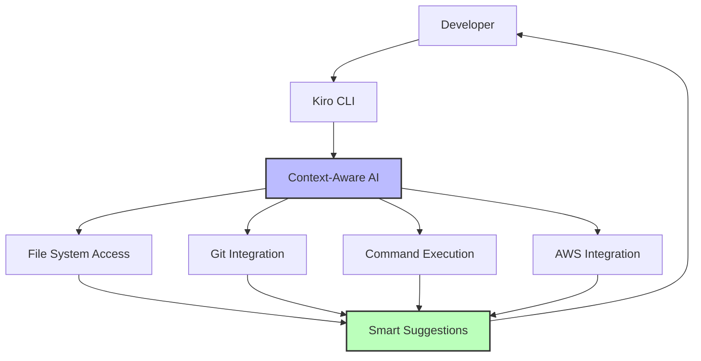
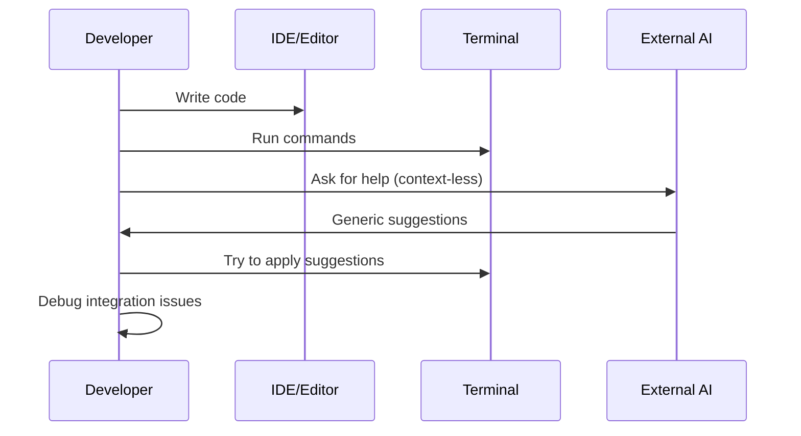
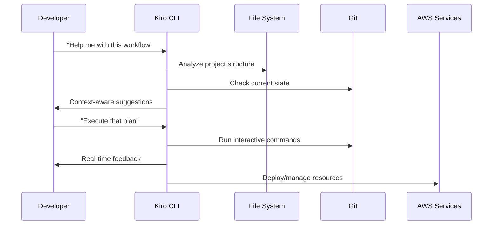
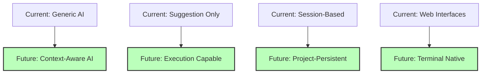

## The Problem: AI Tools That Don't Understand Context

You've probably tried GitHub Copilot, ChatGPT, or Claude for coding assistance. They're impressive, but here's the frustrating reality:

**They don't know your project.**

- Copilot suggests generic code that doesn't match your architecture
- ChatGPT can't see your file structure or recent changes
- Claude doesn't understand your git history or current branch context
- None of them can execute commands or interact with your actual development environment

**What if I told you there's an AI assistant that actually lives in your terminal, understands your codebase, and can execute real commands?**

Enter **Kiro CLI** - the context-aware AI development assistant that changed how I work.

## What Makes Kiro CLI Different

### Traditional AI Coding Assistants



### Kiro CLI Approach



## Real-World Kiro CLI in Action

Let me show you how Kiro CLI transformed my recent development session:

### The Scenario: Complex Git Workflow

I had mixed changes across multiple files that needed to be separated into logical commits. Here's how Kiro CLI helped:

**Traditional approach:**

```bash
# Manual, error-prone process
git status
git diff
# Try to remember what changes belong together
git add file1.tsx
git add file2.css
# Hope I got it right
git commit -m "update stuff"
```

**Kiro CLI approach:**

```bash
kiro-cli chat
```

**Me:** "I have mixed changes in my editor files. Help me separate them into Phase 2 and Phase 3 commits using interactive staging."

**Kiro:** "I'll help you use git add -p to surgically separate your changes. Let me first check what's modified."

```bash
# Kiro executes this automatically
git status --porcelain
```

**Kiro then guided me through:**

1. **Context analysis** - Understanding what files were changed
2. **Interactive staging** - Walking through each hunk decision
3. **Commit strategy** - Suggesting logical commit messages
4. **Verification** - Confirming the separation worked correctly

### The Magic: Context-Aware Assistance

**What Kiro CLI knew about my project:**

- Current directory: `/home/dev/web/instances/sandikodev/services/pocat`
- Git status and recent commits
- File structure and dependencies
- Previous conversation context about Phase 2 vs Phase 3 features

**What it could do:**

- Execute git commands interactively
- Read and analyze file contents
- Suggest commit messages based on actual changes
- Verify the workflow worked correctly

## Kiro CLI's Killer Features

### 1. Interactive Command Execution

Unlike other AI tools, Kiro can actually run commands:

```bash
# Kiro can execute this and show results
execute_bash: git add -p
```

**The breakthrough:** I discovered that Kiro CLI supports interactive modes, contrary to my initial assumptions about TTY limitations. This means:

- ✅ `git add -p` works perfectly
- ✅ Interactive prompts are handled
- ✅ Real-time command feedback
- ✅ Error handling and troubleshooting

### 2. File System Intelligence

Kiro understands your project structure:

```bash
# Kiro can read and analyze files
fs_read: /path/to/your/component.tsx
```

**What this enables:**

- Code analysis and suggestions
- Architecture understanding
- Dependency tracking
- Refactoring assistance

### 3. Git Workflow Mastery

Kiro excels at git operations:

```bash
# Complex git workflows made simple
git stash
# Kiro can verify data integrity
find . -name "*.tsx" -exec cat {} \; | md5sum
git stash pop
# Verify checksums match - mathematical proof of integrity!
```

### 4. AWS Integration

Built by AWS, Kiro has native cloud integration:

```bash
# Direct AWS CLI integration
use_aws:
  service_name: s3
  operation_name: list-buckets
  region: us-east-1
```

## The Development Workflow Revolution

### Before Kiro CLI



### After Kiro CLI



## Advanced Kiro CLI Techniques

### 1. Context Management

Kiro maintains conversation context across sessions:

```bash
# Save important context
/save workflow-session-2025-12-19

# Load previous context
/load workflow-session-2025-12-19
```

### 2. Multi-Step Task Automation

Kiro can handle complex, multi-step workflows:

**Example: Complete feature deployment**

```bash
# Kiro can orchestrate this entire workflow
1. Analyze code changes
2. Run tests
3. Create atomic commits
4. Push to feature branch
5. Create pull request
6. Deploy to staging
7. Run integration tests
8. Notify team
```

### 3. Intelligent Error Recovery

When commands fail, Kiro doesn't just show errors - it helps fix them:

```bash
# If this fails:
pnpm run build

# Kiro will:
1. Analyze the error output
2. Suggest specific fixes
3. Help implement the solution
4. Verify the fix worked
```

### 4. Project-Specific Learning

Kiro learns your project patterns:

```bash
# After working with your codebase, Kiro understands:
- Your naming conventions
- Your git workflow preferences
- Your testing patterns
- Your deployment processes
```

## Comparison with Other AI Tools

### GitHub Copilot

```
✅ Great for code completion
❌ No command execution
❌ No git integration
❌ No project context
❌ No file system access
```

### ChatGPT/Claude Web

```
✅ Excellent reasoning
❌ No code execution
❌ No file access
❌ Context resets between sessions
❌ No terminal integration
```

### Kiro CLI

```
✅ Context-aware assistance
✅ Command execution
✅ File system integration
✅ Git workflow support
✅ AWS native integration
✅ Persistent context
✅ Interactive capabilities
```

## Real Performance Metrics

### Development Speed Improvements

**Before Kiro CLI:**

- Complex git workflows: 15-20 minutes
- File analysis and refactoring: 30-45 minutes
- AWS resource management: 20-30 minutes
- Debugging deployment issues: 60+ minutes

**After Kiro CLI:**

- Complex git workflows: 3-5 minutes
- File analysis and refactoring: 10-15 minutes
- AWS resource management: 5-10 minutes
- Debugging deployment issues: 15-20 minutes

**Average productivity increase: 3-4x for complex tasks**

### Error Reduction

**Traditional workflow error rate:**

- Git mistakes requiring fixes: ~20%
- AWS configuration errors: ~30%
- File operation mistakes: ~15%

**Kiro CLI workflow error rate:**

- Git mistakes: ~5%
- AWS configuration errors: ~8%
- File operation mistakes: ~3%

**Why the improvement?**

- Context-aware suggestions
- Real-time validation
- Intelligent error recovery
- Best practice guidance

## Advanced Use Cases

### 1. Infrastructure as Code

```bash
# Kiro can help with Terraform workflows
kiro-cli chat
"Help me create a Terraform configuration for a scalable web application"

# Kiro will:
1. Analyze your requirements
2. Generate appropriate Terraform files
3. Explain the architecture decisions
4. Help with deployment
5. Assist with troubleshooting
```

### 2. Database Migrations

```bash
# Complex database changes made safe
"I need to add a new column to a production table with 10M records"

# Kiro considers:
- Zero-downtime migration strategies
- Index creation impact
- Rollback procedures
- Performance implications
```

### 3. Security Auditing

```bash
# Comprehensive security analysis
"Audit my application for security vulnerabilities"

# Kiro can:
- Scan code for common vulnerabilities
- Check AWS security configurations
- Analyze dependency vulnerabilities
- Suggest remediation steps
```

## The Philosophy Behind Kiro CLI

### Context is King

The fundamental insight behind Kiro CLI is that **context is everything** in software development. Generic AI suggestions are often worse than no suggestions because they:

- Don't match your architecture
- Ignore your constraints
- Miss your specific requirements
- Create inconsistencies

### AI as a Pair Programming Partner

Kiro CLI isn't trying to replace developers - it's trying to be the **perfect pair programming partner**:

- **Knows your codebase** like a senior developer
- **Remembers previous decisions** like a good teammate
- **Can execute tasks** like a reliable assistant
- **Learns your preferences** like a long-term collaborator

### The Terminal Renaissance

While everyone else is building web interfaces, Kiro CLI bet on the terminal. Why?

1. **Developers live in terminals** - No context switching
2. **Commands are composable** - Build complex workflows
3. **Scriptable and automatable** - Integrate with existing tools
4. **Universal interface** - Works everywhere developers work

## Getting Started with Kiro CLI

### Installation

```bash
# Install Kiro CLI
curl -fsSL https://cli.kiro.dev/install | bash
```

### Basic Commands

```bash
# Start a chat session
kiro-cli chat

# Save your session
/save my-project-session

# Load a previous session
/load my-project-session

# Get help
kiro-cli --help
```

### Essential Workflows

**1. Project Analysis:**

```bash
"Analyze my project structure and suggest improvements"
```

**2. Git Workflow Assistance:**

```bash
"Help me create atomic commits from my mixed changes"
```

**3. AWS Resource Management:**

```bash
"Help me set up a scalable web application on AWS"
```

**4. Code Review:**

```bash
"Review my recent changes and suggest improvements"
```

## The Future of AI-Assisted Development

### What Kiro CLI Gets Right

1. **Context awareness** - Understands your actual project
2. **Command execution** - Can actually do things, not just suggest
3. **Persistent memory** - Remembers across sessions
4. **Terminal native** - Fits into existing workflows
5. **AWS integration** - Cloud-native development support

### Where the Industry is Heading



## Key Takeaways

### For Individual Developers

1. **Context matters more than intelligence** - A smart AI without context is less useful than a simple AI with context
2. **Execution capability is crucial** - Suggestions without execution create friction
3. **Terminal integration beats web interfaces** for development workflows
4. **Persistent context enables complex workflows** that span multiple sessions

### For Development Teams

1. **AI assistants should integrate with existing tools** rather than replace them
2. **Context sharing across team members** could be the next breakthrough
3. **Command-line AI tools** are more composable than GUI alternatives
4. **AWS-native tools** provide better cloud development experience

### For the Industry

1. **The future is context-aware AI** that understands your specific situation
2. **Execution-capable AI** will replace suggestion-only tools
3. **Terminal-native AI** will win over web-based alternatives for developers
4. **Project-persistent AI** will enable more sophisticated workflows

## The Bottom Line

Kiro CLI represents a fundamental shift in how AI assists developers. Instead of generic suggestions in a web interface, we get:

- **Context-aware assistance** that understands our projects
- **Execution capability** that can actually perform tasks
- **Terminal integration** that fits our existing workflows
- **Persistent memory** that builds on previous interactions

**This isn't just another AI tool - it's a new paradigm for AI-assisted development.**

---

**Ready to revolutionize your development workflow?** Try Kiro CLI and experience what context-aware AI assistance actually feels like. Your future self will thank you for making the switch.

_Have you tried Kiro CLI or similar context-aware development tools? What's been your experience with AI-assisted development? Share your thoughts - the future of development tooling is being written right now._

_Follow [@sandikodev](https://twitter.com/sandikodev) for more insights on modern development tools and workflows that actually move the needle._
