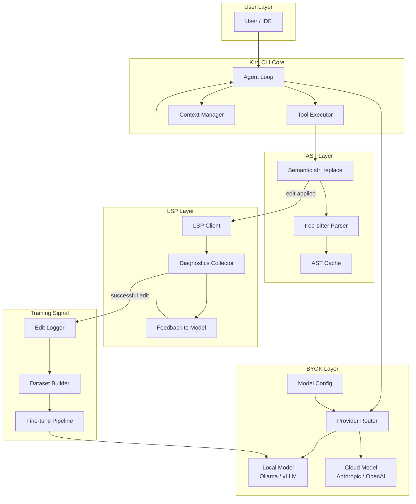

Ada satu baris kode di Kiro CLI yang, setelah saya baca, membuat saya berpikir panjang:

```rust
let matches: Vec<_> = content.match_indices(old_str).collect();
```

Satu baris. Sederhana. Bekerja. Tapi juga — secara fundamental — tidak tahu apa-apa tentang kode yang sedang ia edit.

Ini bukan kritik. Ini adalah titik awal dari sebuah roadmap.

---

## State Saat Ini: Exact-Byte, Bukan Semantic

Kiro CLI menggunakan `match_indices` untuk menemukan string yang akan diganti dalam operasi `str_replace`. Artinya, pencarian dilakukan secara literal — byte per byte, karakter per karakter. Jika `old_str` ada dua kali dalam file, operasi gagal. Jika ada whitespace yang berbeda, operasi gagal. Jika konteks semantiknya berbeda tapi teksnya sama, Kiro tidak bisa membedakan.

```rust
// Dari implementasi str_replace di Kiro CLI
let matches: Vec<_> = content.match_indices(old_str).collect();

match matches.len() {
    0 => Err(/* not found */),
    1 => Ok(content.replacen(old_str, new_str, 1)),
    _ => Err(/* ambiguous — multiple matches */),
}
```

Ini adalah pendekatan yang pragmatis dan cukup untuk banyak kasus. Tapi ada satu skenario yang sering muncul dalam praktik: dua fungsi dengan nama yang mirip, dua blok `if` dengan kondisi yang identik, atau dua `impl` block untuk trait yang sama. Dalam semua kasus itu, model harus memberikan konteks yang sangat spesifik agar `str_replace` tidak ambigu — dan itu beban yang seharusnya tidak perlu ditanggung oleh LLM.

---

## Apa Itu AST-Aware Editing?

AST (*Abstract Syntax Tree*) adalah representasi struktural dari kode sumber. Alih-alih melihat kode sebagai string, parser mengubahnya menjadi pohon node yang merepresentasikan konstruksi bahasa: fungsi, blok, ekspresi, tipe, dan seterusnya.

AST-aware editing berarti: alih-alih mencari string `"fn calculate"` lalu menggantinya, kita parse file menjadi AST, temukan node `FnItem` dengan nama `calculate`, lalu modifikasi node tersebut secara presisi — tanpa risiko mengenai kode lain yang kebetulan mengandung teks yang sama.

Untuk Rust, crate `syn` adalah standar de facto:

```rust
use syn::{parse_file, Item};

let ast = parse_file(&source_code)?;

for item in &ast.items {
    if let Item::Fn(func) = item {
        if func.sig.ident == "calculate" {
            // Kita tahu persis node mana yang harus dimodifikasi
            // Tidak ada ambiguitas
        }
    }
}
```

Untuk multi-language support, `tree-sitter` adalah pilihan yang lebih generalis. Tree-sitter adalah parser incremental yang mendukung puluhan bahasa — Rust, Python, TypeScript, Go, dan lainnya — dengan API yang konsisten:

```rust
use tree_sitter::{Parser, Language};

let mut parser = Parser::new();
parser.set_language(tree_sitter_rust::language())?;

let tree = parser.parse(&source_code, None).unwrap();
let root = tree.root_node();

// Traverse AST, temukan node yang tepat berdasarkan tipe dan posisi
// bukan berdasarkan konten string
```

Perbedaannya fundamental: `match_indices` bertanya *"di mana teks ini?"*, sedangkan AST-aware editing bertanya *"di mana konstruksi kode ini?"*

---

## Perbandingan dengan OpenCode: LSP sebagai Feedback Loop

OpenCode mengambil pendekatan yang berbeda dan, dalam satu aspek kritis, lebih maju: integrasi dengan Language Server Protocol (LSP).

Setelah setiap operasi edit, OpenCode menjalankan diagnostics check melalui LSP. Hasilnya — error, warning, type mismatch — dilaporkan kembali ke model sebagai konteks. Model bisa melihat: *"edit yang baru saja saya lakukan menyebabkan type error di baris 47"*, lalu melakukan koreksi tanpa perlu intervensi manusia.

Ini adalah feedback loop yang sangat powerful. Model tidak hanya menulis kode — ia menulis kode, melihat hasilnya, dan memperbaiki dirinya sendiri.

Kiro CLI saat ini tidak punya mekanisme ini. Setelah `fs_write` atau `str_replace` berhasil, tidak ada yang mengecek apakah kode yang dihasilkan valid secara semantik. Model tidak tahu apakah ia baru saja memperkenalkan compile error.

```
OpenCode flow:
  edit → LSP diagnostics → error context → model correction → edit lagi

Kiro CLI flow saat ini:
  edit → selesai (model tidak tahu apakah kode valid)
```

Ini bukan kelemahan yang fatal — tapi ini adalah gap yang nyata antara Kiro CLI dan state-of-the-art.

---

## Mengapa Rust Adalah Fondasi yang Tepat

Ini bukan argumen emosional tentang "Rust itu keren". Ini tentang ekosistem yang sudah ada dan siap digunakan.

**Tree-sitter punya Rust bindings yang mature.** Crate `tree-sitter` di crates.io adalah binding resmi, dikelola oleh tim yang sama yang membuat tree-sitter. Grammar untuk berbagai bahasa tersedia sebagai crate terpisah (`tree-sitter-rust`, `tree-sitter-python`, dll). Integrasi ke Kiro CLI bukan proyek besar — ini adalah beberapa baris dependency dan wrapper.

**LSP protocol bisa diimplementasikan dengan `tower-lsp`.** Crate `tower-lsp` menyediakan framework untuk membangun LSP server maupun client. Untuk kebutuhan Kiro CLI — yaitu menjadi LSP *client* yang bisa query diagnostics dari language server yang sudah berjalan — ini adalah abstraksi yang tepat.

```rust
use tower_lsp::lsp_types::*;
use tower_lsp::Client;

// Setelah fs_write, query diagnostics dari LSP server
async fn check_diagnostics(client: &Client, uri: &Url) -> Vec<Diagnostic> {
    // LSP client mengirim textDocument/diagnostic request
    // dan menerima list error/warning dari language server
    client.publish_diagnostics(uri.clone(), vec![], None).await;
    // ...
}
```

**Byte-level precision yang sudah kita bahas sebelumnya.** Artikel sebelumnya membahas bagaimana Rust menangani byte offset dengan presisi tinggi. Ini relevan langsung dengan AST-aware editing: tree-sitter mengembalikan posisi node dalam bentuk byte range, bukan karakter range. Rust's `&str` dan slice semantics membuat operasi ini natural dan aman — tidak ada off-by-one error yang tersembunyi di balik encoding.

Ketiga komponen ini — tree-sitter, tower-lsp, byte precision — sudah ada di ekosistem Rust. Tidak perlu membangun dari nol.

---

## Visi BYOK: Bring Your Own Key, Bring Your Own Model

Ada dimensi lain yang belum banyak dibicarakan dalam konteks Kiro CLI: BYOK, atau *Bring Your Own Key/Model*.

Saat ini, Kiro CLI terikat pada model tertentu dengan konfigurasi yang terbatas. Tapi bayangkan skenario ini: komunitas open source bisa menghubungkan LLM mereka sendiri — baik itu model yang di-host sendiri, model fine-tuned, atau model dari provider alternatif — ke Kiro CLI melalui konfigurasi API endpoint yang sederhana.

```toml
# Konfigurasi hipotetis: ~/.kiro/config.toml
[model]
provider = "custom"
endpoint = "http://localhost:11434/v1"  # Ollama, vLLM, atau provider lain
model = "codellama:34b-instruct"
api_key = "${CUSTOM_API_KEY}"

[model.fallback]
provider = "anthropic"
model = "claude-3-5-sonnet"
```

Ini bukan sekadar kenyamanan. Ini membuka kemungkinan yang jauh lebih menarik: **fine-tuning dengan AST-aware edits sebagai training signal**.

Jika kita punya model yang bisa menghasilkan AST-aware edits, dan kita bisa merekam setiap edit yang berhasil (edit yang tidak menyebabkan LSP error, edit yang diterima oleh user), kita punya dataset training yang sangat berkualitas. Model bisa di-fine-tune untuk menghasilkan edits yang lebih presisi, lebih jarang ambigu, dan lebih sering benar pada percobaan pertama.

Loop-nya menjadi:

```
BYOK model → AST-aware edit → LSP validation → 
  jika berhasil: simpan sebagai training signal →
  fine-tune model → model yang lebih baik → kembali ke awal
```

Ini adalah flywheel. Dan Rust, dengan ekosistem yang sudah ada, bisa menjadi platform untuk membangunnya.

---

## Arsitektur Ideal: Diagram

Berikut adalah arsitektur yang saya bayangkan untuk Kiro CLI generasi berikutnya:



Setiap layer punya tanggung jawab yang jelas dan bisa dikembangkan secara independen. AST layer tidak perlu tahu tentang BYOK. LSP layer tidak perlu tahu tentang tree-sitter. Tapi semuanya terhubung melalui agent loop yang menjadi orkestrator.

---

## Proposal Konkret untuk Repo

Ini bukan wishlist abstrak. Ini adalah tiga issue yang bisa dibuka di repo Kiro CLI dengan scope yang terdefinisi:

**Issue 1: Integrasi `tree-sitter` untuk AST-aware `str_replace`**

Scope: Tambahkan optional AST-aware mode untuk `str_replace`. Jika file adalah Rust/Python/TypeScript dan `old_str` ambigu (multiple matches), gunakan tree-sitter untuk disambiguasi berdasarkan node type dan scope. Fallback ke behavior saat ini jika tree-sitter tidak bisa resolve.

Dependency yang dibutuhkan:
```toml
[dependencies]
tree-sitter = "0.22"
tree-sitter-rust = "0.21"
tree-sitter-python = "0.21"
tree-sitter-typescript = "0.21"
```

**Issue 2: LSP diagnostics check setelah setiap `fs_write`**

Scope: Setelah operasi `fs_write` atau `str_replace` berhasil, jalankan diagnostics check melalui LSP client. Jika ada error, tambahkan ke context sebagai `<diagnostics>` block sebelum model melanjutkan. Ini opsional dan bisa di-disable via config.

**Issue 3: BYOK API endpoint configuration**

Scope: Tambahkan support untuk custom model endpoint di config file. Format mengikuti OpenAI-compatible API (yang sudah didukung oleh Ollama, vLLM, LM Studio, dan lainnya). Ini memungkinkan komunitas menggunakan model lokal atau model fine-tuned mereka sendiri.

---

## Penutup: Ini Adalah Roadmap, Bukan Kritik

Kiro CLI, dalam kondisinya saat ini, adalah alat yang bekerja. `match_indices` yang exact-byte itu pragmatis dan cukup untuk mayoritas use case. Tapi "cukup" dan "optimal" adalah dua hal yang berbeda.

Yang menarik bukan di mana Kiro CLI berada sekarang — tapi di mana ia *bisa* berada. Ekosistem Rust sudah menyediakan semua building blocks: tree-sitter untuk AST parsing, tower-lsp untuk LSP integration, dan arsitektur yang memungkinkan BYOK tanpa perlu rewrite besar.

Jarak antara Kiro CLI saat ini dan visi yang saya gambarkan di atas bukan jarak yang besar. Ini adalah beberapa crate, beberapa abstraksi, dan — yang paling penting — komunitas yang mau mendorong ke arah itu.

Rust memberikan fondasinya. Pertanyaannya adalah: siapa yang akan membangun di atasnya?

---

*Artikel ini adalah bagian dari seri eksplorasi Kiro CLI dari perspektif Rust engineering. Jika kamu tertarik berkontribusi pada salah satu proposal di atas, cek repo Kiro CLI dan buka diskusi di issue tracker.*
