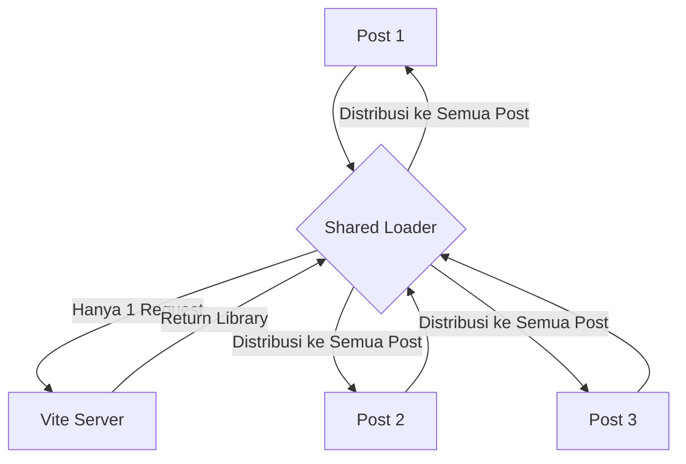
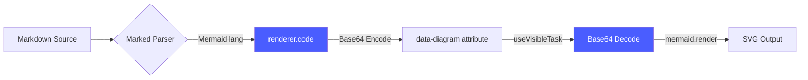

Dalam pengembangan aplikasi web modern yang menggunakan arsitektur **Islands Architecture** (seperti Astro) yang dikombinasikan dengan framework **Resumable** (seperti Qwik), kita seringkali menghadapi tantangan unik saat mengintegrasikan library berat sisi klien seperti **Mermaid.js**.

Baru-baru ini, kami menghadapi masalah di mana diagram gagal termuat, rendering terasa sangat lambat, dan muncul error misterius `ERR_INVALID_HTTP_RESPONSE` di browser console. Artikel ini akan membedah penyebabnya dan bagaimana pola **Singleton Dependency Loader** menjadi solusinya.

### Masalah 1: "Parallel Chaos" pada Dev Server

Di dalam Qwik, kita sering menggunakan `useVisibleTask$` untuk memuat library hanya saat komponen muncul di layar. Masalah muncul ketika kita memiliki banyak komponen sejenis (misalnya, daftar postingan feed) yang semuanya mencoba mengimpor library yang sama secara bersamaan.

Berikut adalah gambaran visual saat terjadi kemacetan request:

```text
[ Browser Client ]                [ Vite Dev Server ]
       |                                  |
       |-- GET mermaid.js (Post 1) ------>|
       |-- GET mermaid.js (Post 2) ------>|  [!] Server Kewalahan
       |-- GET mermaid.js (Post 3) ------>|      (Race Condition)
       |-- GET mermaid.js (Post 4) ------>|
       |                                  |
       |<-- [ERR_INVALID_HTTP_RESPONSE] --| 
```

```tsx
// Kode yang bermasalah jika ada 20 post di halaman
useVisibleTask$(async () => {
  const mermaid = await import("mermaid"); // 20 request paralel ke Vite!
  mermaid.initialize({...});
});
```

Vite dev server terkadang kewalahan menangani request paralel yang berlebihan untuk *chunk* ESM yang sama, menyebabkan respon HTTP yang korup.

### Masalah 2: Global Pollution & Library Bloat

Library seperti `marked` bersifat singleton jika digunakan secara global melalui `marked.use()`. Setiap kali komponen baru memanggil fungsi ini, ekstensi atau middleware akan terus bertumpuk. 

Jika Anda memiliki 10 postingan, postingan ke-10 akan menjalankan logika parser sebanyak 10 kali lipat lebih berat dari yang seharusnya. Inilah penyebab utama mengapa halaman menjadi lambat seiring bertambahnya konten.

---

### Solusi: Singleton Dependency Loader

Solusi pertama adalah memindahkan logika pemuatan ke tingkat global file dan membungkusnya dalam satu `Promise` tunggal. Berapapun jumlah komponen yang ada, library hanya akan di-download **satu kali**.



Berikut implementasinya dalam kode:

```tsx
// sharedDepsPromise disimpan di luar komponen
let sharedDepsPromise: Promise<any> | null = null;

const loadDependencies = () => {
  if (sharedDepsPromise) return sharedDepsPromise;

  sharedDepsPromise = (async () => {
    const [lib1, lib2] = await Promise.all([
      import("heavy-lib-1"),
      import("heavy-lib-2")
    ]);
    return { lib1, lib2 };
  })();
  
  return sharedDepsPromise;
};
```

### Arsitektur Pipeline Rendering

Selain membatasi request, kita juga memastikan data diagram aman dari korupsi karakter spesial menggunakan pipeline encoding berikut:



### Solusi: Local Instance Parser

Untuk menghindari penumpukan ekstensi secara global, kita harus beralih dari penggunaan objek `marked` global ke pembuatan *instance* lokal per komponen.

```tsx
// Gunakan instance lokal (new Marked) alih-alih marked.use() global
const localMarked = new Marked(
  markedHighlight({
    highlight(code, lang) {
      if (lang === "mermaid") return code; // Jangan sentuh mermaid di tahap ini
      return hljs.highlight(code, { language: lang }).value;
    },
  })
);
localMarked.use({ renderer });
```

#
### Test Solidity Highlighting

```solidity
// SPDX-License-Identifier: MIT
pragma solidity ^0.8.0;

contract TestHighlight {
    string public greeting = "Hello KonXC";
    
    function setGreeting(string memory _greeting) public {
        greeting = _greeting;
    }
}
```

## Kesimpulan

Mengintegrasikan library berat ke dalam arsitektur modern membutuhkan ketelitian dalam pengelolaan resource. Dengan menerapkan **Singleton Loader**, kita berhasil:
1. **Menghemat Bandwidth:** Mengurangi request redundan ke server.
2. **Stabilitas Server:** Menghindari *race condition* pada bundling sistem.
3. **Performa Rendering:** Memastikan parser tetap ringan dengan instance lokal.

Sekarang, diagram bisnis yang kompleks sekalipun dapat termuat mulus di tengah interaktivitas framework Qwik yang responsif!
