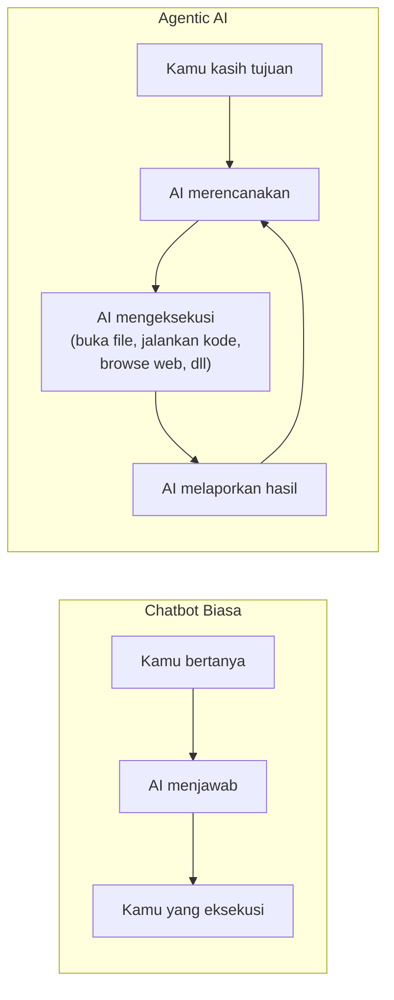
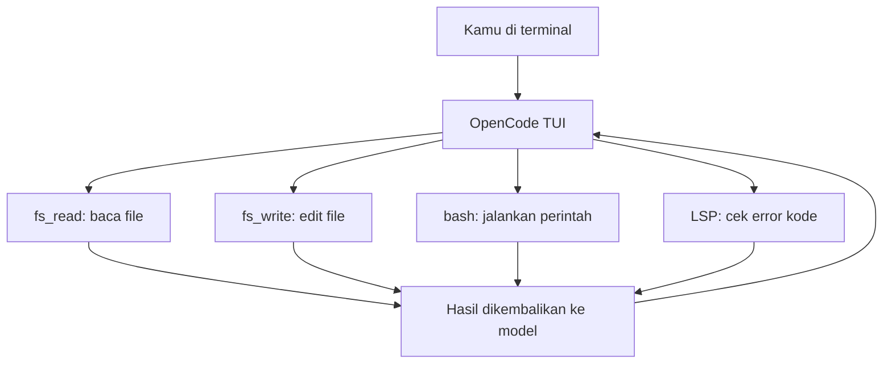

## Mulai dari Pertanyaan yang Paling Mendasar

Kamu pasti sudah pernah pakai ChatGPT. Kamu tanya sesuatu, dia jawab. Sesederhana itu.

Tapi belakangan ini muncul istilah baru yang sering disebut-sebut: **Agentic AI**. Dan kalau kamu baca beritanya, rasanya seperti sesuatu yang jauh lebih besar dari sekadar chatbot. Ada yang bilang ini akan mengubah cara kita bekerja. Ada yang bilang ini adalah lompatan terbesar sejak ChatGPT pertama kali muncul.

Apa sebenarnya yang berbeda?

---

## Chatbot vs Agent: Perbedaan yang Fundamental

Bayangkan kamu punya asisten. Ada dua jenis asisten:

**Asisten pertama** — kamu tanya, dia jawab. Kamu minta saran, dia kasih saran. Tapi dia tidak melakukan apa-apa sendiri. Semua eksekusi tetap di tanganmu.

**Asisten kedua** — kamu kasih tujuan, dia yang cari cara, dia yang eksekusi, dia yang lapor hasilnya. Kalau ada hambatan di tengah jalan, dia cari solusi sendiri. Kalau perlu buka file, dia buka. Kalau perlu jalankan perintah, dia jalankan.

ChatGPT biasa adalah asisten pertama. **Agentic AI adalah asisten kedua.**

Perbedaannya bukan di kecerdasan modelnya — tapi di **kemampuan untuk mengambil aksi di dunia nyata**.

---

## Apa yang Bisa Dilakukan Agent?

Ketika kita bilang AI "mengambil aksi", apa konkretnya?

Agent modern bisa:

- **Membaca dan menulis file** — bukan hanya menyarankan kode, tapi langsung mengedit file di komputermu
- **Menjalankan perintah terminal** — `npm install`, `git commit`, `docker build` — semua bisa dijalankan oleh agent
- **Browsing web** — mencari informasi, membaca dokumentasi, mengecek error message
- **Memanggil API** — berinteraksi dengan layanan eksternal
- **Mengelola proses** — menjalankan server, memonitor output, menghentikan proses yang bermasalah

Yang membuat ini menjadi "agentic" adalah kemampuan untuk **merangkai semua aksi itu secara otomatis** berdasarkan satu instruksi tingkat tinggi dari kamu.

Contoh nyata: kamu bilang *"buatkan REST API sederhana untuk manajemen todo list"*. Agent yang baik akan:

1. Membuat struktur folder proyek
2. Menulis kode server
3. Menjalankan server untuk test
4. Memperbaiki error yang muncul
5. Menulis dokumentasi
6. Melaporkan hasilnya kepadamu

Semua itu tanpa kamu perlu mengarahkan setiap langkahnya.

---

## ChatGPT Agent dan Claude Cowork: Titik Masuk yang Bagus

Kalau kamu baru pertama kali ingin mencoba Agentic AI, **ChatGPT Agent** (tersedia di ChatGPT Plus) dan **Claude Cowork** (dari Anthropic) adalah titik masuk yang paling mudah.

Keduanya punya antarmuka yang familiar — mirip chatbot biasa, tapi dengan kemampuan untuk mengeksekusi aksi. Kamu tidak perlu install apa-apa. Tidak perlu konfigurasi. Tinggal buka browser, ketik instruksi, dan lihat agent bekerja.

Ini bagus untuk pemula yang ingin merasakan *"oh, jadi begini rasanya"* tanpa harus pusing dengan setup teknis.

Tapi ada satu hal yang perlu kamu tahu: **keduanya adalah black box**.

Kamu tidak tahu persis apa yang terjadi di balik layar. Kamu tidak bisa kustomisasi bagaimana agent mengambil keputusan. Kamu tidak bisa menambahkan tool baru. Kamu tidak bisa melihat kenapa agent melakukan sesuatu dengan cara tertentu.

Untuk pengguna umum, ini tidak masalah. Tapi untuk developer — ini terasa seperti memakai mobil tanpa bisa buka kap mesinnya.

---

## Tiga Tool Open Source yang Wajib Kamu Coba

Di sinilah tiga tool berikut menjadi menarik. Semuanya open source, semuanya bisa kamu install sendiri, dan semuanya memberikan visibilitas penuh tentang apa yang terjadi di balik layar.

### OpenClaw — Otomasi yang Bisa Berjalan Sendiri

**[OpenClaw](https://github.com/openclaw/openclaw)** (348K+ stars) adalah AI assistant yang dirancang untuk berjalan di berbagai platform dan sistem operasi. Tagline-nya: *"Your own personal AI assistant. Any OS. Any Platform. The lobster way."*

Yang membedakan OpenClaw dari yang lain adalah fokusnya pada **otomasi**. Ini bukan tool yang kamu ajak ngobrol — ini tool yang kamu kasih tugas, lalu dia kerjakan sendiri di background. Cocok untuk:

- Otomasi tugas berulang
- Skrip yang perlu kecerdasan kontekstual
- Workflow yang melibatkan banyak langkah

Kalau ChatGPT Agent terasa seperti asisten yang kamu awasi terus, OpenClaw lebih seperti karyawan yang bisa kamu percaya untuk bekerja mandiri.

### OpenCode — Coding Agent dengan Antarmuka Terminal

**[OpenCode](https://github.com/anomalyco/opencode)** (137K+ stars) adalah coding agent yang berjalan langsung di terminal. Antarmukanya berbasis TUI (Terminal User Interface) — tidak ada browser, tidak ada GUI, semua di dalam terminal.

Yang menarik dari OpenCode adalah integrasinya dengan **LSP (Language Server Protocol)** — setelah setiap perubahan kode, OpenCode otomatis mengecek apakah ada error kompilasi atau type error. Ini membuat agent jauh lebih akurat karena ia mendapat feedback langsung dari compiler.

OpenCode juga punya **mode Plan** (read-only) dan **mode Build** (read-write) — kamu bisa minta agent untuk merencanakan dulu sebelum mengeksekusi, sehingga kamu bisa review rencananya sebelum ada perubahan nyata di file.

Ini adalah tool yang paling cocok untuk developer yang ingin AI membantu coding secara langsung di dalam workflow terminal mereka.

### OpenWork — Antarmuka GUI untuk Tim

**[OpenWork](https://github.com/different-ai/openwork)** (13K+ stars) adalah alternatif open source untuk Claude Cowork, dibangun di atas OpenCode. Kalau OpenCode adalah untuk developer individual di terminal, OpenWork adalah untuk **tim yang butuh antarmuka visual**.

OpenWork menyediakan GUI berbasis web yang bisa diakses oleh seluruh tim. Kamu bisa melihat apa yang sedang dikerjakan agent, memberikan feedback, dan berkolaborasi dengan anggota tim lain — semua dalam satu antarmuka yang familiar.

Ini adalah pilihan yang tepat kalau kamu ingin memperkenalkan Agentic AI ke tim yang tidak semuanya nyaman dengan terminal.

---

## Perbandingan Singkat

| | ChatGPT Agent | Claude Cowork | OpenClaw | OpenCode | OpenWork |
|---|---|---|---|---|---|
| **Antarmuka** | Web/Chat | Web/Chat | CLI/Otomasi | Terminal TUI | Web GUI |
| **Open Source** | ✗ | ✗ | ✓ | ✓ | ✓ |
| **Self-hosted** | ✗ | ✗ | ✓ | ✓ | ✓ |
| **BYOK** | Terbatas | Terbatas | ✓ | ✓ | ✓ |
| **LSP Integration** | ✗ | ✗ | ✗ | ✓ | ✓ |
| **Cocok untuk** | Pemula | Tim non-teknis | Otomasi | Developer | Tim teknis |

---

## Kenapa Developer Teknis Perlu Tool yang Lebih Terbuka?

Ada alasan konkret kenapa ChatGPT Agent dan Claude Cowork terasa "abstrak" bagi developer teknis.

Pertama, **kamu tidak bisa debug**. Kalau agent melakukan sesuatu yang salah, kamu tidak tahu kenapa. Tidak ada log yang bisa kamu baca, tidak ada konfigurasi yang bisa kamu ubah.

Kedua, **kamu tidak bisa extend**. Kalau kamu butuh agent untuk berinteraksi dengan tool internal perusahaanmu, kamu tidak bisa menambahkan tool baru ke ChatGPT Agent.

Ketiga, **datamu keluar dari kontrolmu**. Semua yang kamu kirim ke ChatGPT atau Claude melewati server mereka. Untuk kode proprietary atau data sensitif, ini bisa menjadi masalah.

Dengan OpenClaw, OpenCode, atau OpenWork — semua berjalan di infrastrukturmu sendiri. Kamu bisa lihat setiap tool call yang dibuat agent. Kamu bisa tambahkan tool baru via MCP (Model Context Protocol). Kamu bisa hubungkan ke model LLM apapun yang kamu mau.

---

## Cara Mulai

Kalau kamu baru pertama kali:

**Mulai dengan ChatGPT Agent atau Claude Cowork** — rasakan dulu apa itu Agentic AI tanpa perlu setup apapun. Minta agent untuk membuat sebuah program sederhana, atau minta ia untuk menganalisis sebuah dokumen. Perhatikan bagaimana ia merencanakan dan mengeksekusi langkah demi langkah.

**Setelah itu, coba OpenCode** — install di terminal, hubungkan ke API key LLM pilihanmu (OpenAI, Anthropic, atau model lokal via Ollama), dan coba minta ia untuk mengerjakan sebuah task coding nyata di proyekmu. Perhatikan perbedaannya: kamu bisa lihat setiap tool call, setiap file yang dibaca, setiap perintah yang dijalankan.

**Kalau kamu butuh otomasi** — eksplorasi OpenClaw untuk workflow yang perlu berjalan tanpa pengawasan terus-menerus.

**Kalau kamu bekerja dalam tim** — OpenWork bisa menjadi jembatan antara kemampuan teknis OpenCode dan kebutuhan kolaborasi tim.

---

## Satu Hal yang Perlu Selalu Diingat

Agentic AI adalah alat yang sangat powerful — dan seperti semua alat powerful, ia bisa berbahaya kalau dipakai tanpa pemahaman.

Agent yang berjalan di komputermu punya akses ke file system, bisa menjalankan perintah terminal, bisa mengubah kode. Selalu review apa yang akan dilakukan agent sebelum mengizinkannya — terutama untuk operasi yang tidak bisa di-undo seperti menghapus file atau melakukan push ke repository.

Tool seperti OpenCode sudah membangun mekanisme approval untuk ini — setiap aksi yang berpotensi destruktif akan meminta konfirmasimu terlebih dahulu. Tapi tetap, pemahaman tentang apa yang terjadi di balik layar adalah tanggung jawabmu sebagai pengguna.

---

## Penutup

Agentic AI bukan hype semata. Ini adalah perubahan nyata dalam cara kita berinteraksi dengan komputer — dari *"saya yang mengeksekusi, AI yang menyarankan"* menjadi *"AI yang mengeksekusi, saya yang mengarahkan"*.

ChatGPT Agent dan Claude Cowork adalah pintu masuk yang bagus. Tapi kalau kamu developer yang ingin benar-benar memahami dan mengontrol apa yang terjadi, OpenClaw, OpenCode, dan OpenWork adalah tempat yang jauh lebih menarik untuk belajar.

Kap mesinnya terbuka. Silakan masuk.

---

**Referensi:**
- [OpenClaw](https://github.com/openclaw/openclaw) — Personal AI assistant, any OS, any platform
- [OpenCode](https://github.com/anomalyco/opencode) — The open source coding agent
- [OpenWork](https://github.com/different-ai/openwork) — Open-source alternative to Claude Cowork
