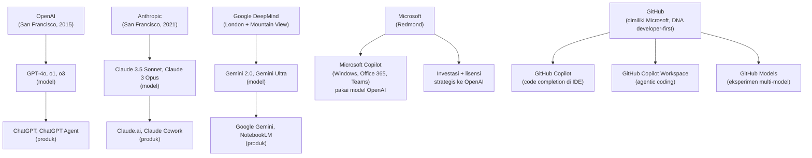
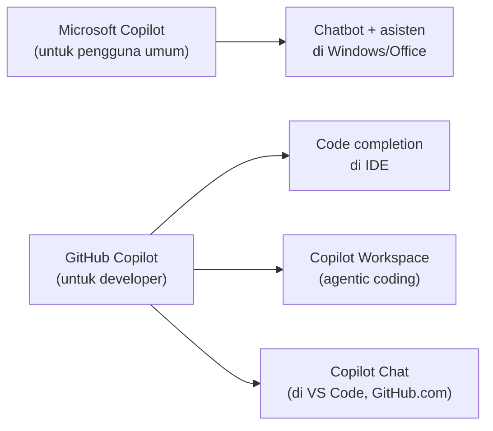
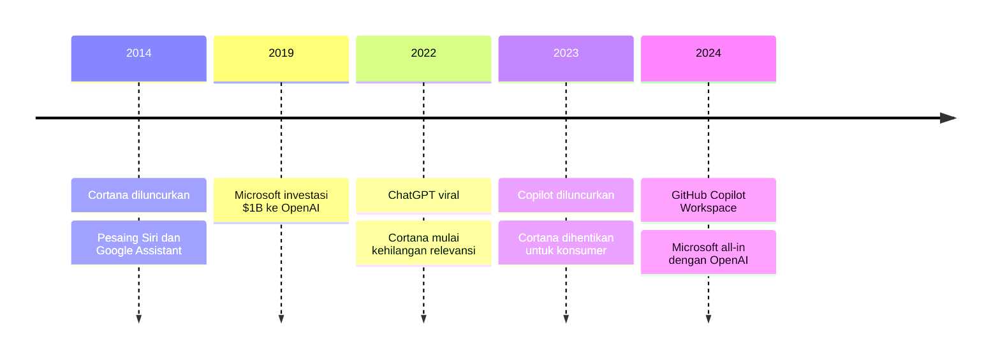
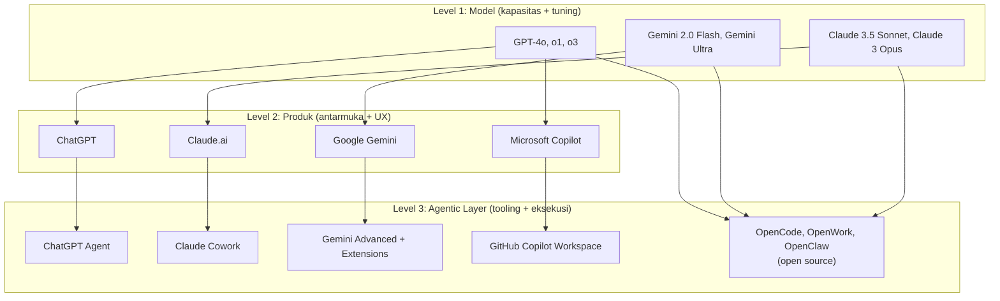

## Masalah dengan "Claude vs ChatGPT"

Setiap kali ada diskusi tentang AI di media sosial, hampir pasti ada komentar seperti ini: *"Claude lebih pintar dari ChatGPT"* atau *"ChatGPT lebih bagus dari Gemini"*.

Kalimat-kalimat itu tidak salah secara faktual — tapi mereka membandingkan hal yang berbeda level. Seperti bilang *"Toyota lebih bagus dari Elon Musk"*. Toyota adalah produk. Elon Musk adalah orang. Keduanya ada di dunia otomotif, tapi tidak bisa dibandingkan secara langsung.

Untuk benar-benar memahami lanskap AI saat ini, kamu perlu membaca peta yang lebih lengkap — dari basis proyek (perusahaan), model, produk, hingga layer agentic.

---

## Layer 1: Basis Proyek — Siapa yang Bermain

Di level paling atas, ada beberapa pemain besar yang mengelola ekosistem AI:

Yang perlu diperhatikan: **Microsoft tidak punya model sendiri yang dipublikasikan secara luas**. Copilot — baik Copilot di Windows, Microsoft 365 Copilot, maupun GitHub Copilot — semuanya berjalan di atas model OpenAI (GPT-4 dan variannya). Microsoft adalah investor terbesar OpenAI, dan hubungan keduanya jauh lebih dalam dari sekadar lisensi API.

Tapi ada nuansa penting di sini: **Microsoft Copilot dan GitHub Copilot adalah dua jalur yang berbeda**, meski keduanya berada di bawah payung Microsoft.

Microsoft Copilot adalah produk untuk pengguna umum dan enterprise — terintegrasi di Windows, Office 365, Teams, dan Bing. Fokusnya adalah produktivitas sehari-hari: merangkum email, membuat presentasi, menjawab pertanyaan di dalam dokumen.

GitHub Copilot adalah produk yang dikelola GitHub — perusahaan yang dimiliki Microsoft tapi beroperasi dengan DNA developer-first yang berbeda. GitHub punya roadmap, komunitas, dan ekosistem tersendiri. GitHub Copilot Workspace, GitHub Models, GitHub Actions — semua ini dibangun dengan perspektif developer, bukan perspektif enterprise productivity. Keduanya memperkuat ekosistem Microsoft, tapi dari arah yang berbeda.

Perbandingan yang apple to apple:

| | OpenAI | Anthropic | Google DeepMind | Microsoft / GitHub |
|---|---|---|---|---|
| **Model** | GPT-4o, o1, o3 | Claude 3.5 Sonnet, Claude 3 Opus | Gemini 2.0 / 3, Gemini Ultra | *(pakai lisensi OpenAI)* |
| **Chatbot** | ChatGPT | Claude.ai | Google Gemini | Microsoft Copilot |
| **AI Cowork** | ChatGPT Agent | Claude Cowork | Gemini Advanced | Microsoft Copilot (enterprise) |
| **CLI Coding Agent** | Codex CLI | Claude CLI | Gemini CLI | Copilot CLI (`/plan`, `/fleet`, `/delegate`) |
| **IDE** | — | — | Google Antigravity *(fork VS Code, agent-first, Nov 2025)* | VS Code + GitHub Copilot |

Microsoft bermain dengan strategi yang berbeda dari tiga lainnya — bukan membangun model sendiri, tapi **menguasai lisensi dan distribusi**. Dengan investasi miliaran dolar ke OpenAI dan integrasi Copilot ke seluruh ekosistem Microsoft 365, Windows, dan GitHub, mereka tidak perlu punya model terbaik untuk menjadi pemain terkuat di enterprise. Ini adalah keputusan bisnis yang sangat cerdas: biarkan OpenAI yang menanggung biaya riset dan infrastruktur model, sementara Microsoft mengontrol jalur distribusi ke ratusan juta pengguna korporat.

---

## Google DeepMind: Pemain Terkuat yang Paling Jarang Disebut

Ada ironi besar di sini. Google DeepMind adalah salah satu lab AI paling berpengaruh di dunia — mereka yang menciptakan AlphaGo, AlphaFold, dan banyak terobosan fundamental dalam AI. Tapi dalam percakapan sehari-hari tentang AI, nama mereka jarang muncul.

Kenapa? Karena produk konsumer mereka — Google Gemini — tidak sepopuler ChatGPT atau Claude dalam persepsi publik, meskipun secara teknis model Gemini Ultra bersaing langsung dengan GPT-4o dan Claude 3 Opus.

DeepMind juga punya sejarah yang berbeda dari OpenAI dan Anthropic. Mereka diakuisisi Google pada 2014 — jauh sebelum era ChatGPT — dan fokus awalnya lebih ke riset fundamental daripada produk konsumer. Ini membuat mereka kurang "viral" tapi tidak kurang berpengaruh.

Ada satu momen yang sering terlupakan: **Google Duplex** pada 2018 — sistem yang bisa menelepon restoran dan membuat reservasi secara otomatis, dengan suara yang terdengar sangat manusiawi. Demonstrasinya di Google I/O 2018 membuat penonton terdiam. Ini bukan lagi chatbot biasa — ini adalah sesuatu yang berbeda secara fundamental. Tapi Google terlalu berhati-hati untuk merilisnya secara luas, dan Duplex tidak pernah menjadi produk mainstream. Pola ini berulang: Google punya teknologi revolusioner, tapi ragu untuk mendorongnya ke publik — sampai ChatGPT memaksa mereka bergerak cepat dengan Bard (yang kemudian menjadi Gemini). Google Antigravity, IDE agent-first mereka yang diluncurkan November 2025 bersama Gemini 3, adalah tanda bahwa Google akhirnya memilih untuk tidak menahan diri lagi.

---

## Microsoft dan Copilot: Kekuatan yang Tersembunyi di Balik Ekosistem

Microsoft adalah pemain yang paling sering diremehkan dalam diskusi AI publik — padahal mereka mungkin yang paling dalam tertanam di kehidupan sehari-hari pengguna enterprise.

Copilot hadir di mana-mana: Windows 11, Microsoft 365 (Word, Excel, PowerPoint, Teams), GitHub, Azure. Ini bukan produk AI yang kamu buka di browser terpisah — ini AI yang terintegrasi langsung ke dalam workflow yang sudah ada.

Dari sudut pandang developer, **GitHub Copilot** punya terminologi dan posisi yang berbeda dari Copilot untuk pengguna umum:

GitHub Copilot Workspace — yang diluncurkan 2024 — adalah upaya Microsoft/GitHub untuk masuk ke ruang agentic coding yang sama dengan Claude Cowork dan OpenCode. Tapi karena ia terintegrasi langsung ke GitHub (bukan tool terpisah), cara orang menggunakannya sangat berbeda.

---

## Cortana: AI yang Ditelan Bumi

Tidak bisa membahas Microsoft AI tanpa menyebut Cortana — dan nasibnya yang tragis.

Cortana diluncurkan 2014 sebagai asisten virtual Microsoft, pesaing langsung Siri (Apple) dan Google Assistant. Pada masanya, Cortana cukup inovatif — terintegrasi di Windows 10, bisa menjawab pertanyaan, mengatur jadwal, bahkan berinteraksi dengan Xbox. Yang sering terlupakan: Cortana punya beberapa keunggulan nyata — ia bisa membaca email dan kalendermu untuk memberikan konteks yang relevan, mengingatkanmu berdasarkan lokasi, dan Microsoft mempekerjakan penulis fiksi untuk membuat kepribadiannya terasa lebih manusiawi.

Tapi ada satu masalah yang tidak bisa diselesaikan dengan kepribadian yang bagus: **data gap**. Google punya miliaran query pencarian setiap hari sebagai training signal. Microsoft tidak punya itu. Cortana kalah bukan karena buruk — tapi karena Google punya keunggulan data yang hampir tidak bisa dikejar.

Ketika OpenAI merilis ChatGPT pada November 2022 dan langsung viral, Cortana seperti kehilangan relevansi dalam semalam. Microsoft — yang sudah berinvestasi besar di OpenAI sejak 2019 — memilih untuk pivot: daripada mengembangkan Cortana lebih jauh, mereka mengintegrasikan teknologi OpenAI ke dalam produk-produk mereka dan meluncurkan Copilot sebagai brand baru.

Cortana secara resmi dihentikan untuk konsumer pada 2023. Sebuah akhir yang sunyi untuk AI yang pernah menjadi andalan Microsoft.

---

## Anthropic: Lahir dari Perpecahan OpenAI

Satu detail yang sering terlewat: Anthropic bukan perusahaan yang lahir dari nol. Ia didirikan pada 2021 oleh Dario Amodei, Daniela Amodei, dan beberapa peneliti lain yang sebelumnya bekerja di OpenAI.

Mereka keluar dari OpenAI karena perbedaan pandangan tentang keamanan AI — Anthropic lebih fokus pada "AI safety" sebagai prioritas utama, bukan hanya sebagai pertimbangan sekunder. Ini tercermin dalam cara Claude dirancang: lebih berhati-hati, lebih sering menolak permintaan yang berpotensi berbahaya, dan lebih transparan tentang keterbatasannya.

Ini juga yang membuat perbandingan "OpenAI vs Anthropic" menarik secara filosofis — bukan hanya soal siapa yang punya model lebih pintar, tapi soal **nilai apa yang diprioritaskan** dalam pengembangan AI.

---

## Model vs Produk vs Agentic Layer: Tiga Level yang Berbeda

Sekarang kita bisa membuat peta yang lebih lengkap:

Ketika orang bilang *"Claude lebih pintar dari ChatGPT"*, mereka biasanya membandingkan Level 2 (produk) tapi menggunakan bahasa Level 1 (model). Dan ketika mereka membandingkan Claude Cowork dengan ChatGPT Agent, mereka sebenarnya membandingkan Level 3 (agentic layer) — yang tidak ada hubungannya dengan seberapa "pintar" modelnya.

---

## Yang Paling Penting untuk Dipahami

Dari semua ini, ada satu insight yang paling berguna:

**Kecerdasan model dan kemampuan agentic adalah dua hal yang ortogonal.**

Model yang "lebih pintar" tidak otomatis menghasilkan agent yang lebih baik. Agent yang baik bergantung pada:
- Seberapa baik tool-tool yang tersedia
- Seberapa baik orkestrator mengelola loop eksekusi
- Seberapa baik feedback loop antara eksekusi dan model
- Seberapa terbuka arsitekturnya untuk dikustomisasi

Ini adalah alasan kenapa OpenCode — yang bisa dipakai dengan model apapun, termasuk model lokal yang jauh lebih kecil dari GPT-4o — bisa menghasilkan output coding yang sangat baik untuk task tertentu. Bukan karena modelnya lebih pintar, tapi karena tooling-nya lebih tepat.

---

## Penutup: Membaca Peta, Bukan Hanya Label

Lanskap AI bergerak sangat cepat. Nama-nama baru muncul setiap bulan. Tapi kalau kamu sudah memahami strukturnya — basis proyek, model, produk, agentic layer — kamu tidak akan mudah tersesat oleh hype atau narasi pemasaran.

Cortana mengingatkan kita bahwa tidak ada yang terlalu besar untuk tenggelam. DeepMind mengingatkan kita bahwa yang paling berpengaruh tidak selalu yang paling viral. Dan OpenCode mengingatkan kita bahwa yang paling terbuka sering kali yang paling powerful dalam jangka panjang.

Tapi peta ini masih belum lengkap. Ada pemain-pemain lain yang jarang masuk dalam diskusi AI sehari-hari — Apple dengan Vision Pro dan riset spatial computing-nya, IBM yang diam-diam menguasai infrastruktur enterprise, Meta yang memegang data interaktivitas sosial terbesar di dunia, dan Nvidia yang jauh lebih dari sekadar perusahaan GPU. Microsoft sendiri baru saja mempublikasikan **GigaTIME** di jurnal *Cell* (Desember 2025) — model AI yang bisa memetakan tumor microenvironment dari slide jaringan seharga $10, sesuatu yang sebelumnya membutuhkan ribuan dolar per sampel. Ini bukan lagi soal chatbot atau coding agent — ini adalah AI yang menyentuh fondasi peradaban manusia.

Untuk ulasan yang lebih dalam tentang pemain-pemain ini dan ke mana semuanya bermuara, baca: [Fondasi yang Tak Terlihat: Apple, IBM, Meta, Nvidia, dan Pertarungan untuk Masa Depan Manusia](/posts/fondasi-tak-terlihat-apple-ibm-meta-nvidia).

Ingin tahu lebih dalam tentang era sebelum LLM — ketika Siri, Alexa, Cortana, dan Google Assistant masih merajai? Baca: [Sebelum LLM: Era Gelap yang Melahirkan Segalanya](/posts/sebelum-llm-era-gelap-siri-alexa-cortana).

---

**Referensi:**
- [OpenAI](https://openai.com)
- [Anthropic](https://anthropic.com)
- [Google DeepMind](https://deepmind.google)
- [Microsoft Copilot](https://copilot.microsoft.com)
- [GitHub Copilot Workspace](https://githubnext.com/projects/copilot-workspace)
