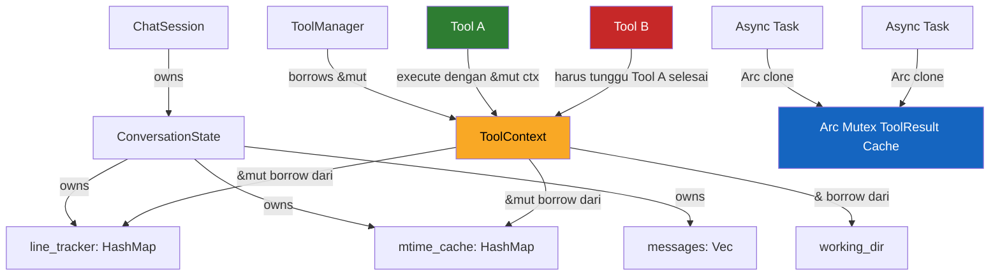

Ketika pertama kali membangun AI agent yang bisa memanggil tools — membaca file, menjalankan perintah shell, mengakses API — kamu mungkin mengira tantangan terbesarnya ada di integrasi LLM atau parsing output-nya. Tapi ada masalah yang lebih halus dan jauh lebih berbahaya: siapa yang boleh mengubah state, kapan, dan bagaimana memastikan tidak ada dua hal yang mengubahnya secara bersamaan?

Rust punya jawaban untuk ini. Dan jawabannya bukan sekadar "gunakan mutex". Jawabannya adalah sistem tipe yang memaksa kamu berpikir tentang kepemilikan state sejak awal.

---

## State yang Dikelola AI Agent

Bayangkan sebuah AI agent seperti Kiro CLI. Di balik setiap percakapan, ada beberapa lapisan state yang harus dijaga konsistensinya: conversation history berisi semua pesan antara user dan model, tool results menyimpan output dari setiap tool call yang sudah dieksekusi, file line tracker memetakan nama file ke baris-baris yang sudah dibaca agar agent tahu konteks mana yang sudah "dilihat", dan mtime cache menyimpan timestamp modifikasi file untuk mendeteksi apakah file sudah berubah sejak terakhir dibaca.

Semua ini hidup dalam satu sesi percakapan. Dan setiap kali agent memanggil sebuah tool, tool itu berpotensi membaca atau memodifikasi sebagian dari state ini.

```rust
struct ConversationState {
    messages: Vec<Message>,
    tool_results: HashMap<String, ToolResult>,
    line_tracker: HashMap<String, FileLineTracker>,
    mtime_cache: HashMap<PathBuf, SystemTime>,
}
```

Pertanyaannya: bagaimana kamu memastikan bahwa dua tool calls yang berjalan tidak saling menginjak state satu sama lain?

---

## Masalah di Bahasa Lain: Shared Mutable State

Di JavaScript atau Python, state seperti ini biasanya hidup sebagai objek yang di-pass by reference. Tidak ada yang mencegah dua fungsi memegang referensi ke objek yang sama dan memodifikasinya.

```typescript
// TypeScript — tidak ada yang mencegah ini
class AgentSession {
  lineTracker: Map<string, FileLineTracker> = new Map();
}

async function toolA(session: AgentSession) {
  // membaca dan memodifikasi lineTracker
  session.lineTracker.set("file.ts", newTracker);
}

async function toolB(session: AgentSession) {
  // juga memodifikasi lineTracker — secara bersamaan
  session.lineTracker.set("file.ts", anotherTracker);
}

// Keduanya dipanggil "bersamaan" — siapa yang menang?
await Promise.all([toolA(session), toolB(session)]);
```

Inilah shared mutable state — dua pihak memegang referensi yang sama dan keduanya bisa mengubahnya. Di lingkungan async seperti ini, hasilnya tidak deterministik. Kamu bisa mendapat race condition di mana dua tool menulis ke key yang sama dan salah satu hasilnya hilang, atau stale data di mana tool B membaca state yang sudah dimodifikasi tool A di tengah eksekusi, atau context pollution di mana tool yang gagal meninggalkan state setengah jadi dan tool berikutnya membaca data yang korup.

Yang lebih berbahaya: bug ini tidak selalu muncul. Mereka baru muncul ketika timing-nya tepat — di production, di bawah load tinggi, atau ketika LLM kebetulan memanggil dua tools yang berinteraksi dengan state yang sama.

---

## Bagaimana Rust Ownership Mencegah Ini

Rust punya aturan sederhana yang terdengar membatasi tapi justru membebaskan:

> Pada satu waktu, kamu boleh punya satu mutable reference, atau banyak immutable references — tapi tidak keduanya.

Aturan ini ditegakkan oleh borrow checker pada waktu kompilasi. Bukan runtime. Bukan test. Kompilasi.

### Satu Pemilik, Satu Mutator

Ketika kamu menulis fungsi tool yang menerima `&mut HashMap<String, FileLineTracker>`, kamu sedang mendeklarasikan: "fungsi ini butuh akses eksklusif untuk memodifikasi line tracker."

```rust
fn read_file_tool(
    path: &str,
    line_tracker: &mut HashMap<String, FileLineTracker>,
    mtime_cache: &HashMap<PathBuf, SystemTime>, // hanya baca
) -> ToolResult {
    // Hanya fungsi ini yang bisa memodifikasi line_tracker
    // selama fungsi ini berjalan
    line_tracker.entry(path.to_string())
        .or_insert_with(FileLineTracker::new)
        .mark_read(0..50);
    
    ToolResult::success(/* ... */)
}
```

Borrow checker memastikan bahwa selama `read_file_tool` berjalan dan memegang `&mut line_tracker`, tidak ada kode lain yang bisa mengakses `line_tracker` — baik untuk baca maupun tulis. Ini bukan konvensi. Ini adalah kontrak yang ditegakkan compiler.

### Dua Tool Calls Tidak Bisa Memodifikasi State yang Sama Secara Bersamaan

Coba tulis kode ini di Rust:

```rust
// Ini TIDAK akan dikompilasi
let mut state = ConversationState::new();

let result_a = tool_a(&mut state.line_tracker); // mutable borrow
let result_b = tool_b(&mut state.line_tracker); // ERROR: sudah ada mutable borrow aktif
```

Compiler akan menolak ini dengan pesan yang jelas. Kamu dipaksa untuk menyelesaikan satu operasi sebelum memulai yang lain, atau menggunakan mekanisme sinkronisasi yang eksplisit.

Ini bukan bug yang kamu temukan di production. Ini adalah bug yang tidak bisa kamu tulis.

---

## Contoh Nyata: `line_tracker` di Kiro CLI

Di Kiro CLI, setiap tool invocation menerima mutable reference ke `line_tracker` sebagai bagian dari konteks eksekusi. Polanya kira-kira seperti ini:

```rust
struct ToolContext<'a> {
    line_tracker: &'a mut HashMap<String, FileLineTracker>,
    mtime_cache: &'a mut HashMap<PathBuf, SystemTime>,
    working_dir: &'a Path,
}

trait Tool {
    fn execute(&self, input: ToolInput, ctx: &mut ToolContext) -> ToolResult;
}
```

Lifetime `'a` di sini bukan hanya anotasi — ini adalah pernyataan eksplisit bahwa `ToolContext` tidak boleh hidup lebih lama dari state yang ia pinjam. Dan karena `ctx` di-pass sebagai `&mut`, hanya satu tool yang bisa memegang referensi ini pada satu waktu.

Ketika tool manager mengeksekusi tools secara sekuensial:

```rust
for tool_call in tool_calls {
    let mut ctx = ToolContext {
        line_tracker: &mut session.line_tracker,
        mtime_cache: &mut session.mtime_cache,
        working_dir: &session.working_dir,
    };
    
    let result = tool_manager.execute(tool_call, &mut ctx)?;
    session.tool_results.insert(tool_call.id.clone(), result);
}
```

Setiap iterasi membuat `ctx` baru yang meminjam state dari `session`. Setelah iterasi selesai, borrow berakhir, dan iterasi berikutnya bisa meminjam state yang sama. Tidak ada overlap. Tidak ada ambiguitas.

---

## `Arc<Mutex<T>>` untuk State yang Di-share Antar Async Tasks

Tapi bagaimana kalau kamu memang butuh concurrency? Misalnya, tool manager yang menjalankan beberapa tools secara paralel, atau state yang perlu diakses dari multiple async tasks?

Di sinilah `Arc<Mutex<T>>` masuk — tapi dengan cara yang berbeda dari mutex di bahasa lain. Di Rust, kamu tidak bisa "lupa" untuk mengunci mutex. Compiler memaksamu.

```rust
use std::sync::{Arc, Mutex};

struct SharedToolState {
    results_cache: Arc<Mutex<HashMap<String, ToolResult>>>,
}

impl SharedToolState {
    async fn cache_result(&self, id: String, result: ToolResult) {
        // lock() mengembalikan MutexGuard — akses hanya lewat guard ini
        let mut cache = self.results_cache.lock().unwrap();
        cache.insert(id, result);
        // Guard di-drop di sini, mutex otomatis di-unlock
    }
}
```

`Arc` (Atomic Reference Counting) memungkinkan multiple owners. `Mutex` memastikan hanya satu yang bisa mengakses data di dalamnya pada satu waktu. Tapi yang penting: kamu tidak bisa mengakses data di dalam `Mutex` tanpa menguncinya terlebih dahulu. Tipe sistem memaksamu.

Bandingkan dengan JavaScript, di mana locking adalah konvensi yang bisa diabaikan:

```typescript
class SharedToolState {
  resultsCache: Map<string, ToolResult> = new Map();
  
  async cacheResult(id: string, result: ToolResult) {
    // Tidak ada mekanisme locking — ini race condition menunggu terjadi
    this.resultsCache.set(id, result);
  }
}
```

Di JavaScript, locking adalah konvensi. Di Rust, locking adalah kontrak tipe.

---

## Diagram: Ownership Flow di AI Agent



Perhatikan bahwa Tool A dan Tool B tidak bisa memegang `&mut ctx` secara bersamaan — ini ditegakkan oleh borrow checker. Sementara untuk `Arc<Mutex<T>>`, multiple tasks bisa memegang `Arc` clone, tapi akses ke data di dalamnya tetap eksklusif melalui mutex.

---

## Perbandingan: Rust vs TypeScript untuk AI Agent State

| Aspek | TypeScript | Rust |
|---|---|---|
| Shared mutable state | Default behavior | Dilarang tanpa `Arc<Mutex<T>>` |
| Race condition detection | Runtime (atau tidak terdeteksi) | Compile-time |
| Stale reference | Mungkin terjadi | Tidak mungkin (lifetime) |
| Locking | Konvensi | Kontrak tipe |
| Refactoring safety | Perlu test coverage | Compiler sebagai safety net |

Di TypeScript, kamu bisa menulis kode yang benar — tapi kamu harus disiplin, menulis test yang tepat, dan berharap tidak ada edge case yang terlewat. Di Rust, kamu tidak punya pilihan selain menulis kode yang benar. Compiler tidak akan membiarkanmu.

Ini bukan berarti TypeScript buruk. Tapi untuk sistem yang mengelola state kompleks dengan concurrency — seperti AI agent yang menjalankan multiple tools — jaminan compile-time Rust sangat berharga.

---

## Ownership Adalah Model untuk Reasoning tentang State Mutation

Ini poin yang sering terlewat ketika orang belajar Rust: ownership bukan hanya tentang memory management. Memory management adalah implementasi dari sesuatu yang lebih fundamental.

Ownership adalah cara untuk reasoning tentang siapa yang bertanggung jawab atas sebuah state, kapan state itu boleh berubah, dan siapa yang boleh melihat perubahan itu.

Di AI agent, ini sangat relevan karena state mutation harus auditable — kamu perlu tahu tool mana yang mengubah state apa, untuk debugging dan untuk membangun trust terhadap agent. Concurrency adalah default karena LLM bisa memanggil multiple tools, async I/O adalah norma, dan race condition adalah musuh nyata. Dan context pollution adalah bug yang sulit di-debug — kalau tool yang gagal meninggalkan state yang korup, agent berikutnya akan membuat keputusan berdasarkan informasi yang salah.

Rust memaksamu untuk membuat keputusan ini eksplisit. Bukan sebagai komentar atau dokumentasi, tapi sebagai bagian dari tipe sistem yang dikompilasi.

Ketika kamu menulis `&mut ToolContext`, kamu tidak hanya mengatakan "fungsi ini butuh akses tulis". Kamu mengatakan: "fungsi ini adalah satu-satunya yang boleh mengubah state ini, dan saya bisa membuktikannya ke compiler."

Itu bukan sekadar memory management. Itu adalah arsitektur yang diekspresikan melalui tipe.

---

## Penutup

Kalau kamu membangun AI agent dan mempertimbangkan Rust, jangan hanya melihat performance. Lihat apa yang kamu dapatkan secara gratis dari sistem tipe-nya: jaminan bahwa state mutation kamu aman, bahwa tidak ada dua tools yang bisa menginjak state yang sama secara bersamaan, dan bahwa setiap akses ke shared state harus melalui mekanisme sinkronisasi yang eksplisit.

Borrow checker bukan hambatan. Borrow checker adalah pair programmer yang tidak pernah lelah, tidak pernah lupa, dan tidak pernah membiarkan kamu commit race condition ke production.

---

*Artikel ini adalah bagian dari seri Rust Cookbook untuk AI Engineer. Seri ini membahas bagaimana konsep-konsep Rust yang sering dianggap "terlalu low-level" ternyata sangat relevan untuk membangun sistem AI yang robust.*
