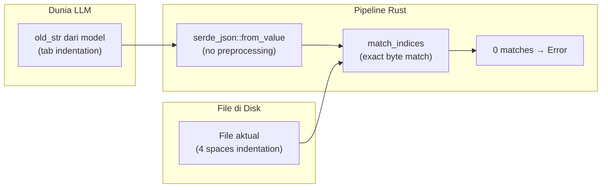
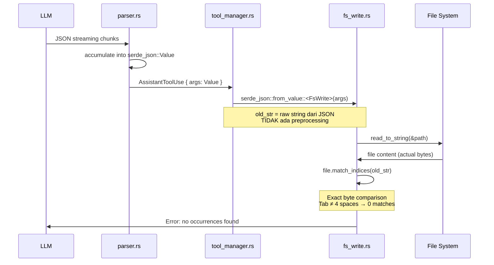
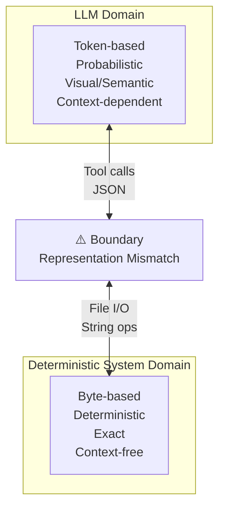

## Prolog: Bug yang Terasa Misterius

Kamu pakai Kiro CLI, minta AI mengedit sebuah fungsi. AI menampilkan diff yang terlihat sempurna. Kamu approve. Lalu:

```
Execution failed after 0.0s:
no occurrences of "    fn calculate() {
    let result = a + b;
    return result;
}" were found
```

Kamu buka file-nya. Fungsi itu ada. Persis seperti yang ditampilkan. Tapi CLI bilang tidak ditemukan.

Ini bukan bug random. Ini adalah manifestasi dari sebuah design flaw fundamental di boundary antara LLM dan deterministic system — dan memahaminya akan mengubah cara kamu berpikir tentang string, byte, dan I/O di Rust.

---

## Bagian 1: Dua Dunia yang Tidak Bicara Bahasa yang Sama

### LLM bekerja di level visual/semantic

Ketika model bahasa menghasilkan teks, ia bekerja di level token — unit abstrak yang merepresentasikan potongan teks. Model tidak "tahu" perbedaan antara tab dan empat spasi. Bagi model, keduanya adalah "indentasi". Bagi model, `\r\n` dan `\n` adalah "baris baru".

Model mengambil `old_str` dari konteks percakapan, bukan dari membaca file secara langsung. Konteks percakapan bisa mengandung representasi kode yang berbeda dari file aktual: diff preview yang ditampilkan di terminal mungkin menggunakan tab, kode yang di-copy-paste user mungkin menggunakan CRLF, output dari tool sebelumnya mungkin sudah di-normalize berbeda.

### Rust bekerja di level byte

Di sisi lain, Rust sangat eksplisit tentang representasi data. Sebuah `String` di Rust adalah:

```rust
pub struct String {
    vec: Vec<u8>,  // ← sequence of bytes, UTF-8 encoded
}
```

Dan `match_indices` — fungsi yang dipakai Kiro CLI untuk mencari `old_str` — bekerja seperti ini:

```rust
// Dari upstream/main Kiro CLI (kode otentik, belum dimodifikasi)
let matches = file.match_indices(old_str).collect::<Vec<_>>();
match matches.len() {
    0 => return Err(eyre!("no occurrences of \"{old_str}\" were found")),
    1 => {
        let file = file.replacen(old_str, new_str, 1);
        os.fs.write(&path, file).await?;
    },
    x => return Err(eyre!("{x} occurrences of old_str were found when only 1 is expected")),
}
```

`match_indices` adalah exact byte comparison. Ia mencari substring yang identik secara byte-for-byte — tidak ada toleransi, tidak ada normalisasi, tidak ada "kelihatannya sama".

### Visualisasi gap-nya



---

## Bagian 2: Anatomy of a String di Rust

Sebelum kita bisa memahami solusinya, kita perlu memahami bagaimana Rust merepresentasikan string di level byte.

### `str` vs `String` vs `&[u8]`

```rust
// String: owned, heap-allocated, UTF-8
let owned: String = String::from("hello");

// &str: borrowed slice, UTF-8
let borrowed: &str = "hello";

// &[u8]: raw bytes, no encoding guarantee
let bytes: &[u8] = b"hello";
```

Perbedaan krusialnya: `str` dan `String` dijamin UTF-8. Ini berarti setiap karakter bisa 1-4 byte, slicing dengan byte index bisa panic jika index jatuh di tengah karakter multi-byte, dan `len()` mengembalikan jumlah byte — bukan jumlah karakter.

```rust
let s = "héllo";
println!("{}", s.len());        // 6 (bukan 5!)
println!("{}", s.chars().count()); // 5

// Ini PANIC karena 'é' adalah 2 byte (0xC3 0xA9)
// let slice = &s[1..2]; // ← byte index 1 ada di tengah 'é'

// Ini aman
let slice = &s[2..];  // mulai dari byte ke-2, tepat setelah 'é'
```

Ini adalah salah satu sumber bug paling umum di Rust ketika bekerja dengan string non-ASCII — dan persis yang menyebabkan panic di Kiro CLI yang kita perbaiki di PR #3716.

### Whitespace di level byte

```
Tab:        0x09
Space:      0x20
CRLF:       0x0D 0x0A
LF:         0x0A
```

Bagi mata manusia (dan LLM), tab dan 4 spasi terlihat sama. Bagi `match_indices`, mereka adalah byte sequence yang berbeda total.

```rust
let file = "    fn foo() {}";  // 4 spaces
let query = "\tfn foo() {}";   // tab

let matches: Vec<_> = file.match_indices(query).collect();
println!("{}", matches.len()); // 0 — tidak ditemukan
```

---

## Bagian 3: Pipeline dari LLM ke Byte

Mari trace alur lengkap dari model ke `match_indices`:



Tidak ada satu pun titik di pipeline ini yang melakukan normalisasi. `serde_json::from_value` hanya melakukan deserialisasi JSON — ia tidak tahu apa-apa tentang whitespace semantics. `match_indices` adalah operasi byte murni.

---

## Bagian 4: Solusi — Fuzzy Matching yang Benar di Rust

Masalahnya jelas: kita butuh matching yang toleran terhadap perbedaan whitespace. Tapi "toleran" harus didefinisikan dengan presisi — kita tidak bisa asal "ignore semua whitespace" karena itu bisa menyebabkan false positive.

### Strategi 1: Exact Match (tetap dipertahankan)

Fast path. Jika exact match berhasil, tidak perlu fuzzy.

```rust
let exact_count = content.match_indices(old_str).count();
match exact_count {
    1 => return Ok(content.replacen(old_str, new_str, 1)),
    x if x > 1 => return Err(/* ambiguous */),
    _ => { /* fall through to fuzzy */ }
}
```

### Strategi 2: Line-Trimmed Match

Bandingkan baris per baris setelah `trim()`. Jika semua baris cocok setelah di-trim, gunakan posisi byte dari baris asli (dengan indentasi) untuk replacement.

```rust
fn line_trimmed_match(content: &str, find: &str) -> Option<(usize, usize)> {
    let content_lines: Vec<&str> = content.split('\n').collect();
    let search_lines = strip_empty_boundary_lines(find.split('\n').collect());

    if search_lines.is_empty() { return None; }

    // Pre-compute byte offsets dengan prefix sum — O(1) lookup
    let offsets = build_line_offsets(&content_lines);

    let mut matches: Vec<(usize, usize)> = Vec::new();
    'outer: for i in 0..=content_lines.len().saturating_sub(search_lines.len()) {
        for (j, search_line) in search_lines.iter().enumerate() {
            if content_lines[i + j].trim() != search_line.trim() {
                continue 'outer;
            }
        }
        // Byte range dari baris asli (dengan indentasi)
        let start = offsets[i];
        let end = offsets[i + search_lines.len()].saturating_sub(1).min(content.len());
        matches.push((start, end));
    }

    if matches.len() == 1 { Some(matches[0]) } else { None }
}
```

Kenapa return `(usize, usize)` bukan `String`? Ini keputusan desain yang krusial. Kalau kita return matched substring sebagai `String` lalu pakai `content.replacen(&matched, new_str, 1)`, kita bisa mengganti kemunculan pertama dari substring itu di file — bukan posisi yang kita temukan. Jika substring yang sama muncul lebih awal di file, kita akan memodifikasi tempat yang salah.

Dengan return byte range `(start, end)`, replacement selalu tepat di posisi yang ditemukan:

```rust
// Aman — selalu di posisi yang benar
Ok(format!("{}{}{}", &content[..start], new_str, &content[end..]))
```

### Strategi 3: Block-Anchor Match dengan Levenshtein

Untuk kasus di mana baris tengah sedikit berbeda (bukan hanya whitespace), kita pakai first+last line sebagai anchor dan Levenshtein similarity untuk menilai baris tengah.

Levenshtein distance mengukur jumlah operasi minimum (insert, delete, replace) untuk mengubah string A menjadi string B:

```rust
// O(n) space — rolling row, bukan O(m×n) matrix
fn levenshtein(a: &str, b: &str) -> usize {
    let a: Vec<char> = a.chars().collect();
    let b: Vec<char> = b.chars().collect();
    // Pastikan a lebih panjang (row) agar b (column) lebih kecil
    let (a, b) = if a.len() >= b.len() { (a, b) } else { (b, a) };
    let (m, n) = (a.len(), b.len());
    let mut prev: Vec<usize> = (0..=n).collect();
    let mut curr = vec![0usize; n + 1];
    for i in 1..=m {
        curr[0] = i;
        for j in 1..=n {
            curr[j] = if a[i - 1] == b[j - 1] {
                prev[j - 1]
            } else {
                1 + prev[j].min(curr[j - 1]).min(prev[j - 1])
            };
        }
        std::mem::swap(&mut prev, &mut curr);
    }
    prev[n]
}
```

Kenapa O(n) bukan O(m×n)? Algoritma Levenshtein klasik menggunakan matrix `m×n`. Untuk baris kode yang panjang (misalnya 200 karakter), ini berarti alokasi 40.000 elemen per perbandingan. Dengan rolling row, kita hanya butuh dua array berukuran `n`.

Kenapa `chars().count()` bukan `len()` untuk denominator similarity?

```rust
let max_len = a.chars().count().max(b.chars().count());
// BUKAN: a.len().max(b.len())
```

`len()` mengembalikan jumlah byte. Untuk string UTF-8 dengan karakter multi-byte — misalnya kode dengan komentar dalam bahasa Indonesia atau Jepang — `len()` akan memberikan angka yang lebih besar dari jumlah karakter aktual, sehingga similarity score menjadi terlalu rendah dan match yang valid bisa ditolak.

---

## Bagian 5: Prefix Sum untuk Byte Offset — Berpikir di Level Memory

Ini adalah bagian yang paling "Rust-idiomatic" dari implementasi kita.

### Masalah naif

Untuk setiap kandidat match di posisi baris `i`, kita perlu tahu byte offset-nya di string asli. Cara naif:

```rust
// O(n) per panggilan — dipanggil berkali-kali dalam loop
let start: usize = content_lines[..i].iter().map(|l| l.len() + 1).sum();
```

Jika ada 1000 baris dan 100 kandidat, ini adalah 100 × 1000 = 100.000 operasi.

### Solusi: Prefix Sum

```rust
fn build_line_offsets(lines: &[&str]) -> Vec<usize> {
    let mut offsets = Vec::with_capacity(lines.len() + 1);
    offsets.push(0usize);
    for line in lines {
        offsets.push(offsets.last().unwrap() + line.len() + 1); // +1 untuk '\n'
    }
    offsets
}
```

`offsets[i]` adalah byte offset dari awal baris ke-i. Build O(n) sekali, lookup O(1) selamanya.

```rust
let start = offsets[i];           // O(1)
let end = offsets[i + n] - 1;     // O(1)
```

Pola ini sangat umum di competitive programming dan systems programming, tapi sering diabaikan di application code. Di Rust, ini sangat natural karena `Vec<usize>` adalah contiguous memory yang cache-friendly.

---

## Bagian 6: File Freshness Check — Berpikir tentang Time dan State

Fuzzy matching menyelesaikan masalah whitespace. Tapi ada masalah lain: apa yang terjadi jika file berubah antara `fs_read` dan `str_replace`?

Skenarionya: AI membaca file (mtime = T1), user mengedit file secara manual (mtime = T2 > T1), lalu AI mengirim `str_replace` berdasarkan konten lama. Kita overwrite perubahan user tanpa tahu.

Solusinya sederhana — simpan mtime saat `fs_read`, verifikasi sebelum `fs_write`:

```rust
// Di FileLineTracker (state yang persist antar tool calls)
pub struct FileLineTracker {
    // ... existing fields ...
    #[serde(skip)]  // tidak perlu di-serialize ke disk
    pub last_read_mtime: Option<SystemTime>,
}

// Di fs_read — catat mtime
if let Ok(meta) = std::fs::metadata(&path) {
    if let Ok(mtime) = meta.modified() {
        line_tracker.entry(key).or_default().last_read_mtime = Some(mtime);
    }
}

// Di fs_write str_replace — verifikasi sebelum tulis
if let Some(read_mtime) = tracker.last_read_mtime {
    if let Ok(current_mtime) = std::fs::metadata(&path).and_then(|m| m.modified()) {
        if current_mtime > read_mtime {
            return Err(eyre!(
                "file was modified externally after last read — re-read before retrying"
            ));
        }
    }
}
```

`SystemTime` di Rust adalah representasi platform-agnostic dari waktu sistem. `metadata().modified()` mengembalikan `Result<SystemTime>` — bisa gagal di beberapa filesystem yang tidak mendukung mtime (misalnya FAT32). Kita handle dengan `if let Ok(...)`: jika tidak bisa dapat mtime, kita skip check (fail open, bukan fail closed).

---

## Bagian 7: Design Flaw di Boundary LLM ↔ Deterministic System

Ini adalah insight yang lebih luas dari sekadar bug di Kiro CLI.



Setiap kali LLM berinteraksi dengan sistem deterministik melalui tool calls, ada potensi representation mismatch:

| LLM menghasilkan | Sistem mengharapkan | Solusi |
|-----------------|---------------------|--------|
| Tab indentation | 4 spaces | Fuzzy matching |
| CRLF line endings | LF | Normalisasi |
| Trailing spaces | No trailing spaces | Strip |
| Approximate context | Exact match | Similarity threshold |
| Stale content | Current content | Freshness check |

Ini bukan masalah yang unik untuk Kiro CLI. Cline, Cursor, GitHub Copilot — semua menghadapi masalah yang sama. Yang membedakan adalah seberapa banyak lapisan perlindungan yang dibangun di boundary ini.

---

## Bagian 8: Pelajaran untuk Developer Rust

### 1. String bukan teks — string adalah bytes

Ketika kamu menerima string dari sumber eksternal (API, LLM, user input), jangan asumsikan encoding atau whitespace-nya. Selalu normalisasi di boundary:

```rust
fn normalize_for_comparison(s: &str) -> String {
    s.lines()
     .map(|l| l.trim())
     .collect::<Vec<_>>()
     .join("\n")
}
```

### 2. Byte offset vs char offset — selalu eksplisit

```rust
// Jangan: bisa panic untuk non-ASCII
let slice = &s[start..end];

// Lakukan: safe, return None jika invalid
let slice = s.get(start..end)?;

// Atau: iterasi berbasis karakter
for (byte_offset, ch) in s.char_indices() {
    // byte_offset adalah byte position yang valid untuk slicing
}
```

### 3. Prefix sum untuk repeated range queries

Jika kamu perlu menghitung offset dari awal array berkali-kali, bangun prefix sum sekali:

```rust
let offsets: Vec<usize> = items.iter()
    .scan(0, |acc, item| {
        let start = *acc;
        *acc += item.len() + 1;
        Some(start)
    })
    .collect();
```

### 4. Rolling array untuk DP yang memory-intensive

Algoritma dynamic programming seperti Levenshtein sering hanya butuh baris sebelumnya:

```rust
// Bukan: Vec<Vec<usize>> — O(m×n) space
// Tapi: dua Vec<usize> — O(n) space
let mut prev = vec![0usize; n + 1];
let mut curr = vec![0usize; n + 1];
// ... isi prev dan curr, swap di setiap iterasi
std::mem::swap(&mut prev, &mut curr);
```

### 5. `SystemTime` untuk file freshness

```rust
use std::time::SystemTime;
use std::fs;

fn file_mtime(path: &Path) -> Option<SystemTime> {
    fs::metadata(path).ok()?.modified().ok()
}

fn is_stale(path: &Path, read_at: SystemTime) -> bool {
    file_mtime(path)
        .map(|mtime| mtime > read_at)
        .unwrap_or(false)  // jika tidak bisa cek, anggap tidak stale
}
```

---

## Epilog: Dari Bug ke Insight

Bug "no occurrences found" di Kiro CLI terlihat seperti masalah kecil. Tapi ketika kita bedah sampai ke level byte, ia mengungkap sesuatu yang lebih dalam: setiap boundary antara sistem probabilistik (LLM) dan sistem deterministik (file I/O, string matching) adalah titik rawan representation mismatch.

Rust, dengan sistem tipe-nya yang eksplisit dan model ownership-nya, sebenarnya sudah menyediakan semua alat yang dibutuhkan untuk menangani ini dengan benar — `str::get()` yang aman untuk byte slicing, `char_indices()` untuk iterasi berbasis karakter, `SystemTime` untuk temporal reasoning, `Vec<usize>` sebagai prefix sum yang cache-friendly. Yang dibutuhkan hanyalah kesadaran bahwa string bukan teks, string adalah bytes, dan membangun lapisan normalisasi yang tepat di setiap boundary.

---

*Artikel ini lahir dari sesi kontribusi ke [Kiro CLI](https://github.com/aws/amazon-q-developer-cli). PR yang direferensikan: [#3725](https://github.com/aws/amazon-q-developer-cli/pull/3725) (fuzzy str_replace), [#3716](https://github.com/aws/amazon-q-developer-cli/pull/3716) (UTF-8 boundary panic fix).*
