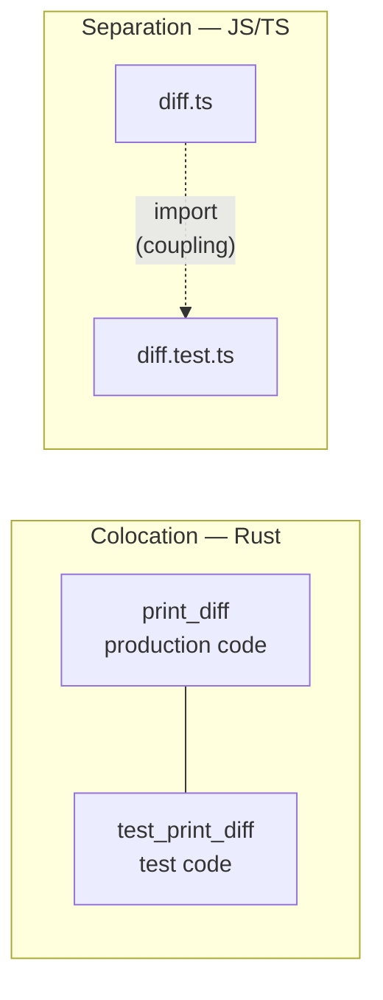
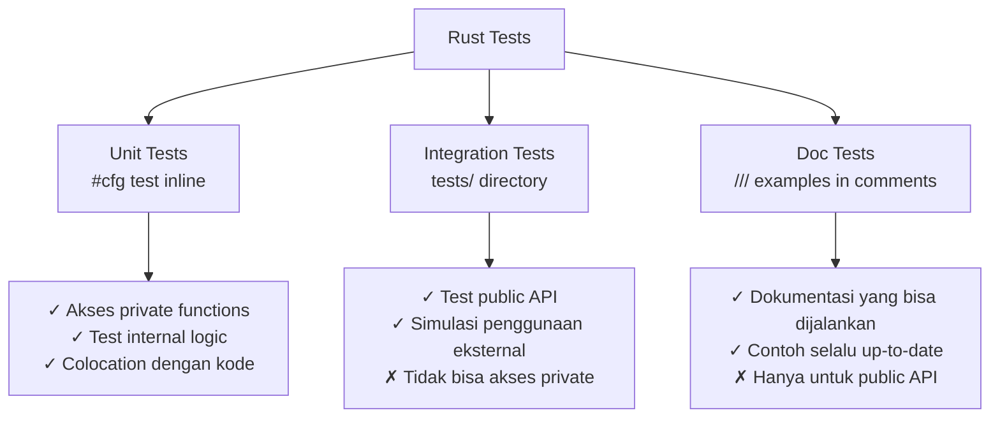
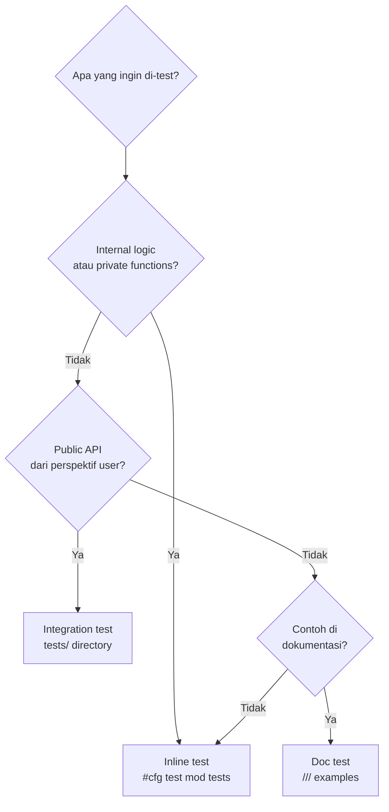

## Pertanyaan yang Wajar

Ketika pertama kali membuka codebase Rust yang serius — dalam hal ini [Kiro CLI](https://github.com/aws/amazon-q-developer-cli), sebuah AI coding agent yang dibangun AWS — ada satu hal yang langsung terasa aneh bagi developer yang terbiasa dengan ekosistem JavaScript/TypeScript:

**Test ada di dalam file yang sama dengan production code.**

```rust
// fs_write.rs — satu file, dua dunia
pub fn print_diff(output: &mut impl Write, old: &StylizedFile, ...) -> Result<()> {
    // ... 100 baris production code ...
}

#[cfg(test)]
mod tests {
    use super::*;

    #[test]
    fn test_trailing_newline_not_shown() {
        // ... test code ...
    }
}
```

Reaksi pertama yang wajar: *"Ini anti-pattern. Harusnya dipisah ke file terpisah."*

Tapi setelah menggali lebih dalam — dan setelah berkontribusi langsung ke codebase tersebut — ternyata ini bukan ketidakdisiplinan. Ini adalah **keputusan desain yang disengaja**, dengan alasan teknis yang kuat, dan didukung oleh dokumentasi resmi Rust.

---

## Bagaimana Ekosistem Lain Melakukannya

Untuk memahami mengapa Rust berbeda, kita perlu memahami mengapa bahasa lain memisahkan test.

### JavaScript/TypeScript

```
src/
├── utils/
│   ├── diff.ts          ← production code
│   └── diff.test.ts     ← test di file terpisah
```

Di JS/TS, pemisahan ini bukan pilihan — ini **keharusan praktis**:

1. Tidak ada mekanisme native untuk mengecualikan test dari production bundle
2. Bundler (webpack, vite, esbuild) harus dikonfigurasi secara eksplisit untuk mengabaikan `*.test.ts`
3. Module system tidak membedakan "internal" vs "public" dengan ketat — semua yang di-export bisa diakses dari mana saja

Akibatnya, jika kamu ingin test fungsi private di JS, kamu harus membuatnya public (atau menggunakan workaround seperti `rewire`).

### Java/C#

```
src/main/java/com/example/Diff.java      ← production
src/test/java/com/example/DiffTest.java  ← test
```

Pemisahan di direktori berbeda karena build system (Maven, Gradle) mengkompilasi keduanya secara terpisah. Test tidak masuk ke JAR production.

Tapi masalah yang sama muncul: **test hanya bisa mengakses public API**. Untuk test internal logic, kamu harus membuat method `package-private` atau menggunakan reflection — keduanya adalah workaround.

---

## Apa yang Rust Lakukan Berbeda

Rust menyelesaikan masalah ini di level bahasa, bukan di level tooling.

### `#[cfg(test)]` — Conditional Compilation

```rust
#[cfg(test)]
mod tests {
    // Blok ini TIDAK ADA di binary production
    // Dikompilasi hanya ketika `cargo test` dijalankan
}
```

Ini bukan komentar, bukan konvensi, bukan konfigurasi build — ini adalah **instruksi ke compiler**. Ketika kamu `cargo build`, blok `#[cfg(test)]` tidak dikompilasi sama sekali. Tidak ada overhead, tidak ada kode test yang bocor ke production binary.

Dari [The Rust Book](https://doc.rust-lang.org/book/ch11-03-test-organization.html):

> *"The `#[cfg(test)]` annotation on the tests module tells Rust to compile and run the test code only when you run `cargo test`, not when you run `cargo build`."*

### `use super::*` — Akses ke Private Functions

```rust
fn sanitize_path(path: &str) -> PathBuf {  // ← private, tidak di-pub
    // implementasi internal
}

#[cfg(test)]
mod tests {
    use super::*;  // ← import semua dari parent module, termasuk yang private

    #[test]
    fn test_sanitize_tilde() {
        // Bisa test fungsi private langsung!
        assert_eq!(sanitize_path("~/file"), PathBuf::from("/home/user/file"));
    }
}
```

Ini adalah keunggulan yang tidak bisa direplikasi dengan file terpisah. Dari [Rust Compiler Dev Guide](https://rust-lang.github.io/rustc-dev-guide/test-implementation.html):

> *"Private items can thus be easily tested without worrying about how to expose them to any sort of external testing apparatus. This is key to the ergonomics of testing in Rust."*

---

## Prinsip Colocation

Ada konsep dalam software engineering yang disebut **colocation** — menempatkan hal-hal yang saling berkaitan secara dekat satu sama lain.



Ketika kamu membaca `print_diff` di `fs_write.rs`, test-nya ada tepat di bawah. Kamu tidak perlu:
- Membuka file lain
- Mencari test yang relevan di direktori berbeda
- Memastikan import path masih valid setelah refactor

Ini bukan sekadar kenyamanan — ini mengurangi **cognitive load** saat membaca kode.

---

## Tiga Jenis Test di Rust

Rust memiliki hierarki test yang jelas, masing-masing dengan tempat dan tujuannya:



### Unit Tests — Inline

```rust
// src/lib.rs atau src/any_module.rs
fn internal_helper(x: u32) -> u32 { x * 2 }

#[cfg(test)]
mod tests {
    use super::*;
    
    #[test]
    fn test_internal_helper() {
        assert_eq!(internal_helper(3), 6);
    }
}
```

### Integration Tests — File Terpisah

```rust
// tests/integration_test.rs
// Hanya bisa akses public API dari crate
use my_crate::public_function;

#[test]
fn test_public_api() {
    assert!(public_function().is_ok());
}
```

### Doc Tests — Di Dalam Komentar

```rust
/// Doubles the input value.
///
/// ```
/// assert_eq!(my_crate::double(3), 6);
/// ```
pub fn double(x: u32) -> u32 { x * 2 }
```

---

## Studi Kasus: Kiro CLI

Ketika berkontribusi ke Kiro CLI untuk memperbaiki bug di `print_diff` ([PR #3717](https://github.com/aws/amazon-q-developer-cli/pull/3717)), pola ini terasa sangat natural.

`print_diff` adalah fungsi **private** — tidak di-`pub`, tidak bisa diakses dari luar modul. Di bahasa lain, ini berarti kamu harus membuatnya public hanya untuk keperluan testing, atau skip test sama sekali.

Di Rust, cukup:

```rust
fn print_diff(output: &mut impl Write, old: &StylizedFile, ...) -> Result<()> {
    // fungsi private — tidak perlu pub
}

#[cfg(test)]
mod tests {
    use super::*;  // akses print_diff langsung

    fn diff_output(old: &str, new: &str) -> String {
        let old = StylizedFile { content: old.to_string(), ..Default::default() };
        let new = StylizedFile { content: new.to_string(), ..Default::default() };
        let mut buf = Vec::new();
        print_diff(&mut buf, &old, &new, 1).unwrap();
        strip_ansi_escapes::strip_str(String::from_utf8(buf).unwrap())
    }

    #[test]
    fn test_trailing_newline_not_shown() {
        let output = diff_output("fi\n", "fi");
        assert_eq!(count_sign(&output, '-'), 0);
        assert_eq!(count_sign(&output, '+'), 0);
    }
}
```

Tidak ada perubahan visibility. Tidak ada workaround. Test langsung menguji implementasi internal.

---

## Mengapa Ini Penting Secara Ilmiah

Konsep ini berkaitan dengan beberapa prinsip software engineering yang sudah mapan:

**Encapsulation** — kemampuan untuk test internal state tanpa mengeksposnya ke dunia luar adalah bentuk encapsulation yang lebih kuat. Kamu tidak perlu "membocorkan" implementasi hanya untuk membuatnya testable.

**Locality of Reference** — dalam konteks kode, ini berarti hal-hal yang saling berkaitan harus berada dekat satu sama lain. Test yang colocated dengan kode yang di-test memiliki locality yang lebih tinggi.

**Zero-cost abstractions** — salah satu filosofi inti Rust. `#[cfg(test)]` adalah contoh sempurna: kamu mendapat kemudahan testing tanpa membayar biaya apapun di production binary.

---

## Kapan Tetap Pakai File Terpisah

Bukan berarti semua test harus inline. Ada kasus di mana file terpisah lebih tepat:



Di Kiro CLI sendiri, `tests/` hampir tidak dipakai karena sebagian besar yang perlu di-test adalah internal logic — path sanitization, diff rendering, markdown parsing. Semua private, semua inline.

---

## Kesimpulan

Pertanyaan "kenapa test Rust tidak dipisah ke file terpisah?" ternyata mengandung asumsi yang perlu dipertanyakan: bahwa pemisahan adalah default yang benar.

Di Rust, inline test bukan kompromi — ini adalah solusi yang lebih elegan untuk masalah yang bahasa lain selesaikan dengan workaround:

| Masalah | JS/TS | Rust |
|---------|-------|------|
| Test tidak masuk production | Konfigurasi bundler | `#[cfg(test)]` di level compiler |
| Test fungsi private | Buat public / gunakan `rewire` | `use super::*` langsung |
| Test dekat dengan kode | Konvensi direktori | Colocation native |
| Dokumentasi yang testable | Tidak ada | Doc tests |

Ini adalah salah satu contoh di mana Rust tidak hanya meminjam konvensi dari bahasa lain, tapi **merancang ulang dari prinsip pertama** — dan hasilnya lebih baik.

---

*Artikel ini lahir dari sesi kontribusi ke [Kiro CLI](https://github.com/aws/amazon-q-developer-cli) — sebuah AI coding agent open source yang dibangun dengan Rust. PR yang direferensikan ([#3717](https://github.com/aws/amazon-q-developer-cli/pull/3717)) adalah kontribusi nyata yang masih dalam review.*

**Referensi:**
- [The Rust Book — Test Organization](https://doc.rust-lang.org/book/ch11-03-test-organization.html)
- [Rust Compiler Dev Guide — Test Implementation](https://rust-lang.github.io/rustc-dev-guide/test-implementation.html)
- [Rust Forum — Testing Private Functions](https://users.rust-lang.org/t/testing-private-functions/41097)
