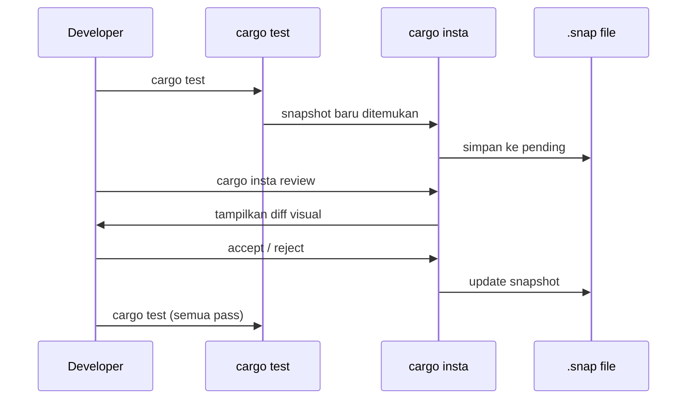
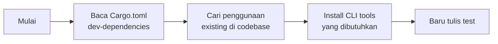

## Awal Mula: Sebuah Panic yang Tidak Terduga

Sesi kerja malam itu berjalan normal — sampai terminal tiba-tiba menampilkan ini:

```
The application panicked (crashed).
Message:  byte index 536 is out of bounds of `...`[...]
Location: crates/chat-cli/src/cli/chat/mod.rs:3849
```

Kiro CLI crash. Bukan karena input yang aneh, bukan karena jaringan bermasalah — tapi karena AI merespons dengan teks yang mengandung triple backtick (` ``` `), dan kode rendering di dalamnya tidak siap menghadapi karakter multi-byte UTF-8 yang berdampingan dengan itu.

Ini adalah titik awal dari perjalanan kontribusi yang mengajarkan lebih dari sekadar cara memperbaiki bug — tapi juga tentang **bagaimana sebuah codebase open source yang aktif bisa punya celah besar di infrastruktur testing-nya**.

---

## Anatomi Bug: Byte Index Out of Bounds

Di Rust, string adalah UTF-8. Tapi slicing string dengan byte index adalah operasi yang **tidak aman secara default** — jika index jatuh di tengah karakter multi-byte, program langsung panic.

Kode yang bermasalah di `crates/chat-cli/src/cli/chat/mod.rs`:

```rust
// Loop rendering response AI
loop {
    let input = Partial::new(&buf[offset..]);  // ← PANIC di sini
    match interpret_markdown(input, &mut self.stdout, &mut state) {
        Ok(parsed) => {
            offset += parsed.offset_from(&input);  // ← offset diakumulasi
            // ...
        }
    }
}
```

`parsed.offset_from(&input)` mengembalikan byte count relatif terhadap `input` (substring). Nilai ini diakumulasi ke `offset` yang digunakan sebagai byte index ke `buf` asli. Ketika `buf` mengandung karakter non-ASCII — misalnya teks Indonesia, emoji, atau karakter yang berdampingan dengan triple backtick — `offset` bisa mendarat di tengah karakter multi-byte.

Iterasi berikutnya: `&buf[offset..]` → **panic**.

### Fix-nya Sederhana, tapi Maknanya Dalam

```rust
// Sebelum
let input = Partial::new(&buf[offset..]);

// Sesudah
let Some(slice) = buf.get(offset..) else { break };
let input = Partial::new(slice);
```

`str::get()` mengembalikan `None` alih-alih panic ketika index tidak valid. Satu baris perubahan, tapi ini adalah perbedaan antara **crash** dan **graceful degradation**.

---

## Bug Kedua: Diff yang Berisik

Setelah PR pertama ([#3716](https://github.com/aws/amazon-q-developer-cli/pull/3716)) masuk, saya melihat issue lain yang sudah lama terbuka: **#923 — diffs show trailing newline differences**.

Setiap kali `fs_write` tool memodifikasi file, diff yang ditampilkan selalu punya baris terakhir yang "palsu":

```diff
- 92    : fi
+     92: fi
```

Kontennya identik. Yang berbeda hanya trailing newline. Ini terjadi karena `write_to_file` **selalu menambahkan `\n`** di akhir file, tapi konten yang di-diff belum dinormalisasi.

Fix-nya:

```rust
// Sebelum
let diff = similar::TextDiff::from_lines(&old_str.content, &new_str.content);

// Sesudah — strip satu trailing newline saja, bukan semua
let old_content = old_str.content.strip_suffix('\n').unwrap_or(&old_str.content);
let new_content = new_str.content.strip_suffix('\n').unwrap_or(&new_str.content);
let diff = similar::TextDiff::from_lines(old_content, new_content);
```

Kenapa `strip_suffix('\n')` dan bukan `trim_end_matches('\n')`?

Karena `trim_end_matches` akan menghapus **semua** trailing newline. Jika user sengaja menambahkan tiga baris kosong di akhir file, perbedaan itu harus tetap terlihat di diff. `strip_suffix` hanya menghapus satu — cukup untuk menghilangkan artefak dari `write_to_file`, tanpa menyembunyikan perubahan yang disengaja.

---

## Titik Balik: Menulis Test

Di sinilah perjalanan menjadi lebih menarik — dan lebih jujur.

Saat menulis test untuk fix kedua, saya langsung menulis:

```rust
#[test]
fn test_print_diff_real_change_is_shown() {
    let output = diff_output("old line\n", "new line\n");
    assert_eq!(count_sign(&output, '-'), 1);  // ← tidak bekerja
    assert_eq!(count_sign(&output, '+'), 1);  // ← tidak bekerja
}
```

Test gagal. Bukan karena logikanya salah, tapi karena `output` mengandung **ANSI escape codes** — karakter warna terminal yang membuat `starts_with('-')` tidak pernah true.

```
\u001B[38;5;9m- 1   : old line\u001B[0m
```

Baris itu dimulai dengan `\u001B[38;5;9m` (kode warna merah), bukan `-`. `count_sign` tidak bisa mendeteksinya.

### Solusi Naif vs Solusi yang Benar

**Solusi naif** yang sempat saya coba: hardcode string output lengkap dengan escape codes. Ini rapuh — berubah sedikit saja di formatting, semua test merah.

**Solusi yang lebih baik**: strip ANSI codes dulu, baru assert.

```rust
fn diff_output(old: &str, new: &str) -> String {
    let old = StylizedFile { content: old.to_string(), ..Default::default() };
    let new = StylizedFile { content: new.to_string(), ..Default::default() };
    let mut buf = Vec::new();
    print_diff(&mut buf, &old, &new, 1).unwrap();
    // strip_ansi_escapes sudah ada di codebase!
    strip_ansi_escapes::strip_str(String::from_utf8(buf).unwrap())
}
```

Tapi untuk output yang kompleks seperti diff dengan line numbers dan formatting, `assert_eq!` dengan string masih terasa rapuh. Di sinilah `insta` masuk.

---

## assert_eq! vs cargo-insta: Kapan Masing-masing Tepat

Ini bukan pertanyaan tentang mana yang "lebih baik" — tapi tentang **konteks penggunaan**.

```mermaid
flowchart TD
    A[Apa yang ingin di-test?] --> B{Output berupa nilai sederhana?}
    B -->|Ya| C["assert_eq!(result, 42)\nassert!(result.is_ok())"]
    B -->|Tidak| D{Output berupa string panjang/kompleks?}
    D -->|Ya| E{Apakah format bisa berubah seiring waktu?}
    E -->|Tidak| F["assert_eq!(output, \"expected string\")"]
    E -->|Ya| G["insta::assert_snapshot!(output)"]
    D -->|Tidak| H{Output berupa struktur data?}
    H -->|Ya| I["insta::assert_debug_snapshot!(value)"]
    H -->|Tidak| J["assert!(kondisi_logis)"]
```

### assert_eq! — Tepat untuk:

```rust
// Nilai deterministik dan sederhana
assert_eq!(count, 3);
assert_eq!(path, "/home/user/file.txt");
assert!(result.is_ok());
assert_eq!(count_sign(&output, '-'), 0);  // logika sederhana
```

### insta::assert_snapshot! — Tepat untuk:

```rust
// Output kompleks yang susah ditulis manual
insta::assert_snapshot!(rendered_diff, @"
- 1   : old line
+    1: new line
");

// JSON response
insta::assert_json_snapshot!(api_response);

// Debug output dari struct kompleks
insta::assert_debug_snapshot!(parsed_ast);
```

### Workflow insta yang Benar



Pertama kali test dijalankan, `insta` **merekam output aktual** — bukan menebak. Kamu tinggal verifikasi apakah output itu benar, lalu accept. Di masa depan, jika output berubah, `insta` menampilkan diff dan kamu memutuskan: ini regresi atau perubahan yang disengaja?

---

## Temuan yang Lebih Mengejutkan: Kondisi Testing Codebase

Setelah menyelesaikan kedua PR, saya iseng mengaudit kondisi testing di `crates/chat-cli`:

```bash
$ grep -rn "insta::" crates/ --include="*.rs" | wc -l
3   # hanya 3 penggunaan di seluruh codebase!

$ grep -rn "fn test_" crates/chat-cli/src/ --include="*.rs" | wc -l
278  # 278 test functions

$ for f in crates/chat-cli/src/cli/chat/tools/*.rs; do
    count=$(grep -c "fn test_" "$f" 2>/dev/null || echo 0)
    echo "$count $f"
  done | sort -rn
```

Hasilnya:

```
18  fs_read.rs
16  fs_write.rs
 8  use_aws.rs
 2  mod.rs
 0  todo.rs        ← zero test
 0  thinking.rs    ← zero test
 0  knowledge.rs   ← zero test
 0  introspect.rs  ← zero test
 0  gh_issue.rs    ← zero test
 0  delegate.rs    ← zero test
 0  custom_tool.rs ← zero test
```

278 test functions, tapi `insta` hanya dipakai 3 kali (2 di `builder_id.rs`, 1 yang baru kita tambahkan). Dan 7 dari 11 file tools tidak punya test sama sekali.

Ini bukan kritik — ini adalah **realita umum di codebase open source yang bergerak cepat**. Feature velocity sering mendahului test coverage. Tapi ini juga berarti ada banyak ruang untuk berkontribusi.

---

## Pelajaran: Jangan Ubah Kode Sebelum Cek Dependencies

Ini adalah kesalahan yang saya buat sendiri dan layak didokumentasikan.

Ketika pertama kali menulis test dan `count_sign` tidak bekerja karena ANSI codes, saya sempat mencoba workaround dengan mengubah kode test — padahal solusinya sudah ada di `Cargo.toml`:

```toml
# crates/chat-cli/Cargo.toml
[dev-dependencies]
insta.workspace = true  # sudah ada!
```

Dan `strip_ansi_escapes` juga sudah dipakai di tempat lain:

```rust
// crates/chat-cli/src/cli/chat/tools/delegate.rs
let clean_summary = strip_ansi_escapes::strip_str(&raw_summary)
```

**Alur yang benar sebelum menulis test di codebase asing:**



Dalam kasus ini: `cargo install cargo-insta` seharusnya jadi langkah pertama, bukan langkah terakhir setelah beberapa kali mencoba workaround.

---

## Tiga PR, Satu Sesi

Hasil dari satu sesi kontribusi malam itu:

| PR | Judul | Status |
|----|-------|--------|
| [#3716](https://github.com/aws/amazon-q-developer-cli/pull/3716) | fix(chat): prevent panic on UTF-8 boundary | Open |
| [#3717](https://github.com/aws/amazon-q-developer-cli/pull/3717) | fix(fs_write): suppress spurious trailing-newline diff lines | Open |

Dan satu issue yang dilaporkan:

| Issue | Deskripsi |
|-------|-----------|
| [#3715](https://github.com/aws/amazon-q-developer-cli/issues/3715) | panic: byte index out of bounds in chat response rendering |

---

## Key Takeaways

1. **`str::get()` vs `&str[..]`** — selalu gunakan `get()` ketika byte index berasal dari kalkulasi eksternal. Panic lebih buruk dari `None`.

2. **`strip_suffix` vs `trim_end_matches`** — ketika kamu hanya ingin menghapus satu trailing karakter, bukan semua. Presisi mencegah bug tersembunyi.

3. **`insta` untuk output kompleks** — jangan hardcode string panjang di `assert_eq!`. Biarkan `insta` merekam output aktual, lalu verifikasi secara visual.

4. **Audit dependencies sebelum menulis test** — `Cargo.toml` adalah peta. Baca dulu sebelum reinvent the wheel.

5. **Zero test bukan berarti kode buruk** — tapi berarti ada peluang kontribusi yang nyata dan berdampak.

---

## Langkah Selanjutnya

Rencana PR berikutnya: menambahkan test coverage untuk file-file yang saat ini zero test — dimulai dari `delegate.rs` dan `todo.rs` yang paling sering digunakan dalam sesi chat. Bukan sekadar menambah angka coverage, tapi membangun **test yang benar-benar menangkap regresi**.

Kalau kamu tertarik berkontribusi ke Kiro CLI, repo-nya ada di [github.com/aws/amazon-q-developer-cli](https://github.com/aws/amazon-q-developer-cli). Label `good first issue` adalah titik masuk yang bagus.
