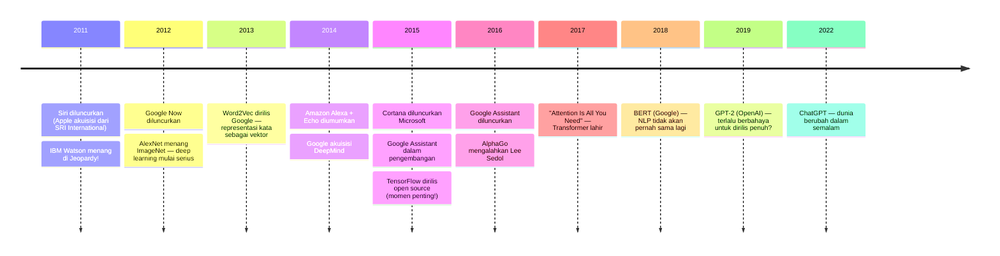
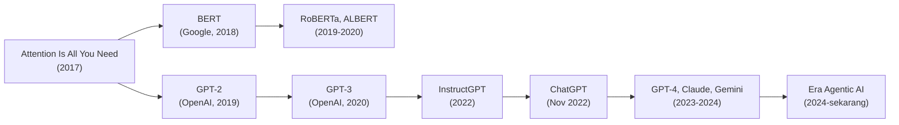

## Sebuah Kenangan yang Terasa Jauh

Coba ingat kembali. Suatu hari di sekitar 2014-2016, kamu mengangkat ponselmu dan berkata: *"Hey Siri, set alarm jam 7 pagi."* Siri merespons. Kamu merasa seperti sedang hidup di masa depan.

Itu bukan perasaan yang salah. Pada masanya, itu memang masa depan.

Tapi kalau kamu bandingkan dengan apa yang bisa dilakukan Claude Cowork atau OpenCode hari ini — menulis ratusan baris kode, menjalankannya, memperbaiki error, mendeploy ke server — kemampuan Siri di 2014 terasa seperti mainan anak-anak.

Apa yang terjadi di antara dua titik itu? Jawabannya lebih dalam dan lebih dramatis dari yang kebanyakan orang sadari.

---

## Era Sebelum Transformer: Kompetisi yang Sunyi tapi Brutal

Sebelum 2017 — sebelum paper *"Attention Is All You Need"* mengubah segalanya — dunia NLP (Natural Language Processing) adalah medan perang yang sangat berbeda.

Yang bermain di sana bukan startup dengan 10 engineer dan GPU cloud. Yang bermain adalah perusahaan dengan ribuan peneliti, superkomputer khusus, dan anggaran riset yang tidak pernah dipublikasikan. IBM, Google, Microsoft, Amazon, Apple — mereka semua berlomba, tapi lombanya terjadi di balik pintu tertutup.

Teknologi yang mereka kembangkan — speech recognition, text-to-speech, intent classification, named entity recognition — semuanya ada. Tapi semuanya **proprietary**. Kamu tidak bisa download model IBM Watson dan menjalankannya di laptopmu. Kamu tidak bisa fine-tune Google's speech recognition untuk bahasa daerahmu. Kamu harus membeli lisensi, menandatangani NDA, dan membayar per API call.

Ini adalah era di mana AI benar-benar hanya untuk enterprise.

---

## Siri: Yang Pertama, tapi Tidak yang Terbaik

Siri adalah yang pertama masuk ke tangan jutaan orang. Apple mengakuisisinya dari SRI International pada 2010 — sebuah spin-off dari proyek riset DARPA — dan meluncurkannya bersama iPhone 4S pada Oktober 2011.

Pada masanya, Siri terasa ajaib. Kamu bisa bertanya dalam bahasa natural, dan Siri mencoba menjawab. Bukan dengan mengetik query ke search engine — tapi dengan *memahami* maksudmu.

Tapi ada batasan yang sangat fundamental: Siri bekerja dengan **intent classification**. Ia tidak benar-benar "memahami" bahasa — ia mengklasifikasikan ucapanmu ke dalam kategori yang sudah didefinisikan sebelumnya. "Set alarm" → intent: SET_ALARM, entity: TIME=7AM. "Hubungi ibu" → intent: MAKE_CALL, entity: CONTACT=ibu.

Kalau kamu keluar dari kategori yang sudah didefinisikan, Siri bingung. Coba tanya Siri tentang sesuatu yang sedikit di luar script-nya, dan kamu akan mendapat jawaban yang tidak relevan atau "Saya tidak mengerti pertanyaan itu."

Ini bukan kelemahan Siri saja — ini adalah kelemahan fundamental dari pendekatan NLP berbasis rule dan intent classification yang dipakai semua asisten virtual di era itu.

---

## Alexa: Ketika Hardware Menjadi Trojan Horse

Amazon meluncurkan Alexa bersama Echo pada 2014, dan strateginya sangat berbeda dari Apple.

Apple menjual Siri sebagai fitur iPhone. Amazon menjual Echo sebagai perangkat rumah tangga — speaker yang selalu menyala, selalu mendengarkan, selalu siap. Ini adalah keputusan yang brilian secara bisnis: Amazon tidak perlu bersaing di smartphone (di mana Apple dan Google sudah dominan), mereka menciptakan kategori baru.

Yang lebih menarik adalah ekosistem **Alexa Skills** — cara Amazon membuka platform mereka ke developer pihak ketiga. Kamu bisa membuat "skill" untuk Alexa: aplikasi suara yang bisa dipanggil dengan kata kunci tertentu. Ini adalah langkah pertama menuju ekosistem yang lebih terbuka — meskipun masih sangat terbatas dibanding apa yang bisa dilakukan dengan LLM hari ini.

Alexa juga menjadi pemain dominan di smart home — menghubungkan lampu, termostat, kunci pintu, TV. Ini adalah use case yang sangat konkret dan sangat berbeda dari "asisten yang bisa menjawab pertanyaan umum."

---

## Cortana: Ambisi yang Terlalu Besar, Terlalu Cepat

Microsoft meluncurkan Cortana pada 2015 dengan ambisi yang sangat besar. Bukan hanya asisten suara — tapi asisten yang terintegrasi ke seluruh ekosistem Microsoft: Windows, Office, Xbox, bahkan Android dan iOS.

Cortana punya beberapa keunggulan yang sering terlupakan. Ia bisa membaca email dan kalendermu untuk memberikan konteks yang relevan. Ia bisa mengingatkanmu tentang sesuatu berdasarkan lokasi (*"ingatkan saya untuk beli susu ketika saya lewat minimarket"*). Ia punya kepribadian yang lebih kuat dari Siri — Microsoft mempekerjakan penulis fiksi untuk membuat Cortana terasa lebih manusiawi.

Tapi ada masalah yang tidak bisa diselesaikan dengan kepribadian yang bagus: **Cortana tidak cukup pintar untuk use case yang benar-benar penting**.

Di era itu, "kecerdasan" asisten virtual sangat bergantung pada seberapa banyak data training yang kamu punya dan seberapa baik pipeline NLP-mu. Google punya keunggulan yang hampir tidak bisa dikejar — mereka punya miliaran query pencarian setiap hari sebagai data training. Microsoft tidak punya itu.

Ketika ChatGPT muncul pada 2022 dan menunjukkan apa yang sebenarnya mungkin dilakukan AI, Cortana tiba-tiba terlihat seperti produk dari era yang berbeda. Microsoft dengan cepat memutuskan untuk pivot — mengintegrasikan teknologi OpenAI ke dalam produk mereka dan meluncurkan Copilot sebagai brand baru. Cortana secara resmi dihentikan untuk konsumer pada 2023.

---

## Google Assistant: Yang Paling Pintar, tapi Terlambat

Google Assistant diluncurkan pada 2016 — lebih lambat dari Siri, Alexa, dan Cortana. Tapi ketika ia muncul, ia langsung menjadi yang paling canggih.

Alasannya sederhana: Google punya data yang tidak dimiliki siapapun. Miliaran query pencarian, miliaran email di Gmail, miliaran dokumen di Google Docs, peta seluruh dunia dari Google Maps. Semua ini menjadi bahan training yang membuat Google Assistant jauh lebih baik dalam memahami konteks dan memberikan jawaban yang relevan.

Google Assistant juga yang pertama menunjukkan kemampuan yang benar-benar mengejutkan: **Google Duplex** pada 2018 — sistem yang bisa menelepon restoran dan membuat reservasi secara otomatis, dengan suara yang terdengar sangat manusiawi. Demonstrasinya di Google I/O 2018 membuat penonton terdiam. Ini bukan lagi intent classification — ini adalah sesuatu yang berbeda.

Tapi Google punya masalah yang berbeda: **mereka terlalu berhati-hati**. Setiap kali mereka punya teknologi yang revolusioner, mereka ragu untuk merilisnya secara luas karena takut dampak negatifnya. Google Duplex tidak pernah benar-benar menjadi produk mainstream. LaMDA — model bahasa mereka yang sangat canggih — tidak pernah dirilis ke publik sampai ChatGPT memaksa mereka untuk bergerak cepat dengan Bard (yang kemudian menjadi Gemini).

---

## Kaggle dan Hugging Face: Benih Keterbukaan

Di tengah semua kompetisi enterprise yang tertutup ini, ada dua platform yang menanam benih untuk era yang berbeda.

**Kaggle** diluncurkan pada 2010 — platform kompetisi machine learning di mana siapapun bisa berpartisipasi. Ini adalah demokratisasi yang sangat penting: untuk pertama kalinya, seorang mahasiswa di universitas kecil bisa bersaing dengan tim riset dari perusahaan Fortune 500, menggunakan dataset yang sama dan metrik yang sama.

Kaggle mengubah cara orang belajar ML. Bukan dari buku teks — tapi dari kompetisi nyata, dengan data nyata, dan feedback langsung dari leaderboard. Komunitas yang terbentuk di Kaggle menjadi salah satu komunitas ML paling aktif di dunia.

**Hugging Face** muncul lebih belakangan — awalnya sebagai chatbot app pada 2016, kemudian pivot menjadi platform untuk berbagi model ML pada 2018. Timing-nya sempurna: tepat ketika BERT dan GPT-2 dirilis, Hugging Face menyediakan infrastruktur untuk mendistribusikan model-model itu ke seluruh dunia.

Kalau Kaggle adalah tempat untuk belajar dan berkompetisi, Hugging Face adalah tempat untuk berbagi dan berkolaborasi. Keduanya bersama-sama menciptakan ekosistem open source ML yang tidak ada sebelumnya.

---

## "Attention Is All You Need": Selembar Paper yang Mengubah Segalanya

Pada Juni 2017, delapan peneliti Google mempublikasikan sebuah paper dengan judul yang terdengar sederhana: *"Attention Is All You Need"*.

Paper itu memperkenalkan arsitektur **Transformer** — cara baru untuk memproses urutan data (seperti teks) yang jauh lebih efisien dan efektif dari pendekatan sebelumnya (RNN, LSTM). Kunci inovasinya adalah **self-attention mechanism** — cara model untuk "memperhatikan" bagian-bagian berbeda dari input secara bersamaan, bukan secara berurutan.

Dampaknya tidak langsung terasa. Tapi dalam dua tahun, hampir semua model NLP terbaik di dunia dibangun di atas arsitektur Transformer. BERT (2018), GPT-2 (2019), T5 (2019), GPT-3 (2020) — semuanya adalah Transformer.

Yang membuat Transformer berbeda dari semua yang sebelumnya bukan hanya akurasinya — tapi **skalabilitasnya**. Semakin besar model Transformer, semakin pintar ia menjadi. Ini adalah properti yang tidak dimiliki arsitektur sebelumnya. Dan ketika OpenAI menyadari ini dengan GPT-3 — model dengan 175 miliar parameter — mereka tahu bahwa mereka sedang memegang sesuatu yang berbeda dari semua yang pernah ada.

---

## Mengapa Era Itu Terasa Seperti "Masa Kegelapan"

Bukan karena teknologinya buruk. Teknologinya luar biasa untuk masanya.

Tapi ada beberapa hal yang membuat era itu terasa terbatas dibanding sekarang:

**Tertutup secara default.** Hampir semua teknologi AI terbaik adalah proprietary. Kamu tidak bisa inspect, modify, atau redistribute model Siri atau Alexa. Kamu hanya bisa menggunakannya melalui API yang mereka sediakan, dengan harga yang mereka tentukan.

**Narrow AI yang sangat narrow.** Setiap sistem dioptimalkan untuk satu task spesifik. Speech recognition bagus untuk speech recognition, tapi tidak bisa melakukan apa-apa di luar itu. Intent classification bagus untuk intent classification, tapi tidak bisa bernalar tentang hal-hal yang tidak ada dalam training data-nya.

**Barrier to entry yang sangat tinggi.** Untuk melatih model NLP yang serius, kamu butuh dataset yang besar (yang tidak tersedia secara publik), infrastruktur komputasi yang mahal (GPU cluster), dan tim peneliti yang berpengalaman. Ini adalah domain eksklusif perusahaan besar.

**Tidak ada "general intelligence" yang terasa nyata.** Kamu bisa bicara dengan Siri, tapi kamu tidak bisa *berdiskusi* dengannya. Kamu bisa minta Alexa untuk memutar musik, tapi kamu tidak bisa minta Alexa untuk membantu kamu memahami konsep yang kompleks.

---

## Yang Berubah dan Yang Tidak

Hari ini, dengan LLM yang bisa diakses siapapun melalui API atau bahkan dijalankan secara lokal, banyak dari batasan itu sudah hilang.

Tapi ada sesuatu yang menarik: **kompetisi hari ini jauh lebih terbuka tapi juga jauh lebih masif**. Di era Siri-Alexa-Cortana, pemainnya bisa dihitung dengan jari. Hari ini, ada ribuan model LLM — dari GPT-4o hingga Llama 3, dari Mistral hingga Qwen, dari model 7 miliar parameter yang bisa berjalan di laptop hingga model 1 triliun parameter yang butuh cluster GPU.

Kaggle dan Hugging Face yang dulu menanam benih keterbukaan kini menjadi infrastruktur utama ekosistem AI global. Hugging Face hari ini punya lebih dari 500.000 model yang bisa didownload gratis — sesuatu yang tidak terbayangkan di era Cortana.

Dan Siri? Ia masih ada. Masih menjawab pertanyaan sederhana di iPhone. Tapi Apple — yang dulu menjadi yang pertama — kini menjadi yang paling tertinggal dalam perlombaan LLM. Ironi yang tidak kecil.

---

## Penutup: Sejarah yang Perlu Diingat

Ketika kamu menggunakan Claude Cowork atau OpenCode hari ini dan merasa kagum dengan kemampuannya, ada baiknya sesekali mengingat bahwa semua ini berdiri di atas fondasi yang dibangun selama puluhan tahun — oleh ribuan peneliti yang bekerja di era ketika tidak ada yang tahu apakah AI akan pernah menjadi sesuatu yang benar-benar berguna.

Siri, Alexa, Cortana, Google Assistant — mereka bukan kegagalan. Mereka adalah batu loncatan. Mereka membuktikan bahwa orang mau berbicara dengan mesin, mau mempercayakan tugas kepada AI, mau membayar untuk kecerdasan buatan yang tertanam dalam kehidupan sehari-hari mereka.

Tanpa mereka, mungkin tidak ada ChatGPT. Tanpa ChatGPT, mungkin tidak ada Claude Cowork. Tanpa Claude Cowork, mungkin tidak ada OpenWork dan ekosistem open source yang tumbuh di sekitarnya.

Sejarah AI bukan garis lurus dari bodoh ke pintar. Ia adalah spiral — setiap putaran membawa kita lebih tinggi, tapi selalu melewati titik-titik yang pernah kita lewati sebelumnya, hanya dengan pemahaman yang lebih dalam.

---

*Artikel ini adalah bagian dari series tentang lanskap AI. Artikel sebelumnya: [Peta Kekuatan AI: OpenAI, Anthropic, Google DeepMind, dan Microsoft](/posts/peta-kekuatan-ai-openai-anthropic-google-microsoft).*
