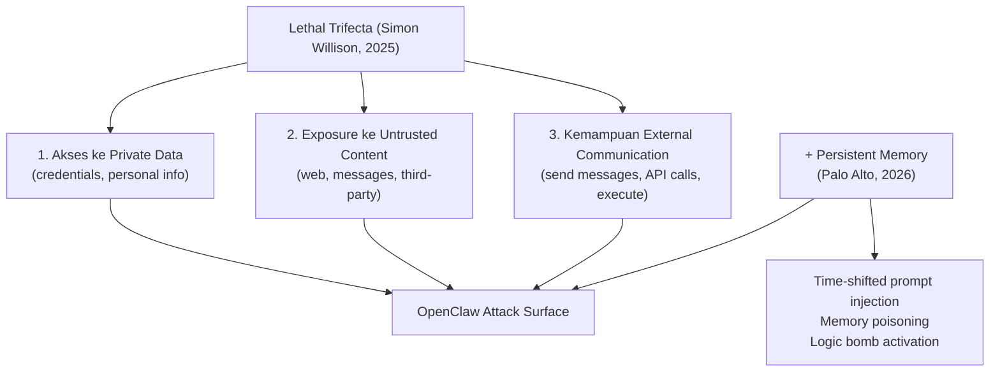
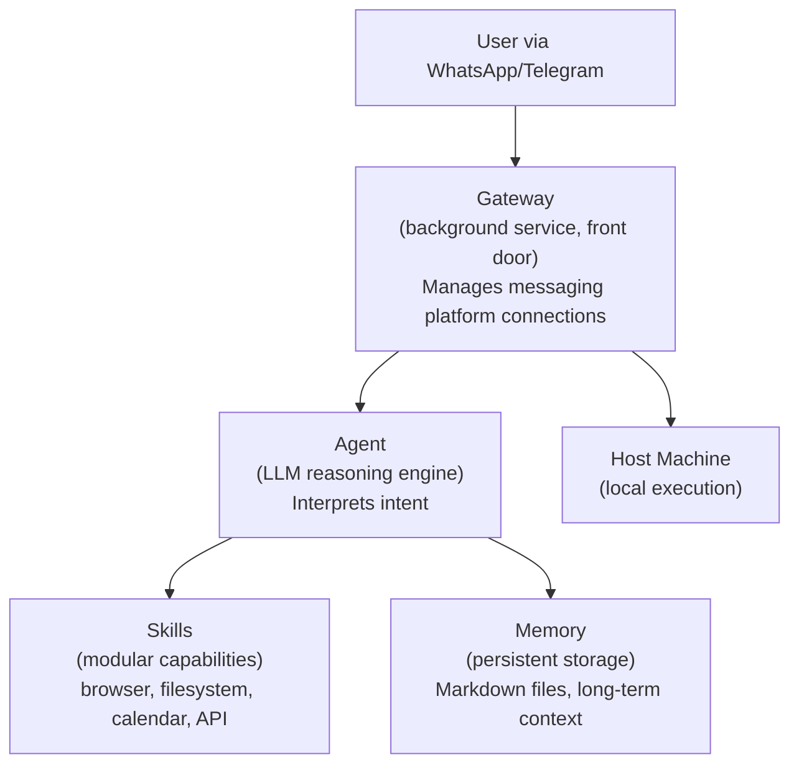
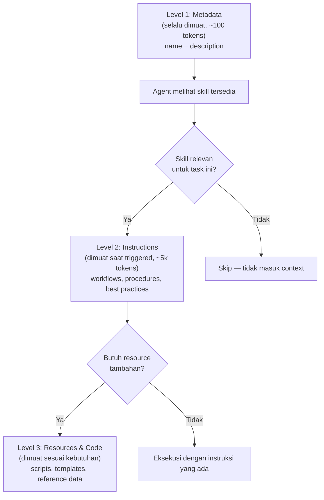
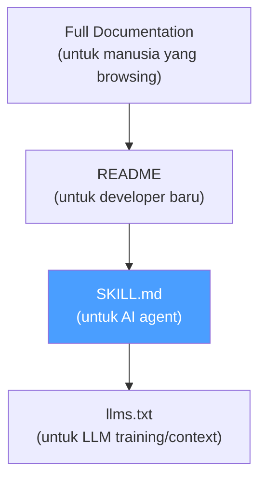

## Sebuah Drama Rebranding yang Mengungkap Sesuatu yang Lebih Besar

Januari 2026. Seorang developer bernama Peter Steinberger merilis sebuah tool bernama **Clawdbot** — personal AI assistant yang langsung viral. Dalam hitungan minggu, ia mendapat surat dari Anthropic: nama itu terlalu mirip dengan "Claude". Ia harus ganti nama.

Pada 27 Januari 2026, ia mengumumkan rebranding ke **Moltbot** — terinspirasi dari proses molting lobster, melepas cangkang lama untuk tumbuh:

> *"Molt fits perfectly — it's what lobsters do to grow."*

Tapi nama itu pun tidak bertahan lama. Akhirnya ia menetap di **OpenClaw** — nama yang sekarang dikenal sebagai salah satu personal AI assistant paling populer di 2026 dengan ratusan ribu stars di GitHub, lebih dari 11.500 forks, semua dalam waktu kurang dari seminggu.

Tiga nama, satu produk. Tapi yang menarik bukan dramanya — yang menarik adalah *mengapa* tool ini begitu cepat viral, dan apa yang ia ungkap tentang arah ekosistem AI agent.

---

## Apa yang Membuat OpenClaw Berbeda

OpenClaw bukan sekadar chatbot. Ia adalah autonomous agent yang bisa:

- Browse web dan merangkum PDF
- Menjadwalkan kalender
- Membaca dan menulis file di sistemmu
- Mengirim email atas namamu
- Mengambil screenshot dan mengontrol aplikasi desktop
- Terintegrasi dengan WhatsApp, Telegram, dan messaging app lainnya
- **Menyimpan memori persisten** — ia ingat interaksi dari minggu atau bulan lalu

Memori persisten inilah yang menjadi pembeda sekaligus sumber kontroversi terbesar.

---

## Sisi Gelap: Ketika Power Bertemu Kerentanan

Palo Alto Networks mempublikasikan analisis keamanan yang sangat detail tentang OpenClaw (saat itu masih bernama Moltbot) pada Januari 2026. Judulnya cukup provokatif: *"Why Moltbot May Signal the Next AI Security Crisis"*.

Argumen utamanya: OpenClaw memiliki akses ke root files, authentication credentials, browser history, cookies, dan semua folder di sistemmu. Kombinasi ini dengan memori persisten menciptakan attack surface yang sangat luas.

Palo Alto memperkenalkan konsep **"Lethal Trifecta + 1"** — memperluas konsep Simon Willison tentang tiga kerentanan fundamental AI agent:



Skenario serangan yang paling mengkhawatirkan: pesan WhatsApp yang berisi payload berbahaya tersimpan di memori persisten agent, lalu dieksekusi beberapa hari kemudian ketika kondisi tertentu terpenuhi — tanpa ada human-in-the-loop check.

Palo Alto memetakan kerentanan OpenClaw ke **OWASP Top 10 for Agentic Applications 2026**:

| OWASP Risk | Kerentanan OpenClaw |
|---|---|
| A01: Prompt Injection | Web results dan messages bisa inject instruksi berbahaya |
| A02: Insecure Tool Invocation | Tools dipanggil berdasarkan reasoning yang termasuk untrusted memory |
| A03: Excessive Autonomy | Root access + credential access + network, tanpa privilege boundaries |
| A04: Missing Human-in-the-Loop | Tidak ada approval untuk operasi destruktif |
| A05: Memory Poisoning | Semua memory tidak dibedakan berdasarkan sumber atau trust level |
| A06: Insecure Third-Party Skills | Skills pihak ketiga berjalan dengan full agent privileges |

Ini bukan berarti OpenClaw adalah produk yang buruk — ini adalah peringatan bahwa **power yang besar membutuhkan governance yang setara**.

---

## Arsitektur OpenClaw: Empat Komponen Utama

Berdasarkan analisis mendalam dari [AIMultiple](https://aimultiple.com/moltbot), OpenClaw terdiri dari empat komponen utama:



Yang membuat arsitektur ini unik dibanding agent lain:

**vs Visual Agents** — Visual agents mengambil screenshot, memproses pixel data, dan menghitung koordinat untuk simulasi klik mouse. OpenClaw bypass GUI sepenuhnya — ia tidak "melihat" ikon file untuk memindahkannya, ia langsung mengeksekusi shell command (`mv /downloads/*.pdf /documents`). Hasilnya: tidak ada grounding errors, beroperasi di machine speed bukan human interface speed.

**vs CLI Agents** — CLI agents seperti Claude Code atau Open Interpreter berjalan dalam terminal window dan hanya merespons ketika user menginput command. Mereka menderita "session amnesia" — tutup terminal, context hilang. OpenClaw berjalan sebagai gateway daemon 24/7, mempertahankan memori jangka panjang di file lokal (MEMORY.md), dan bisa **menginisiasi interaksi sendiri** melalui Heartbeat Engine dan cron job integration.

## Moltworker: OpenClaw di Cloudflare Workers

Salah satu deployment pattern yang menarik adalah **Moltworker** — cara menjalankan OpenClaw di Cloudflare Workers (serverless) alih-alih VPS tradisional.

Dalam setup ini:
- Execution logic OpenClaw berjalan di Cloudflare Workers
- Agent memory, logs, dan artifacts disimpan di Cloudflare R2 (object storage)
- R2 menyediakan free tier hingga 10GB — deployment kecil bisa berjalan tanpa biaya infrastruktur tambahan

Cocok untuk: chat-based assistants, on-demand automation agents, dan personal/experimental agents dengan traffic rendah. Tidak cocok untuk: long-running autonomous agents atau agents yang butuh GPU atau local filesystem access.


Di luar isu keamanan, ada paradoks yang dialami siapapun yang pernah serius menggunakan AI coding agent: model yang sangat canggih, tapi sering menghasilkan kode yang salah untuk library atau framework tertentu.

Bukan karena modelnya bodoh. Tapi karena **dokumentasi ditulis untuk manusia, bukan untuk AI**.

Dokumentasi manusia menyebar informasi di puluhan halaman, mengasumsikan pembaca akan browsing secara non-linear, dan sering melewatkan detail teknis yang "sudah jelas" bagi developer berpengalaman. LLM tidak bisa memegang seluruh dokumentasi dalam context window-nya sekaligus — dan bahkan kalau bisa, performa model menurun drastis ketika context terlalu panjang.

**SKILL.md** adalah jawaban untuk masalah ini.

---

## Apa Itu SKILL.md?

SKILL.md adalah file markdown yang hidup bersama kode atau dokumentasimu, berisi instruksi yang dioptimalkan untuk AI agent — bukan untuk manusia.

Bukan README. Bukan dokumentasi API. Ini adalah **cheat sheet untuk agent** — berisi keputusan yang sudah dibuat untuknya, gotchas yang sering dilupakan, dan batasan yang harus direspek.

Formatnya sederhana:

```markdown
---
name: git-release
description: Create consistent releases and changelogs
license: MIT
compatibility: opencode
metadata:
  audience: maintainers
  workflow: github
---

## What I do

- Draft release notes from merged PRs
- Propose a version bump
- Provide a copy-pasteable `gh release create` command

## When to use me

Use this when you are preparing a tagged release.

## Gotchas

- Never use `git tag` directly — always use `gh release create`
- Version bumps follow semver strictly
- Always check CHANGELOG.md exists before creating release
```

Frontmatter-nya minimal: `name` (required, 1-64 karakter, lowercase alphanumeric), `description` (required, max 1024 karakter), dan beberapa field opsional.

---

## Tiga Level Progressive Disclosure

Salah satu desain paling cerdas dari agent skills adalah **progressive disclosure** — cara agent memuat informasi secara bertahap sesuai kebutuhan:



Ini mencegah context bloat — agent tidak perlu membawa semua instruksi setiap saat. Hanya yang relevan yang masuk ke working memory.

---

## Bagaimana Berbagai Tool Mengimplementasikan Skills

### OpenCode

OpenCode mencari SKILL.md di beberapa lokasi secara hierarkis:

```
.opencode/skills/<name>/SKILL.md          # project-local
~/.config/opencode/skills/<name>/SKILL.md  # global
.claude/skills/<name>/SKILL.md            # Claude-compatible
.agents/skills/<name>/SKILL.md            # agent-compatible
```

Dokumentasi lengkap: [opencode.ai/docs/skills](https://opencode.ai/docs/skills/)

### Claude Code (Anthropic)

Anthropic mendokumentasikan agent skills di [platform.claude.com/docs/en/agents-and-tools/agent-skills/overview](https://platform.claude.com/docs/en/agents-and-tools/agent-skills/overview). Skills di Claude Code berjalan di VM environment dengan filesystem access — memungkinkan skills untuk menjalankan scripts dan mengakses resources secara langsung.

Perbedaan penting antar platform Claude:
- **Claude API**: Tidak ada network access untuk skills
- **Claude Code**: Full network access
- **Claude.ai**: Bervariasi tergantung settings

### Cursor

Cursor mengimplementasikan skills sebagai bagian dari sistem rules-nya. Dokumentasi di [cursor.com/docs/skills](https://cursor.com/docs/skills).

### Gemini CLI

Google Gemini CLI juga mendukung skills dengan format yang kompatibel. Dokumentasi di [geminicli.com/docs/cli/skills](https://geminicli.com/docs/cli/skills/).

### GitHub Copilot CLI

Copilot CLI mengimplementasikan skills melalui AGENTS.md dan Agent Skills — memungkinkan kustomisasi behavior yang konsisten across models, sessions, dan delegated work.

---

## Ekosistem yang Tumbuh: Dari Tool ke Standar Universal

SKILL.md bukan hanya fitur satu tool. Ia sedang menjadi **open standard** yang diadopsi secara luas.

**Mintlify** mengumumkan bahwa semua dokumentasi yang dihosting di platform mereka otomatis menghasilkan file `/.well-known/skills/default/SKILL.md`. Setiap kali dokumentasi diupdate, SKILL.md-nya diregenerasi otomatis. Artikel lengkap: [mintlify.com/blog/skill-md](https://www.mintlify.com/blog/skill-md).

**Vercel** merilis `skills` CLI — tool untuk menginstall skills dari URL ke berbagai agent sekaligus:

```bash
# Install skill dari URL dokumentasi
npx skills add https://mintlify.com/docs

# Skills otomatis terdeteksi dan diinstall ke semua agent yang terdeteksi
```

**[agentskills.so](https://agentskills.so)** menjadi direktori komunitas untuk berbagi skills — mirip npm registry tapi untuk instruksi agent.

**[awesome-agent-skills](https://github.com/heilcheng/awesome-agent-skills)** adalah kurasi komunitas dari skills terbaik yang tersedia.

**[CommandCodeAI/agent-skills](https://github.com/CommandCodeAI/agent-skills)** menyediakan koleksi skills yang bisa langsung diinstall.

**Anthropic** sendiri memaintain repository skills resmi di [github.com/anthropics/skills](https://github.com/anthropics/skills/blob/main/skills/skill-creator/SKILL.md), termasuk skill untuk membuat skills baru.

---

## 5 Agent Skills yang Dipakai Engineer Setiap Hari

Matt Pocock dari AIHero.dev mendokumentasikan 5 skills yang ia gunakan setiap hari dalam artikel [5 Agent Skills I Use Every Day](https://www.aihero.dev/5-agent-skills-i-use-every-day). Ini adalah contoh nyata bagaimana skills mengubah cara kerja dengan AI:

### 1. `/grill-me` — Flesh Out an Idea

```bash
npx skills@latest add mattpocock/skills/grill-me
```

Hanya tiga kalimat, tapi sangat impactful:

> *"Interview me relentlessly about every aspect of this plan until we reach a shared understanding. Walk down each branch of the design tree, resolving dependencies between decisions one by one. And finally, if a question can be answered by exploring the code base, explore the code base instead."*

Konsep "design tree" dari buku *The Design of Design* oleh Frederick P. Brooks — kamu harus menjelajahi semua cabang keputusan sebelum commit ke kode. Skill ini memaksa Claude untuk bertanya 16-50 pertanyaan sebelum mulai coding.

### 2. `/write-a-prd` — From Conversation to Document

```bash
npx skills@latest add mattpocock/skills/write-a-prd
```

Setelah mencapai shared understanding, skill ini membuat Product Requirements Document lengkap dengan user stories. Workflow-nya: interview → eksplorasi repo → sketch modules → tulis PRD → submit sebagai GitHub issue.

### 3. `/prd-to-issues` — Breaking Down the Destination

```bash
npx skills@latest add mattpocock/skills/prd-to-issues
```

Mengubah PRD menjadi Kanban board berisi independent issues. Setiap issue adalah "vertical slice" — potongan tipis yang menembus semua integration layers, bukan horizontal slice dari satu layer. Ini memungkinkan multiple agents bekerja paralel.

### 4. `/tdd` — Test-Driven Development

```bash
npx skills@latest add mattpocock/skills/tdd
```

Memaksa agent mengikuti red-green-refactor loop. Skill ini berisi filosofi tentang refactoring, mocking, dan deep modules. Menurut Matt: *"Doing really good TDD has been the most consistent way to improve agent outputs."*

### 5. `/improve-codebase-architecture` — Making Code Agent-Friendly

```bash
npx skills@latest add mattpocock/skills/improve-codebase-architecture
```

Mengeksplorasi codebase untuk menemukan "deepening opportunities" — tempat di mana shallow modules bisa diperdalam untuk membuat testing lebih mudah dan agent output lebih baik. *"If you have a garbage code base, the AI will produce garbage within that code base."*

---

## Menulis SKILL.md yang Efektif

Berdasarkan praktik terbaik dari komunitas dan artikel [Deep Dive: SKILL.md](https://abvijaykumar.medium.com/deep-dive-skill-md-part-1-2-09fc9a536996) oleh Abhijay Kumar:

**1. Decision tables untuk tribal knowledge**

```markdown
## Component Selection

| Need | Use |
|------|-----|
| Hide optional details | `<Accordion>` |
| Sequential steps | `<Steps>` |
| Code in multiple languages | `<CodeGroup>` |
```

**2. Explicit boundaries**

```markdown
## What agents can do
- Update content in any .mdx file
- Add new pages to existing sections

## Requires human action
- Custom domain setup (needs DNS access)
- Billing changes (needs dashboard access)
```

**3. Gotchas section** — ini yang paling sering dilewatkan tapi paling berharga:

```markdown
## Gotchas

- Never use `mint.json` — it's deprecated, use `docs.json` only
- Every MDX file needs a `title` frontmatter at minimum
- Images must be in `/public/images/`, not `/assets/`
```

**4. Link ke dokumentasi lengkap**

SKILL.md adalah cheat sheet, bukan pengganti docs. Selalu sertakan link ke dokumentasi lengkap untuk konteks yang lebih dalam.

---

## Panduan untuk Pemula

Untuk yang baru mulai, artikel [What Are Agent Skills: Beginner's Guide](https://dev.to/debs_obrien/what-are-agent-skills-beginners-guide-e2n) oleh Debbie O'Brien di dev.to adalah titik masuk yang bagus.

Cara paling mudah untuk mulai:

```bash
# Install skills CLI
npm install -g skills

# Cari skills yang tersedia
npx skills search git

# Install skill dari komunitas
npx skills add mattpocock/skills/tdd

# Atau install dari URL dokumentasi
npx skills add https://your-docs-url.com
```

---

## Implikasi Keamanan: Jangan Abaikan

Kembali ke peringatan Palo Alto Networks — ada beberapa prinsip keamanan yang harus diikuti ketika menggunakan agent skills:

**Hanya gunakan skills dari sumber yang dipercaya.** Skills dari sumber tidak dikenal bisa berisi instruksi berbahaya yang akan dieksekusi agent dengan privilege penuh.

**Audit semua file dalam skill directory** — bukan hanya SKILL.md, tapi juga scripts, templates, dan resources yang disertakan.

**Waspadai skills yang meminta akses luar biasa** — network calls yang tidak relevan, akses ke credentials, atau operasi file yang tidak sesuai dengan tujuan skill.

**Gunakan permission system** yang disediakan OpenCode:

```json
{
  "permission": {
    "skill": {
      "*": "allow",
      "internal-*": "deny",
      "experimental-*": "ask"
    }
  }
}
```

---

## Mengapa Ini Penting: Shift dalam Nilai AI

Seperti yang diargumentasikan dalam artikel [What Are Agent Skills](https://medium.com/@tahirbalarabe2/what-are-agent-skills-c7793b206daf) oleh Tahir Balarabe:

> *"The value shifts from the raw capability of the AI to the quality of the Skills built for it. The AI is the engine. The Skills are the specialized attachments."*

Model LLM yang lebih besar tidak selalu lebih baik untuk task spesifik. Model yang lebih kecil dengan konteks yang tepat — termasuk SKILL.md yang relevan — sering menghasilkan output yang lebih akurat dan lebih konsisten.

Ini juga mengubah cara kita berpikir tentang dokumentasi. Dokumentasi bukan lagi hanya untuk manusia — ia adalah input untuk sistem AI yang akan bekerja dengan produkmu.



---

## Penutup

Dari drama rebranding Clawdbot → Moltbot → OpenClaw, peringatan keamanan dari Palo Alto Networks, hingga lahirnya SKILL.md sebagai open standard yang diadopsi Mintlify, Vercel, OpenCode, Claude, Cursor, dan Gemini CLI — ada satu benang merah yang jelas: **ekosistem AI agent sedang membangun infrastruktur untuk membuat AI bekerja lebih presisi dan lebih aman**.

Bukan dengan membuat model lebih besar. Tapi dengan memberikan konteks yang lebih tepat, pada waktu yang tepat, dalam format yang dioptimalkan untuk mesin — sambil membangun governance yang setara dengan power yang diberikan.

SKILL.md adalah langkah kecil tapi signifikan dalam arah itu.

---

**Referensi lengkap:**
- [What are Clawdbot, Moltbot, and OpenClaw? — Medium](https://medium.com/data-science-collective/what-are-clawdbot-moltbot-and-openclaw-7cc9faaae6c3)
- [Why Moltbot May Signal the Next AI Security Crisis — Palo Alto Networks](https://www.paloaltonetworks.com/blog/network-security/why-moltbot-may-signal-ai-crisis/)
- [Moltbot Overview — AIMultiple](https://aimultiple.com/moltbot)
- [agentskills.so — Community Skills Directory](https://agentskills.so)
- [awesome-agent-skills — GitHub](https://github.com/heilcheng/awesome-agent-skills)
- [Agent Skills Overview — Anthropic](https://platform.claude.com/docs/en/agents-and-tools/agent-skills/overview)
- [agent-skills — CommandCodeAI GitHub](https://github.com/CommandCodeAI/agent-skills)
- [What Are Agent Skills? — Medium (Tahir Balarabe)](https://medium.com/@tahirbalarabe2/what-are-agent-skills-c7793b206daf)
- [Agent Skills — OpenCode Docs](https://opencode.ai/docs/skills/)
- [5 Agent Skills I Use Every Day — AIHero.dev](https://www.aihero.dev/5-agent-skills-i-use-every-day)
- [Agent Skills — Cursor Docs](https://cursor.com/docs/skills)
- [Skills — Gemini CLI Docs](https://geminicli.com/docs/cli/skills/)
- [What Are Agent Skills: Beginner's Guide — dev.to](https://dev.to/debs_obrien/what-are-agent-skills-beginners-guide-e2n)
- [SKILL.md — Anthropic Skills Repository](https://github.com/anthropics/skills/blob/main/skills/skill-creator/SKILL.md)
- [skill.md: An open standard — Mintlify](https://www.mintlify.com/blog/skill-md)
- [Deep Dive: SKILL.md — Medium (Abhijay Kumar)](https://abvijaykumar.medium.com/deep-dive-skill-md-part-1-2-09fc9a536996)
