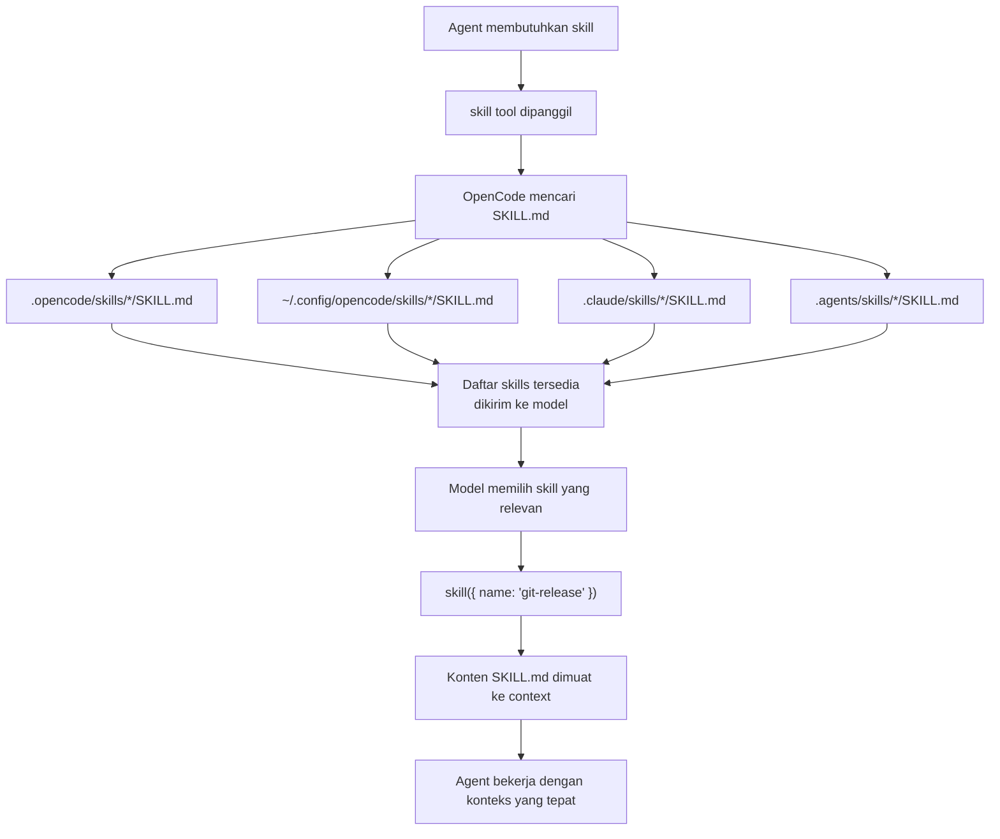
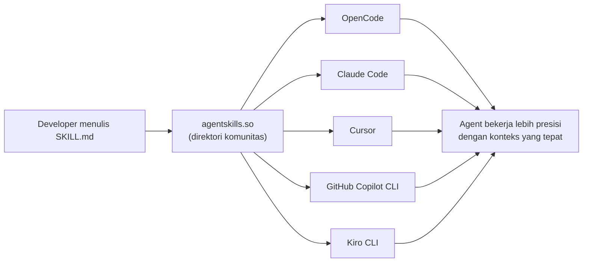
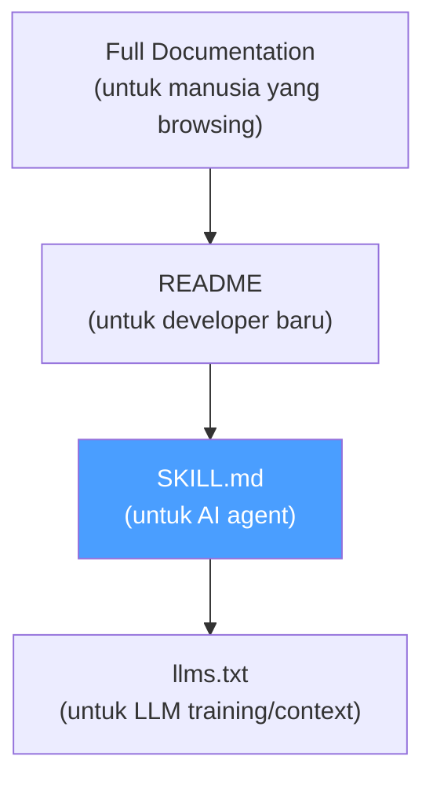

## Sebuah Drama Rebranding yang Mengungkap Sesuatu yang Lebih Besar

Januari 2026. Seorang developer bernama Peter Steinberger merilis sebuah tool bernama **Clawdbot** — personal AI assistant yang langsung viral. Dalam hitungan minggu, ia mendapat surat dari Anthropic: nama itu terlalu mirip dengan "Claude". Ia harus ganti nama.

Pada 27 Januari 2026, ia mengumumkan rebranding ke **Moltbot** — terinspirasi dari proses molting lobster, melepas cangkang lama untuk tumbuh. Tapi nama itu pun tidak bertahan lama. Akhirnya ia menetap di **OpenClaw** — nama yang sekarang dikenal sebagai salah satu personal AI assistant paling populer di 2026 dengan ratusan ribu stars di GitHub.

Tiga nama, satu produk. Tapi yang menarik bukan dramanya — yang menarik adalah *mengapa* tool ini begitu cepat viral, dan apa yang ia ungkap tentang arah ekosistem AI agent.

---

## Masalah yang Belum Terpecahkan: AI Tahu Banyak tapi Sering Salah

Ada paradoks yang dialami siapapun yang pernah serius menggunakan AI coding agent: model yang sangat canggih, tapi sering menghasilkan kode yang salah untuk library atau framework tertentu.

Bukan karena modelnya bodoh. Tapi karena **dokumentasi ditulis untuk manusia, bukan untuk AI**.

Dokumentasi manusia menyebar informasi di puluhan halaman, mengasumsikan pembaca akan browsing secara non-linear, dan sering melewatkan detail teknis yang "sudah jelas" bagi developer berpengalaman. LLM tidak bisa memegang seluruh dokumentasi dalam context window-nya sekaligus — dan bahkan kalau bisa, performa model menurun drastis ketika context terlalu panjang.

Hasilnya: AI menggunakan API yang sudah deprecated, melewatkan best practice yang tidak eksplisit, dan membuat keputusan yang salah karena tidak punya konteks yang tepat.

**SKILL.md** adalah jawaban untuk masalah ini.

---

## Apa Itu SKILL.md?

SKILL.md adalah file markdown yang hidup bersama kode atau dokumentasimu, berisi instruksi yang dioptimalkan untuk AI agent — bukan untuk manusia.

Bukan README. Bukan dokumentasi API. Ini adalah **cheat sheet untuk agent** — berisi keputusan yang sudah dibuat untuknya, gotchas yang sering dilupakan, dan batasan yang harus direspek.

Formatnya sederhana:

```markdown
---
name: git-release
description: Create consistent releases and changelogs
license: MIT
compatibility: opencode
---

## What I do

- Draft release notes from merged PRs
- Propose a version bump
- Provide a copy-pasteable `gh release create` command

## When to use me

Use this when you are preparing a tagged release.

## Gotchas

- Never use `git tag` directly — always use `gh release create`
- Version bumps follow semver strictly
```

Frontmatter-nya minimal: `name` (required), `description` (required), dan beberapa field opsional. Kontennya bebas — tapi yang efektif biasanya berisi decision tables, explicit boundaries, dan gotchas section.

---

## Bagaimana Agent Menemukan dan Menggunakan Skills

OpenCode — salah satu tool yang paling mature dalam mengimplementasikan agent skills — mencari SKILL.md di beberapa lokasi:



Yang menarik dari desain ini: **skills dimuat on-demand**, bukan semuanya sekaligus. Agent melihat daftar nama dan deskripsi skill yang tersedia, lalu memilih mana yang relevan untuk task saat ini. Ini mencegah context bloat — agent tidak perlu membawa semua instruksi setiap saat.

---

## Ekosistem yang Tumbuh: Dari OpenCode ke Standar Universal

SKILL.md bukan hanya fitur OpenCode. Ia sedang menjadi **open standard** yang diadopsi oleh banyak tool sekaligus.

Pada Januari 2026, Mintlify mengumumkan bahwa semua dokumentasi yang dihosting di platform mereka otomatis menghasilkan file `/.well-known/skills/default/SKILL.md` — berisi ringkasan best practice, gotchas, dan decision tables yang dioptimalkan untuk agent. Setiap kali dokumentasi diupdate, SKILL.md-nya diregenerasi otomatis.

Vercel merilis `skills` CLI — tool untuk menginstall skills dari URL ke berbagai agent sekaligus:

```bash
# Install skill dari URL dokumentasi
npx skills add https://mintlify.com/docs

# Skills otomatis terdeteksi dan diinstall ke semua agent yang terdeteksi
# (OpenCode, Claude Code, Cursor, dll)
```

[agentskills.so](https://agentskills.so) menjadi direktori komunitas untuk berbagi skills — mirip npm registry tapi untuk instruksi agent.



---

## Apa yang Membuat SKILL.md Berbeda dari README atau Docs?

Perbedaannya bukan di format — tapi di **audiens dan tujuan**.

| | README | Dokumentasi | SKILL.md |
|---|---|---|---|
| **Audiens** | Developer baru | Developer yang browsing | AI agent |
| **Tujuan** | Orientasi | Referensi | Instruksi eksekusi |
| **Panjang** | Bebas | Panjang | Ringkas (max 1024 char description) |
| **Gaya** | Naratif | Komprehensif | Decision tables + gotchas |
| **Update** | Manual | Manual | Bisa otomatis |

Yang paling penting: SKILL.md berisi **keputusan yang sudah dibuat**. Alih-alih menjelaskan semua opsi dan membiarkan agent memilih, SKILL.md bilang: "Untuk use case X, gunakan Y. Jangan gunakan Z karena deprecated."

Ini adalah perbedaan antara memberikan peta dan memberikan GPS dengan rute yang sudah dipilih.

---

## OpenClaw, Moltbot, dan Mengapa Ini Relevan

Kembali ke drama rebranding di awal. OpenClaw (sebelumnya Clawdbot, lalu Moltbot) viral bukan hanya karena fiturnya — tapi karena ia menunjukkan bahwa **personal AI assistant yang bisa dikustomisasi secara mendalam** adalah sesuatu yang sangat diinginkan orang.

OpenClaw mendukung agent skills sejak awal. Pengguna bisa mendefinisikan skills untuk workflow mereka sendiri — cara mereka menulis commit message, cara mereka mengelola branch, cara mereka berinteraksi dengan API internal perusahaan. Skills ini kemudian bisa dibagikan ke komunitas atau disimpan secara private.

Ini adalah visi yang berbeda dari ChatGPT Agent atau Claude Cowork: bukan AI yang bekerja dengan cara yang ditentukan vendor, tapi AI yang bekerja dengan cara yang kamu tentukan sendiri.

---

## Menulis SKILL.md yang Efektif

Berdasarkan praktik terbaik dari komunitas, ada beberapa pola yang terbukti efektif:

**1. Decision tables untuk tribal knowledge**

Alih-alih menjelaskan semua opsi, buat tabel keputusan:

```markdown
## Component Selection

| Need | Use |
|------|-----|
| Hide optional details | `<Accordion>` |
| Sequential steps | `<Steps>` |
| Code in multiple languages | `<CodeGroup>` |
| Warning/info callout | `<Note>` or `<Warning>` |
```

**2. Explicit boundaries**

Pisahkan apa yang bisa dilakukan agent dari apa yang butuh intervensi manusia:

```markdown
## What agents can do
- Update content in any .mdx file
- Add new pages to existing sections
- Modify navigation in docs.json

## Requires human action
- Custom domain setup (needs DNS access)
- Billing changes (needs dashboard access)
- New integrations (needs API key setup)
```

**3. Gotchas section**

Ini yang paling sering dilewatkan tapi paling berharga:

```markdown
## Gotchas

- Never use `mint.json` — it's deprecated, use `docs.json` only
- Every MDX file needs a `title` frontmatter at minimum
- Images must be in `/public/images/`, not `/assets/`
- Don't use `export default` in MDX files
```

**4. Versi dan kompatibilitas**

```markdown
---
name: my-framework-skill
description: Best practices for MyFramework v3.x
compatibility: opencode, claude-code, cursor
metadata:
  version: "3.x"
  last-updated: "2026-04"
---
```

---

## Implikasi yang Lebih Luas

SKILL.md adalah gejala dari sesuatu yang lebih besar: **ekosistem AI agent sedang bergerak dari "AI yang tahu segalanya" ke "AI yang tahu apa yang perlu diketahui untuk task ini"**.

Model LLM yang lebih besar tidak selalu lebih baik untuk task spesifik. Model yang lebih kecil dengan konteks yang tepat — termasuk SKILL.md yang relevan — sering menghasilkan output yang lebih akurat dan lebih konsisten.

Ini juga mengubah cara kita berpikir tentang dokumentasi. Dokumentasi bukan lagi hanya untuk manusia — ia adalah input untuk sistem AI yang akan bekerja dengan produkmu. SKILL.md adalah layer baru dalam stack dokumentasi: di atas README, di bawah full docs, dioptimalkan untuk mesin.



---

## Cara Mulai

Kalau kamu punya proyek atau library yang sering digunakan dengan AI agent, membuat SKILL.md adalah investasi yang sangat worth it:

```bash
# Buat struktur skill untuk OpenCode
mkdir -p .opencode/skills/my-project
cat > .opencode/skills/my-project/SKILL.md << 'EOF'
---
name: my-project
description: Best practices and gotchas for working with my-project
---

## Setup

Always run `npm install` before starting development.

## Gotchas

- Use `src/` for all source files, never `lib/`
- Config goes in `.env.local`, not `.env`

## Common tasks

- Start dev server: `npm run dev`
- Run tests: `npm test`
- Build: `npm run build`
EOF
```

Atau install skills dari komunitas:

```bash
# Install skill dari agentskills.so atau URL dokumentasi
npx skills add https://your-docs-url.com
```

---

## Penutup

Dari drama rebranding Clawdbot → Moltbot → OpenClaw, sampai lahirnya SKILL.md sebagai open standard yang diadopsi Mintlify, Vercel, OpenCode, Claude, dan Cursor — ada satu benang merah yang jelas: **komunitas sedang membangun infrastruktur untuk membuat AI agent bekerja lebih presisi**.

Bukan dengan membuat model lebih besar. Tapi dengan memberikan konteks yang lebih tepat, pada waktu yang tepat, dalam format yang dioptimalkan untuk mesin.

SKILL.md adalah langkah kecil tapi signifikan dalam arah itu.

---

**Referensi:**
- [OpenCode Agent Skills Documentation](https://opencode.ai/docs/skills/)
- [skill.md: An open standard for agent skills — Mintlify](https://www.mintlify.com/blog/skill-md)
- [agentskills.so — Community Skills Directory](https://agentskills.so)
- [awesome-agent-skills — GitHub](https://github.com/heilcheng/awesome-agent-skills)
- [What are Clawdbot, Moltbot, and OpenClaw? — Medium](https://medium.com/data-science-collective/what-are-clawdbot-moltbot-and-openclaw-7cc9faaae6c3)
